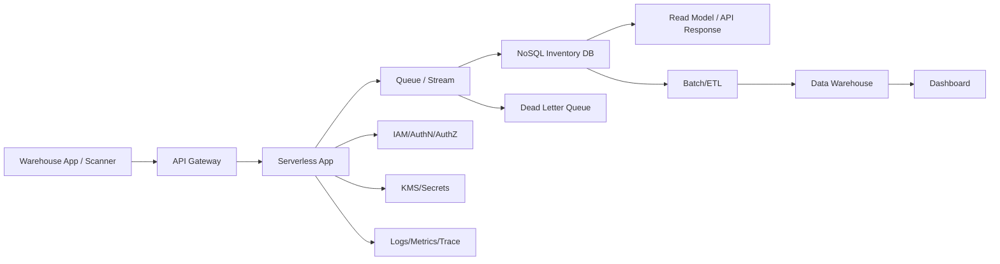

[[Home]]

# Cloud Engineer Magazine (2026-03-10)

## 1) 今日のアプリ
**倉庫向けリアルタイム在庫最適化アプリ**
- バーコード/QR スキャンで入出庫を即時反映
- 需要予測に基づき発注点を自動提案
- 複数拠点の在庫を可視化し、欠品と過剰在庫を削減

> 今日の視点: **マルチクラウド比較（AWS/OCI/GCP）**

---

## 2) 要件整理
### 機能要件
- 在庫イベント（入庫/出庫/棚卸）を秒単位で反映
- SKU 別ダッシュボード（現在庫、滞留日数、欠品リスク）
- 閾値超過で通知（メール/チャット/Webhook）
- 予測バッチ（日次）と緊急再計算（オンデマンド）

### 非機能要件
- **可用性**: 月間 99.9% 以上、リージョン障害時に RTO 60 分以内
- **性能**: API P95 < 300ms、イベント処理遅延 < 5 秒
- **セキュリティ**: 最小権限 IAM、保存時/転送時暗号化、監査ログ
- **コスト**: 初期はサーバレス中心、成長後は継続負荷を割引/予約で最適化

---

## 3) 推奨アーキテクチャ（なぜその構成か）
**イベント駆動 + マネージド DB + オブジェクトストレージ + BI** を基本形にする。
- 在庫更新は突発的なスパイクがあるため、キュー/ストリームでバッファ
- トランザクションは低レイテンシ NoSQL、分析は DWH に分離（OLTP/OLAP 分離）
- 予測はバッチ実行し、結果のみ API 側へ配信

**理由**
- スケーラビリティ: 書き込み急増を吸収しやすい
- 運用性: マネージドサービスでパッチ/可用性運用を削減
- セキュリティ: IAM 境界と KMS 鍵管理をサービス連携で一貫化

---

## 4) クラウド別実装マップ
### AWS
- API: **Amazon API Gateway** + **AWS Lambda**
- イベント取り込み: **Amazon SQS**（または Kinesis）
- 在庫 DB: **Amazon DynamoDB**
- 分析基盤: **Amazon S3** + **AWS Glue** + **Amazon Athena**
- 可視化: **Amazon QuickSight**
- 認証: **Amazon Cognito**
- 秘密情報/鍵: **AWS Secrets Manager**, **AWS KMS**
- 監視: **Amazon CloudWatch**, **AWS X-Ray**, **AWS CloudTrail**

### OCI
- API: **API Gateway** + **Functions**
- イベント取り込み: **OCI Streaming** + **Queue**
- 在庫 DB: **NoSQL Database**
- 分析基盤: **Object Storage** + **Data Integration** + **Autonomous Data Warehouse**
- 可視化: **Oracle Analytics Cloud**
- 認証: **OCI IAM**
- 秘密情報/鍵: **OCI Vault**
- 監視: **Monitoring**, **Logging**, **Audit**, **Application Performance Monitoring**

### GCP
- API: **API Gateway**（または Cloud Endpoints）+ **Cloud Run/Cloud Functions**
- イベント取り込み: **Pub/Sub**
- 在庫 DB: **Firestore**（要件次第で Bigtable）
- 分析基盤: **Cloud Storage** + **Dataflow** + **BigQuery**
- 可視化: **Looker Studio**（または Looker）
- 認証: **Identity Platform** / **Cloud IAM**
- 秘密情報/鍵: **Secret Manager**, **Cloud KMS**
- 監視: **Cloud Monitoring**, **Cloud Logging**, **Cloud Audit Logs**, **Cloud Trace**

**トレードオフ（短評）**
- DynamoDB / NoSQL Database / Firestore はいずれも高可用なマネージド NoSQL。クエリ柔軟性と運用習熟で選定。
- Athena / ADW / BigQuery は分析体験が異なる。高速集計と運用簡素化では BigQuery/ADW が強く、S3 直読中心なら Athena が軽量。

---

## 5) システム構成図（Mermaid）

---

## 6) データフロー / 認証・認可 / 監視運用の要点
- **データフロー**: 受信イベントに idempotency key を付与し重複反映を防止。失敗時は DLQ に退避し再処理。
- **認証・認可**: 
  - ユーザー認証は ID 基盤（Cognito/OCI IAM/Identity Platform）
  - サービス間は IAM ロール/サービスアカウントで短期資格情報
  - テーブル/バケットは業務ロール単位で最小権限
- **監視運用**:
  - SLI: API レイテンシ、イベント遅延、在庫反映失敗率
  - アラート: 閾値 + 異常検知
  - 監査: 変更操作は CloudTrail / Audit Logs で証跡化

---

## 7) コスト最適化ポイント（初期・成長期）
### 初期
- サーバレス中心（Lambda/Functions/Cloud Run）でアイドルコスト削減
- ストレージはライフサイクルで低頻度層へ自動移行
- BI は閲覧者数と更新頻度に合わせ最小プラン

### 成長期
- 継続高負荷は予約/コミット（Savings Plans, CUD 等）を検討
- ストリーム/ETL はバッチ窓を最適化して実行回数を削減
- 分析クエリはパーティション/クラスタリングでスキャン量最小化

---

## 8) 障害時の設計（DR/バックアップ/フェイルオーバー）
- **バックアップ**: NoSQL の PITR（Point-in-Time Recovery）有効化
- **DR**: 重要データを別リージョン複製（RPO 15 分目標）
- **フェイルオーバー**:
  - API は DNS/ロードバランサで切替
  - キューは再送可能設計（at-least-once 前提）
  - Runbook に「在庫整合性再計算ジョブ」を定義

---

## 9) 学習ポイント（今日覚えるクラウド機能）
1. キュー + DLQ による疎結合化と再処理設計
2. OLTP（NoSQL）と OLAP（DWH）分離の実装理由
3. IAM 最小権限の実践（人・アプリ・運用ロール分離）
4. 監査ログを前提にした運用設計

---

## 10) 30〜60分ミニ演習
**演習: 「在庫更新 API + 非同期反映」ミニ実装設計**
- 目標: 1 SKU の入出庫イベントを API 経由で受け、キュー投入→DB反映→監視までを設計
- 手順:
  1. API エンドポイント定義（POST /inventory/events）
  2. イベント JSON スキーマ定義（eventId, sku, qty, type, ts）
  3. 重複排除キー設計（eventId）
  4. 失敗時 DLQ と再処理フローを文章化
  5. 監視項目 3 つ（遅延、失敗率、P95）を決める
- 完了条件: 「通常系・重複・障害系」の3ケースの処理手順を説明できる

---

## 11) 公式ドキュメント参照リンク（AWS/OCI/GCP）
### AWS
- Well-Architected Framework: https://docs.aws.amazon.com/wellarchitected/latest/framework/welcome.html
- Amazon API Gateway: https://docs.aws.amazon.com/apigateway/
- AWS Lambda: https://docs.aws.amazon.com/lambda/
- Amazon DynamoDB: https://docs.aws.amazon.com/dynamodb/
- Amazon SQS: https://docs.aws.amazon.com/AWSSimpleQueueService/
- Amazon S3: https://docs.aws.amazon.com/s3/
- AWS Glue: https://docs.aws.amazon.com/glue/
- Amazon Athena: https://docs.aws.amazon.com/athena/
- Amazon CloudWatch: https://docs.aws.amazon.com/cloudwatch/

### OCI
- OCI Architecture Center: https://docs.oracle.com/en-us/iaas/Content/Architecture/home.htm
- API Gateway: https://docs.oracle.com/en-us/iaas/Content/APIGateway/home.htm
- Functions: https://docs.oracle.com/en-us/iaas/Content/Functions/home.htm
- Streaming: https://docs.oracle.com/en-us/iaas/Content/Streaming/home.htm
- Queue: https://docs.oracle.com/en-us/iaas/Content/queue/home.htm
- NoSQL Database: https://docs.oracle.com/en-us/iaas/nosql-database/
- Object Storage: https://docs.oracle.com/en-us/iaas/Content/Object/home.htm
- Monitoring: https://docs.oracle.com/en-us/iaas/Content/Monitoring/home.htm

### GCP
- Google Cloud Architecture Framework: https://docs.cloud.google.com/architecture/framework
- API Gateway: https://docs.cloud.google.com/api-gateway/docs
- Cloud Run: https://docs.cloud.google.com/run/docs
- Pub/Sub: https://docs.cloud.google.com/pubsub/docs
- Firestore: https://docs.cloud.google.com/firestore/docs
- BigQuery: https://docs.cloud.google.com/bigquery/docs
- Cloud Monitoring: https://docs.cloud.google.com/monitoring/docs
- Cloud IAM: https://docs.cloud.google.com/iam/docs
