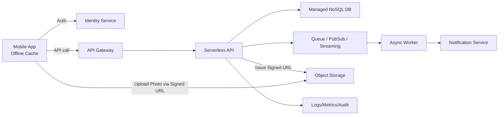

[[Home]]

# Cloud Engineer Magazine (2026-03-11)
#cloud #aws #oci #gcp #architecture #daily

## 1) 今日のアプリ
**フィールド保守向け「写真付き作業報告 + オフライン同期」アプリ**
- 現場作業員がスマホで点検票入力、写真添付、署名取得
- 通信不安定な場所ではオフライン保存し、復帰時に自動同期
- 管理者はWebダッシュボードで進捗/異常報告を確認

> 今日の視点: **マルチクラウド実装マップ（AWS/OCI/GCP）**

---

## 2) 要件整理（機能要件 / 非機能要件）
### 機能要件
- 作業報告作成（テキスト、チェック項目、写真、署名）
- オフライン時ローカル保存 + 再接続時の差分同期
- 異常検知時の即時通知（メール/チャット）
- 管理画面で案件別・担当者別の検索/集計

### 非機能要件
- **可用性**: 月間 99.9%以上、API はマルチAZ前提
- **性能**: API P95 < 400ms、画像アップロード開始 < 2秒
- **セキュリティ**: 最小権限IAM、端末～API間TLS、保存時暗号化、監査ログ
- **コスト**: 初期はサーバレス中心、画像保存コストをライフサイクルで最適化

---

## 3) 推奨アーキテクチャ（なぜその構成か）
**BFF(API) + オブジェクトストレージ + マネージドDB + 非同期イベント**
- 写真はAPI経由で直接保存せず、**事前署名URL**でオブジェクトストレージへ直接アップロード
- 報告メタデータはマネージドDBへ保存（検索キー設計）
- 同期イベントはキュー/メッセージングで処理し、通知や集計を非同期化

**理由**
- API負荷を画像転送から分離してスケールしやすい
- 通信不安定時でも再送・冪等制御（idempotency key）を設計しやすい
- 運用はログ/監査/メトリクスをマネージドで統一しやすい

---

## 4) クラウド別実装マップ
### AWS での実装サービス
- 認証: **Amazon Cognito**
- API: **Amazon API Gateway** + **AWS Lambda**
- 写真保存: **Amazon S3**（Pre-signed URL）
- メタデータ: **Amazon DynamoDB**
- 非同期処理: **Amazon SQS**
- 通知: **Amazon SNS**
- 監視/監査: **Amazon CloudWatch**, **AWS CloudTrail**
- 鍵/秘密情報: **AWS KMS**, **AWS Secrets Manager**

### OCI での実装サービス
- 認証/認可: **OCI IAM**
- API: **OCI API Gateway** + **OCI Functions**
- 写真保存: **OCI Object Storage**（Pre-Authenticated Request）
- メタデータ: **OCI NoSQL Database**
- 非同期処理: **OCI Queue** または **OCI Streaming**
- 通知: **OCI Notifications**
- 監視/監査: **OCI Monitoring**, **OCI Logging**, **OCI Audit**
- 鍵/秘密情報: **OCI Vault**

### GCP での実装サービス
- 認証/認可: **Identity Platform** + **Cloud IAM**
- API: **API Gateway** + **Cloud Run**
- 写真保存: **Cloud Storage**（Signed URL）
- メタデータ: **Firestore**
- 非同期処理: **Pub/Sub**
- 通知連携: **Cloud Run + Pub/Sub**（必要に応じ外部通知）
- 監視/監査: **Cloud Monitoring**, **Cloud Logging**, **Cloud Audit Logs**
- 鍵/秘密情報: **Cloud KMS**, **Secret Manager**

**トレードオフ（短評）**
- DynamoDB / OCI NoSQL / Firestore はいずれも運用負荷が低い。複雑クエリ要件が増えるなら検索専用基盤追加を検討。
- Functions/Lambda は短時間処理向き。長め処理・コンテナ依存が多いなら Cloud Run などコンテナ実行基盤が有利。

---

## 5) システム構成図（Mermaid）

---

## 6) データフロー / 認証・認可 / 監視運用の要点
- **データフロー**:
  1. モバイルがログインしてトークン取得
  2. APIで報告レコード作成、画像アップロード用署名URLを発行
  3. モバイルがストレージへ直接アップロード
  4. 完了イベントをキュー送信、非同期で通知/集計
- **認証・認可**:
  - ユーザーはOIDC/OAuthベース認証
  - サービス間はIAMロール/サービスアカウントで短期認証
  - ストレージ権限は「自案件プレフィックスのみ」など最小権限
- **監視運用**:
  - SLI: API成功率、同期遅延、アップロード失敗率
  - 監査: IAM変更、鍵アクセス、機密設定変更を監査ログで追跡
  - 運用: DLQ/再処理Runbookを定義

---

## 7) コスト最適化ポイント（初期・成長期）
### 初期
- サーバレス中心（従量課金）
- 画像は標準ストレージ開始、ライフサイクルで低頻度層へ移行
- ログ保存期間を短めに設定し、監査要件に応じて延長

### 成長期
- API/Worker の実行時間最適化（メモリ/CPUチューニング）
- 画像圧縮・サムネイル生成で保存/転送量削減
- アクセス頻度の低い履歴データはアーカイブ層へ

---

## 8) 障害時の設計（DR/バックアップ/フェイルオーバー）
- DBは PITR/バックアップを有効化、定期リストア訓練を実施
- オブジェクトストレージはバージョニング + クロスリージョン複製を検討
- メッセージングは再送前提（at-least-once）で冪等処理
- APIはマルチAZ、必要に応じて別リージョン待機系を用意（RTO/RPOを明文化）

---

## 9) 学習ポイント（今日覚えるクラウド機能）
1. Signed URL / Pre-signed URL / Pre-Authenticated Request の使い分け
2. オフライン同期での冪等キー設計
3. 最小権限IAM（人・アプリ・運用のロール分離）
4. DLQを使った失敗処理の運用手順

---

## 10) 30〜60分ミニ演習
**演習: 「写真付き報告」最小設計を作る**
- 目標: 1件の作業報告（本文+写真）を安全に登録する設計を作成
- 手順:
  1. `POST /reports` のAPI入出力を定義
  2. 署名URL発行フロー（有効期限、サイズ制限、MIME制限）を設計
  3. 同期イベントJSON（reportId, workerId, status, timestamp）を定義
  4. 失敗時のDLQ再処理手順を3ステップで記述
  5. IAMポリシーを「アプリ」「運用者」で分離
- 完了条件: 通常系/重複送信/オフライン復帰時の3シナリオを説明できる

---

## 11) 公式ドキュメント参照リンク（AWS/OCI/GCP）
### AWS
- AWS Well-Architected Framework:
  https://docs.aws.amazon.com/wellarchitected/latest/framework/welcome.html
- Amazon API Gateway:
  https://docs.aws.amazon.com/apigateway/
- AWS Lambda:
  https://docs.aws.amazon.com/lambda/
- Amazon S3（Pre-signed URL）:
  https://docs.aws.amazon.com/AmazonS3/latest/userguide/using-presigned-url.html
- Amazon DynamoDB:
  https://docs.aws.amazon.com/dynamodb/
- Amazon SQS:
  https://docs.aws.amazon.com/AWSSimpleQueueService/
- Amazon Cognito:
  https://docs.aws.amazon.com/cognito/

### OCI
- OCI Architecture Center:
  https://docs.oracle.com/en-us/iaas/Content/Architecture/home.htm
- API Gateway:
  https://docs.oracle.com/en-us/iaas/Content/APIGateway/home.htm
- Functions:
  https://docs.oracle.com/en-us/iaas/Content/Functions/home.htm
- Object Storage（Pre-Authenticated Requests）:
  https://docs.oracle.com/en-us/iaas/Content/Object/Tasks/usingpreauthenticatedrequests.htm
- NoSQL Database:
  https://docs.oracle.com/en-us/iaas/nosql-database/
- Queue:
  https://docs.oracle.com/en-us/iaas/Content/queue/home.htm
- IAM:
  https://docs.oracle.com/en-us/iaas/Content/Identity/home.htm

### GCP
- Google Cloud Architecture Framework:
  https://docs.cloud.google.com/architecture/framework
- API Gateway:
  https://docs.cloud.google.com/api-gateway/docs
- Cloud Run:
  https://docs.cloud.google.com/run/docs
- Cloud Storage Signed URLs:
  https://docs.cloud.google.com/storage/docs/access-control/signed-urls
- Firestore:
  https://docs.cloud.google.com/firestore/docs
- Pub/Sub:
  https://docs.cloud.google.com/pubsub/docs
- Cloud IAM:
  https://docs.cloud.google.com/iam/docs
