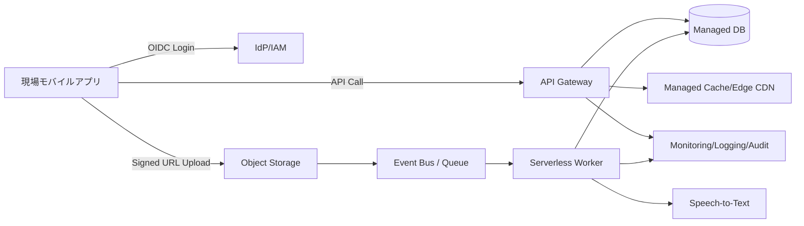

[[Home]]

# Cloud Engineer Magazine (2026-03-13)

## 1) 今日のアプリ
**工場・建設現場向け「点検写真＋音声メモ管理アプリ」**
- スマホで写真撮影、音声メモ添付、オフライン時は一時保存
- 帰社前にクラウド同期し、管理者がダッシュボードで異常検知・是正依頼
- 監査向けに「誰が・いつ・どこで・何を記録したか」を追跡可能にする

---

## 2) 要件整理（機能要件/非機能要件）
### 機能要件
- 写真アップロード、音声→テキスト化、点検レポート生成
- 現場ごとの権限制御（閲覧/編集/承認）
- 異常スコアの自動判定（しきい値 + 将来ML拡張）

### 非機能要件
- **可用性**: 平日日中ピークに耐える（RTO 1時間、RPO 15分）
- **性能**: 写真アップロード開始まで < 2秒、一覧表示 < 1秒（キャッシュ前提）
- **セキュリティ**: 最小権限IAM、保存時/転送時暗号化、監査ログ保持
- **コスト**: 初期はサーバレス中心、成長期でコンテナ常駐化を検討

---

## 3) 推奨アーキテクチャ（なぜその構成か）
**推奨: 「API + オブジェクトストレージ + 非同期処理 + マネージドDB」**
- 画像/音声はオブジェクトストレージに集約（安価・高耐久）
- APIは認証済みクライアントのみ受け付け、アップロードは署名付きURLで直接保存
- 保存イベントをトリガに非同期ワーカーがメタデータ抽出・文字起こし・通知
- トランザクションデータ（点検票、承認履歴）はマネージドRDBへ

**理由**
- 同期処理を最小化し、モバイル体験を改善
- 画像処理の負荷変動をキューで平準化
- サーバ管理工数を抑えつつ監査性を確保

---

## 4) クラウド別実装マップ
### AWS での実装サービス
- 認証: **Amazon Cognito**
- API: **Amazon API Gateway + AWS Lambda**
- オブジェクト保存: **Amazon S3**（署名付きURL）
- 非同期: **Amazon SQS** / イベント駆動なら **EventBridge**
- DB: **Amazon Aurora Serverless v2** または **DynamoDB**（要件次第）
- 監視: **CloudWatch + CloudTrail + AWS X-Ray**

### OCI での実装サービス
- 認証: **OCI IAM Identity Domains**
- API: **OCI API Gateway + OCI Functions**
- オブジェクト保存: **OCI Object Storage**（Pre-Authenticated Requests）
- 非同期: **OCI Queue** / **Events**
- DB: **Autonomous Database** または **MySQL Database Service**
- 監視: **OCI Monitoring + Logging + Audit**

### GCP での実装サービス
- 認証: **Identity Platform** または **Cloud IAM + IAP（管理画面）**
- API: **API Gateway/Cloud Endpoints + Cloud Run/Cloud Functions**
- オブジェクト保存: **Cloud Storage**（Signed URL）
- 非同期: **Pub/Sub**
- DB: **Cloud SQL** または **Firestore**（アクセスパターン次第）
- 監視: **Cloud Monitoring + Cloud Logging + Cloud Audit Logs + Trace**

**トレードオフ（例）**
- RDB一貫性重視: Aurora/ADB/Cloud SQL
- 高スループット・柔軟スキーマ: DynamoDB/Firestore
- 常時高負荷なら Functions/Lambda より Cloud Run・Container系の方が単価有利になる場合あり

---

## 5) システム構成図（Mermaid）

---

## 6) データフロー/認証・認可/監視運用の要点
- **データフロー**: 
  1. ユーザー認証（OIDC）
  2. APIでアップロード用署名URL取得
  3. クライアントが直接オブジェクト保存
  4. 保存イベントで非同期処理（サムネイル/文字起こし/異常判定）
  5. DB更新→通知
- **認証・認可**:
  - JWT検証をAPI層で強制
  - テナント/現場ID単位ABACまたはRBAC
  - ワーカー実行ロールは「対象バケット読取 + 対象DB書込」の最小権限
- **監視運用**:
  - SLI: APIエラー率、P95遅延、キュー滞留、処理失敗率
  - 監査: 誰がデータ閲覧/変更したかを監査ログに一元化

---

## 7) コスト最適化ポイント（初期・成長期）
### 初期
- サーバレス中心（Lambda/Functions/Cloud Functions）
- 画像ライフサイクル管理（低頻度アクセス層へ自動移行）
- 開発/検証環境は夜間停止、ログ保持期間短縮

### 成長期
- 高頻度処理をコンテナ常駐化（Cloud Run最小インスタンス、ECS/Fargate、OKE等）
- CDN最適化でAPI呼び出し・転送料削減
- DBは性能テスト後にストレージ/IOPS/自動スケール閾値を再設定

---

## 8) 障害時の設計（DR/バックアップ/フェイルオーバー）
- **バックアップ**: DB自動バックアップ + PITR、有効性テストを月次実施
- **DR**: オブジェクトはクロスリージョン複製、DBはリージョン冗長構成
- **フェイルオーバー**: DNS/グローバルLB切替手順をRunbook化
- **演習**: 四半期ごとに「リージョン障害想定」の復旧訓練

---

## 9) 学習ポイント（今日覚えるクラウド機能）
1. 署名付きURL（S3/OCI Object Storage/Cloud Storage）で安全に大容量アップロード
2. イベント駆動 + キューでスパイク吸収
3. IAM最小権限と監査ログの組み合わせで「追跡可能な運用」を作る

---

## 10) 30〜60分ミニ演習
**演習: 「画像アップロード→非同期メタデータ保存」最小構成を作る**
- 目標:
  - APIで署名付きURL発行
  - 画像保存イベントで関数起動
  - メタデータ（ファイル名、ユーザーID、時刻）をDBへ保存
- 成果物:
  - API仕様（1ページ）
  - IAMポリシー（最小権限）
  - 監視アラート条件3つ

---

## 11) 公式ドキュメント参照リンク（AWS/OCI/GCP）
### AWS
- Well-Architected Framework: https://docs.aws.amazon.com/wellarchitected/latest/framework/welcome.html
- Amazon S3（機能/ガイド）: https://docs.aws.amazon.com/AmazonS3/latest/userguide/Welcome.html
- API Gateway: https://docs.aws.amazon.com/apigateway/latest/developerguide/welcome.html
- AWS Lambda: https://docs.aws.amazon.com/lambda/latest/dg/welcome.html
- Amazon SQS: https://docs.aws.amazon.com/AWSSimpleQueueService/latest/SQSDeveloperGuide/welcome.html
- Amazon Cognito: https://docs.aws.amazon.com/cognito/latest/developerguide/what-is-amazon-cognito.html

### OCI
- OCI Architecture Center: https://docs.oracle.com/en-us/iaas/Content/Architecture/home.htm
- Object Storage: https://docs.oracle.com/en-us/iaas/Content/Object/Concepts/objectstorageoverview.htm
- API Gateway: https://docs.oracle.com/en-us/iaas/Content/APIGateway/Concepts/apigatewayoverview.htm
- Functions: https://docs.oracle.com/en-us/iaas/Content/Functions/Concepts/functionsoverview.htm
- Queue: https://docs.oracle.com/en-us/iaas/Content/queue/home.htm
- IAM: https://docs.oracle.com/en-us/iaas/Content/Identity/home.htm

### GCP
- Google Cloud Architecture Framework: https://docs.cloud.google.com/architecture/framework
- Cloud Storage: https://docs.cloud.google.com/storage/docs
- Cloud Run: https://docs.cloud.google.com/run/docs
- Pub/Sub: https://docs.cloud.google.com/pubsub/docs
- Cloud SQL: https://docs.cloud.google.com/sql/docs
- IAM overview: https://docs.cloud.google.com/iam/docs/overview
- Operations suite (Monitoring/Logging): https://docs.cloud.google.com/products/operations
