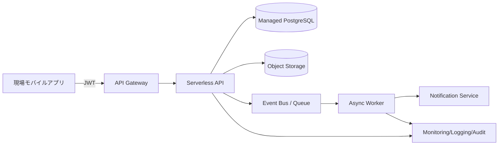

# 2026-03-14 Cloud Engineer Magazine
#cloud #aws #oci #gcp #architecture #daily
[[Home]]

## 1) 今日のアプリ
**写真付き設備点検レポートSaaS（モバイル入力 + 管理者ダッシュボード）**

- 現場担当者がスマホで点検票を入力、写真を添付して送信
- 管理者は未対応/異常項目をダッシュボードで確認
- 異常検知時に即通知（メール/チャット連携）

---

## 2) 要件整理（機能要件/非機能要件）
### 機能要件
- 点検フォーム入力（オフライン再送対応）
- 画像アップロード（1件あたり最大10MB）
- 点検結果検索（拠点・設備ID・期間）
- 異常ステータス時の通知

### 非機能要件
- **可用性**: 月間99.9%以上、リージョン障害時はRTO 2時間 / RPO 15分
- **性能**: API p95 < 300ms、画像アップロード開始まで < 1秒
- **セキュリティ**: 最小権限IAM、保存時暗号化、監査ログ保持1年
- **コスト**: 初期は従量課金優先、利用増で予約/コミット割引へ

---

## 3) 推奨アーキテクチャ（なぜその構成か）
**推奨: API + オブジェクトストレージ + サーバレス処理 + マネージドRDB**

理由:
1. 点検件数の時間変動が大きく、サーバレスがコスト効率良い
2. 画像と業務データを分離（オブジェクト + RDB）して拡張しやすい
3. 通知や画像処理はイベント駆動で疎結合化し、障害局所化できる
4. IAM・KMS・監査ログを標準機能で実装しやすい

---

## 4) クラウド別実装マップ
### AWS での実装サービス
- フロント/API: **Amazon API Gateway + AWS Lambda**
- 認証: **Amazon Cognito**
- 画像保存: **Amazon S3**（SSE-KMS）
- 業務DB: **Amazon Aurora Serverless v2 (PostgreSQL)**
- 非同期処理: **Amazon EventBridge / Amazon SQS**
- 通知: **Amazon SNS**
- 監視/監査: **Amazon CloudWatch / AWS CloudTrail / AWS Config**

### OCI での実装サービス
- フロント/API: **OCI API Gateway + OCI Functions**
- 認証: **OCI IAM Identity Domains**
- 画像保存: **OCI Object Storage**（暗号化有効）
- 業務DB: **OCI Autonomous Transaction Processing**
- 非同期処理: **OCI Streaming + OCI Queue**（用途に応じて）
- 通知: **OCI Notifications**
- 監視/監査: **OCI Monitoring / Logging / Audit / Cloud Guard**

### GCP での実装サービス
- フロント/API: **API Gateway + Cloud Run（またはCloud Functions）**
- 認証: **Identity Platform**（またはCloud IAM + IAP構成）
- 画像保存: **Cloud Storage**（CMEK可）
- 業務DB: **Cloud SQL for PostgreSQL**（将来はAlloyDB検討）
- 非同期処理: **Pub/Sub + Cloud Tasks**
- 通知: **Pub/Sub + Cloud Run ワーカー + 外部通知連携**
- 監視/監査: **Cloud Monitoring / Cloud Logging / Cloud Audit Logs / Security Command Center**

**トレードオフ（短評）**
- 低運用負荷重視: サーバレス統合が強い構成を選ぶ（Lambda / Functions / Cloud Run）
- PostgreSQL互換と移植性重視: Aurora/Cloud SQL/ATPのSQL差分管理を早期に設計
- 通知の柔軟性重視: Pub/Sub/EventBridge/Streamingでイベント契約を明文化

---

## 5) システム構成図（Mermaid）

---

## 6) データフロー/認証・認可/監視運用の要点
- **データフロー**: クライアントはAPIで署名付きURL取得 → 画像を直接オブジェクトストレージへPUT → メタデータのみAPI登録
- **認証・認可**:
  - ユーザー認証はOIDC/OAuth2ベース
  - APIはJWT検証、ロール（現場/管理者/監査）で認可分離
  - ワークロード間は短期資格情報（IAMロール/サービスアカウント）
- **監視運用**:
  - SLI: API遅延、エラー率、キュー滞留、通知失敗率
  - アラート: p95遅延超過、DLQ投入、DB接続逼迫
  - 監査: 管理操作/権限変更/データイベントを集中保管

---

## 7) コスト最適化ポイント（初期・成長期）
### 初期
- サーバレス中心でアイドルコスト削減
- オブジェクトストレージのライフサイクルで低頻度層へ自動移行
- DBは最小構成 + 自動スケール

### 成長期
- 利用予測が立ったらコミット割引/予約適用（Compute/DB）
- 画像配信はCDN導入で転送費最適化
- キュー・再試行回数・ログ保持期間を見直し（不要ログ削減）

---

## 8) 障害時の設計（DR/バックアップ/フェイルオーバー）
- **バックアップ**: DB日次スナップショット + PITR、オブジェクトはバージョニング有効
- **DR**: 別リージョンへDBレプリカ/バックアップ複製、オブジェクトクロスリージョン複製
- **フェイルオーバー**:
  - API層はマルチAZ（またはリージョン冗長）
  - DNS/グローバルLBで切替
  - 非同期処理はDLQで再処理可能にし、順序保証要件を明確化

---

## 9) 学習ポイント（今日覚えるクラウド機能）
1. **署名付きURLアップロード**でAPI負荷を下げる設計
2. **イベント駆動（EventBridge / Streaming / Pub/Sub）**で疎結合化
3. **最小権限IAM**と監査ログのセット運用
4. **PITR + クロスリージョン複製**でRPO/RTOを満たす考え方

---

## 10) 30〜60分ミニ演習
**演習（45分目安）: 「画像アップロード経路の安全化」**
- Step 1 (10分): APIで署名付きURL発行（有効期限5分）
- Step 2 (10分): クライアントから直接アップロード
- Step 3 (10分): メタデータ登録APIでDB保存
- Step 4 (10分): IAM権限を最小化（PUT先プレフィックス限定）
- Step 5 (5分): 失敗時をDLQへ送るルールを追加

**確認項目**
- APIサーバを経由せず画像保存できるか
- 権限が過剰でないか（一覧取得や他プレフィックス書込を拒否）
- 監査ログでアップロード操作を追跡できるか

---

## 11) 公式ドキュメント参照リンク（AWS/OCI/GCP）
### AWS
- API Gateway: https://docs.aws.amazon.com/apigateway/
- Lambda: https://docs.aws.amazon.com/lambda/
- S3: https://docs.aws.amazon.com/s3/
- Aurora Serverless v2: https://docs.aws.amazon.com/AmazonRDS/latest/AuroraUserGuide/aurora-serverless-v2.html
- EventBridge: https://docs.aws.amazon.com/eventbridge/
- Well-Architected Framework: https://docs.aws.amazon.com/wellarchitected/

### OCI
- API Gateway: https://docs.oracle.com/en-us/iaas/Content/APIGateway/home.htm
- Functions: https://docs.oracle.com/en-us/iaas/Content/Functions/home.htm
- Object Storage: https://docs.oracle.com/en-us/iaas/Content/Object/home.htm
- Autonomous Database: https://docs.oracle.com/en-us/iaas/autonomous-database/index.html
- Streaming: https://docs.oracle.com/en-us/iaas/Content/Streaming/home.htm
- Well-Architected Framework: https://docs.oracle.com/en-us/iaas/Content/Architecture/Concepts/well-architected.htm

### GCP
- API Gateway: https://docs.cloud.google.com/api-gateway/docs
- Cloud Run: https://docs.cloud.google.com/run/docs
- Cloud Storage: https://docs.cloud.google.com/storage/docs
- Cloud SQL: https://docs.cloud.google.com/sql/docs
- Pub/Sub: https://docs.cloud.google.com/pubsub/docs
- Architecture Framework: https://docs.cloud.google.com/architecture/framework
