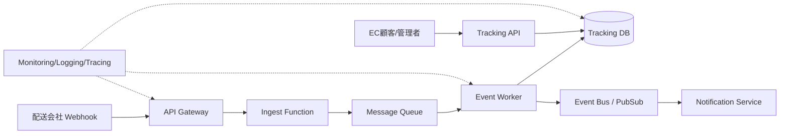

# Cloud Engineer Magazine — 2026-03-15
[[Home]]

#cloud #aws #oci #gcp #architecture #daily

## 1) 今日のアプリ
**リアルタイム配送トラッキングSaaS（中小EC向け）**
- 配送ステータス（集荷/輸送中/配達完了）をリアルタイム表示
- 配送会社Webhookを取り込み、顧客向け追跡ページ/APIを提供
- 遅延予測と通知（メール/Push）を実装

---

## 2) 要件整理（機能要件/非機能要件）
### 機能要件
- 追跡IDでの検索API（REST）
- 配送イベント取り込み（Webhook + バッチ再同期）
- 顧客通知（遅延・配達完了）
- テナント分離（EC店舗ごとのデータ分離）

### 非機能要件
- **可用性**: 99.9%以上、リージョン障害時はRPO 15分/RTO 60分目標
- **性能**: 検索API p95 < 250ms、イベント処理遅延 < 30秒
- **セキュリティ**: 最小権限IAM、暗号化（保存時/転送時）、監査ログ
- **コスト**: 初期はサーバレス中心、成長時にホットパスのみ最適化

---

## 3) 推奨アーキテクチャ（なぜその構成か）
**イベント駆動 + API分離 + マネージドDB**
- 配送イベントはキューでバースト吸収し、ワーカーで非同期処理
- 検索APIは読み取り最適化テーブル/インデックスを利用
- 通知はイベント連携（Pub/Sub）で疎結合化
- IaC前提で環境差分を管理（dev/stg/prod）

**理由**
- Webhook集中時のスパイク耐性が高い
- API可用性と取り込み可用性を独立して伸縮できる
- 初期コストを抑えつつ、成長時に個別ボトルネックを解消しやすい

---

## 4) クラウド別実装マップ
### AWS での実装サービス
- API: **Amazon API Gateway** + **AWS Lambda**
- イベント取込: **Amazon SQS**（DLQ付き）
- 状態保存: **Amazon DynamoDB**（TTL, GSI）
- 通知: **Amazon EventBridge** + **Amazon SNS**
- 認証: **Amazon Cognito**（B2B管理者）
- 監視: **Amazon CloudWatch**, **AWS X-Ray**, **CloudTrail**
- 秘密情報: **AWS Secrets Manager**, 暗号化 **AWS KMS**

### OCI での実装サービス
- API: **API Gateway** + **Functions**
- イベント取込: **OCI Queue**
- 状態保存: **Autonomous Database (JSON/Transaction Processing)** or **NoSQL Database**
- 通知/連携: **OCI Streaming** + **Notifications**
- 認証: **OCI IAM**（Identity Domains）
- 監視: **Monitoring**, **Logging**, **Application Performance Monitoring**
- 鍵管理: **Vault (KMS/HSM)**

### GCP での実装サービス
- API: **API Gateway** + **Cloud Run**（またはCloud Functions）
- イベント取込: **Pub/Sub**
- 状態保存: **Firestore**（またはCloud SQL）
- 通知: **Pub/Sub** + **Cloud Tasks**（再試行制御）
- 認証: **Identity Platform** / **IAM**
- 監視: **Cloud Monitoring**, **Cloud Logging**, **Cloud Trace**, **Cloud Audit Logs**
- 鍵管理: **Cloud KMS**, 秘密情報 **Secret Manager**

**トレードオフ（例）**
- DynamoDB/Firestore/OCI NoSQL: 高スケールで運用負荷低、ただし複雑集計は別基盤が必要
- Cloud Run/Lambda/Functions: 初期は安価で速いが、長時間・高頻度処理は常時稼働基盤が有利になる場合あり

---

## 5) システム構成図（Mermaid）

---

## 6) データフロー/認証・認可/監視運用の要点
### データフロー
1. 配送会社Webhook受信（署名検証）
2. キュー投入（冪等キー: `carrier_event_id`）
3. ワーカーで状態遷移更新（順序制御・重複排除）
4. 重要イベントを通知トピックへ発行

### 認証・認可
- API利用者はOIDC/OAuth2ベース
- サービス間認可はIAMロールで最小権限
- 管理APIと公開追跡APIを分離（WAF + レート制限）

### 監視運用
- SLI: API遅延、5xx率、キュー滞留時間、通知失敗率
- SLO逸脱で自動アラート
- 監査ログを長期保管（改ざん耐性を考慮）

---

## 7) コスト最適化ポイント（初期・成長期）
### 初期
- サーバレス優先（従量課金）
- ログ保持期間を短めに設定し、必要ログのみ保持
- 通知をバッチングして外部配信コスト削減

### 成長期
- ホットパーティション対策（キー設計見直し）
- 読み取りキャッシュ導入（CDN/キャッシュ層）
- 予約/コミット割引やSavings系を適用

---

## 8) 障害時の設計（DR/バックアップ/フェイルオーバー）
- **DR**: マルチAZを基本、マルチリージョンは読み取り系から段階導入
- **バックアップ**: DB PITR + 日次スナップショット
- **フェイルオーバー**: DNS/グローバルLBで切替、キュー再処理で整合性回復
- **設計注意**: 通知は「少なくとも1回」を前提に重複耐性を実装

---

## 9) 学習ポイント（今日覚えるクラウド機能）
- **AWS**: SQS DLQ + Lambda部分バッチ失敗ハンドリング
- **OCI**: Queue/Streamingの使い分け（point-to-point vs stream処理）
- **GCP**: Pub/Sub再配信とDead Letter Topic設計

---

## 10) 30〜60分ミニ演習
1. 1クラウドを選び、Webhook受信APIを作成
2. キュー経由でワーカーを起動し、追跡状態をDB更新
3. わざと重複イベントを送信して冪等処理を確認
4. DLQ（またはDead Letter）に失敗イベントを流し、再処理手順を記録

**完了条件**
- 正常系/重複系/失敗系の3パターンで期待通りに遷移
- 監視ダッシュボードで遅延と失敗率を可視化

---

## 11) 公式ドキュメント参照リンク（AWS/OCI/GCP）
### AWS
- Well-Architected Framework: https://docs.aws.amazon.com/wellarchitected/latest/framework/welcome.html
- Amazon API Gateway: https://docs.aws.amazon.com/apigateway/
- AWS Lambda: https://docs.aws.amazon.com/lambda/
- Amazon SQS: https://docs.aws.amazon.com/AWSSimpleQueueService/
- Amazon DynamoDB: https://docs.aws.amazon.com/amazondynamodb/
- Amazon EventBridge: https://docs.aws.amazon.com/eventbridge/
- IAM Best Practices: https://docs.aws.amazon.com/IAM/latest/UserGuide/best-practices.html

### OCI
- OCI Documentation Home: https://docs.oracle.com/en-us/iaas/Content/home.htm
- API Gateway: https://docs.oracle.com/en-us/iaas/Content/APIGateway/home.htm
- Functions: https://docs.oracle.com/en-us/iaas/Content/Functions/home.htm
- Queue: https://docs.oracle.com/en-us/iaas/Content/queue/home.htm
- Streaming: https://docs.oracle.com/en-us/iaas/Content/Streaming/home.htm
- IAM: https://docs.oracle.com/en-us/iaas/Content/Identity/home.htm
- Vault: https://docs.oracle.com/en-us/iaas/Content/KeyManagement/home.htm

### GCP
- Google Cloud Architecture Framework: https://docs.cloud.google.com/architecture/framework
- API Gateway: https://docs.cloud.google.com/api-gateway/docs
- Cloud Run: https://docs.cloud.google.com/run/docs
- Pub/Sub: https://docs.cloud.google.com/pubsub/docs
- Firestore: https://docs.cloud.google.com/firestore/docs
- IAM: https://docs.cloud.google.com/iam/docs
- Cloud Monitoring: https://docs.cloud.google.com/monitoring/docs
