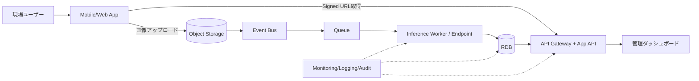

# Cloud Engineer Magazine — 2026-03-16
[[Home]]

#cloud #aws #oci #gcp #architecture #daily

## 1) 今日のアプリ
**現場写真のAI品質検査アプリ（建設・設備点検向け）**
- スマホで撮影した写真を自動解析し、施工不良・未実施項目を検知
- 現場責任者向けに「要再撮影」「要是正」を即時通知
- 監査向けに証跡（誰が/いつ/どこで/何を）を保存

---

## 2) 要件整理（機能要件/非機能要件）
### 機能要件
- 写真アップロード（モバイル/ブラウザ）
- AI推論（分類 + 異常検知）
- 判定結果ワークフロー（承認/差戻し）
- 監査ログとレポート出力（CSV/PDF）

### 非機能要件
- **可用性**: 99.9%以上、推論APIはマルチAZ
- **性能**: 画像1枚あたり推論 p95 2秒以内、同時100reqを吸収
- **セキュリティ**: 最小権限IAM、保存時暗号化、事前署名URL、監査証跡
- **コスト**: 初期はサーバレス + マネージドAI、利用増でGPU常時稼働を検討

---

## 3) 推奨アーキテクチャ（なぜその構成か）
**オブジェクトストレージ中心の非同期推論パイプライン**
- クライアントは事前署名URLで直接アップロード（APIサーバ負荷を回避）
- アップロードイベントをキューへ流し、推論ワーカーで非同期処理
- 判定結果はトランザクションDBに保存、ダッシュボードはAPI経由で参照

**理由**
- 画像アップロードのバーストに強い
- 推論失敗時の再試行/DLQ運用がしやすい
- AIモデル更新と業務APIを疎結合で独立デプロイ可能

---

## 4) クラウド別実装マップ
### AWS での実装サービス
- 画像保存: **Amazon S3**（SSE-KMS, Pre-signed URL）
- 取り込み: **Amazon EventBridge** or S3 Event Notifications + **Amazon SQS**
- 推論: **Amazon SageMaker Endpoint**（または非同期推論）
- API: **Amazon API Gateway** + **AWS Lambda**
- DB: **Amazon Aurora PostgreSQL**（監査・業務データ）
- 認証: **Amazon Cognito**, 権限: **IAM**
- 監視: **Amazon CloudWatch**, **AWS X-Ray**, **CloudTrail**

### OCI での実装サービス
- 画像保存: **Object Storage**（事前認証リクエスト）
- 取り込み: **Events** + **OCI Queue**
- 推論: **OCI Data Science Model Deployment**
- API: **API Gateway** + **Functions**
- DB: **Autonomous Transaction Processing**
- 認証/認可: **OCI IAM (Identity Domains)**
- 監視: **Monitoring**, **Logging**, **Application Performance Monitoring**

### GCP での実装サービス
- 画像保存: **Cloud Storage**（Signed URL/CMEK）
- 取り込み: **Eventarc** + **Pub/Sub**
- 推論: **Vertex AI Endpoint**
- API: **API Gateway** + **Cloud Run**
- DB: **Cloud SQL for PostgreSQL**
- 認証/認可: **Identity Platform** + **Cloud IAM**
- 監視: **Cloud Monitoring**, **Cloud Logging**, **Cloud Trace**, **Cloud Audit Logs**

**トレードオフ（例）**
- マネージド推論（SageMaker/Vertex/OCI DS）は運用が軽いが、常時高負荷では専用推論基盤の方が単価有利な場合あり
- Aurora/ATP/Cloud SQLはSQL集計に強いが、超高スループット単純KVはNoSQL併用が有効

---

## 5) システム構成図（Mermaidで簡易図）

---

## 6) データフロー/認証・認可/監視運用の要点
### データフロー
1. ユーザー認証後、APIでアップロード用署名URL発行
2. クライアントが直接オブジェクトストレージへアップロード
3. イベント発火→キュー投入→推論実行
4. 判定結果をDB保存し、必要に応じて通知

### 認証・認可
- 人ユーザー: OIDC/OAuth2（短命トークン）
- サービス間: IAMロール（最小権限、秘密情報はKMS/Secrets管理）
- ストレージ: バケット公開禁止、署名URLは短TTL

### 監視運用
- SLI: 推論遅延、失敗率、キュー滞留時間、再試行回数
- DLQ監視 + 定期リドライブ手順をRunbook化
- 監査ログで「誰が判定を上書きしたか」を追跡可能にする

---

## 7) コスト最適化ポイント（初期・成長期）
### 初期
- サーバレスAPI/イベント駆動でアイドルコスト削減
- 画像ライフサイクル管理（低頻度アクセス層/アーカイブ）
- モデルは小さく開始し、精度とコストを計測して段階改善

### 成長期
- 推論バッチ化/非同期化でGPU稼働率を改善
- キャッシュ可能な判定は再推論を回避
- 予約割引・コミットメント（Savings Plans/CUD等）を適用

---

## 8) 障害時の設計（DR/バックアップ/フェイルオーバー）
- **DR**: DBはマルチAZ、重要データはクロスリージョン複製
- **バックアップ**: DB PITR + 日次スナップショット、モデル成果物のバージョン保管
- **フェイルオーバー**: APIはDNS/グローバルLBで切替、キュー再処理で整合回復
- **注意点**: 推論は少なくとも1回処理前提。`image_id`で冪等設計

---

## 9) 学習ポイント（今日覚えるクラウド機能）
- **AWS**: S3 pre-signed URL + S3イベント連携の基本
- **OCI**: Object Storage事前認証リクエストとEvents/Queue連携
- **GCP**: Cloud Storage Signed URL + Eventarcでのイベントルーティング

---

## 10) 30〜60分ミニ演習
1. 1クラウドを選び、署名URLで画像アップロードを実装
2. アップロードイベントでキューにメッセージ投入
3. ダミー推論（成功/失敗）を作り、DBに結果保存
4. 失敗メッセージをDLQへ送り、再処理手順を確認

**完了条件**
- 画像アップロード→結果保存までE2Eで動作
- 失敗時にDLQへ入り、手動再処理できる
- 監視画面で遅延/失敗率を確認できる

---

## 11) 公式ドキュメント参照リンク（AWS/OCI/GCP）
### AWS
- AWS Architecture Center: https://docs.aws.amazon.com/architecture/
- Amazon S3: https://docs.aws.amazon.com/s3/
- S3 Pre-signed URL: https://docs.aws.amazon.com/AmazonS3/latest/userguide/ShareObjectPreSignedURL.html
- Amazon SQS: https://docs.aws.amazon.com/AWSSimpleQueueService/
- Amazon SageMaker: https://docs.aws.amazon.com/sagemaker/
- Amazon API Gateway: https://docs.aws.amazon.com/apigateway/
- IAM Best Practices: https://docs.aws.amazon.com/IAM/latest/UserGuide/best-practices.html

### OCI
- OCI Documentation Home: https://docs.oracle.com/en-us/iaas/Content/home.htm
- Object Storage: https://docs.oracle.com/en-us/iaas/Content/Object/home.htm
- Pre-Authenticated Requests: https://docs.oracle.com/en-us/iaas/Content/Object/Tasks/usingpreauthenticatedrequests.htm
- Events: https://docs.oracle.com/en-us/iaas/Content/Events/home.htm
- Queue: https://docs.oracle.com/en-us/iaas/Content/queue/home.htm
- Data Science: https://docs.oracle.com/en-us/iaas/data-science/home.htm
- IAM: https://docs.oracle.com/en-us/iaas/Content/Identity/home.htm

### GCP
- Google Cloud Architecture Framework: https://docs.cloud.google.com/architecture/framework
- Cloud Storage: https://docs.cloud.google.com/storage/docs
- Signed URLs: https://docs.cloud.google.com/storage/docs/access-control/signed-urls
- Eventarc: https://docs.cloud.google.com/eventarc/docs
- Pub/Sub: https://docs.cloud.google.com/pubsub/docs
- Vertex AI: https://docs.cloud.google.com/vertex-ai/docs
- Cloud IAM: https://docs.cloud.google.com/iam/docs
