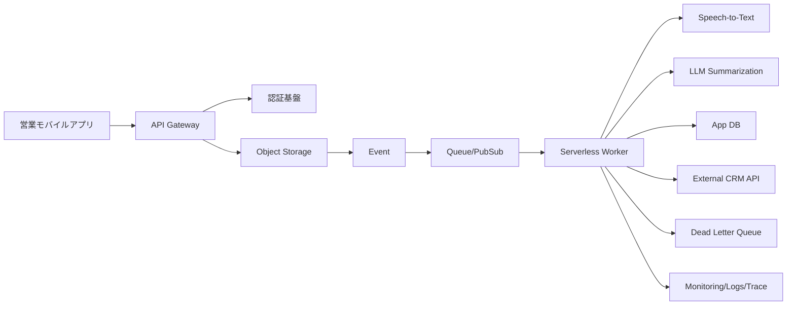

# 2026-03-17 10:15 Cloud Engineer Magazine
[[Home]]

#cloud #aws #oci #gcp #architecture #daily

## 1) 今日のアプリ
**フィールド営業向け「音声→議事録→CRM連携」モバイルアプリ**
- 商談後にスマホで音声メモ録音
- 自動文字起こし＋要約＋TODO抽出
- 顧客情報と紐づけてCRMへ登録

---

## 2) 要件整理（機能/非機能）
### 機能要件
- 音声アップロード（モバイル）
- 非同期で文字起こし・要約
- ユーザー/組織ごとのデータ分離
- CRM API連携（再送制御付き）

### 非機能要件
- **可用性**: 平日ピーク時でも処理継続（キュー＋再試行）
- **性能**: 音声5分あたり2〜4分以内で初回要約表示
- **セキュリティ**: 最小権限IAM、保存時暗号化、監査ログ
- **コスト**: 初期はサーバレス中心、成長時に推論/処理基盤を最適化

---

## 3) 推奨アーキテクチャ（なぜこの構成か）
**イベント駆動サーバレス構成**を推奨。
- 録音ファイルをオブジェクトストレージへ保存
- オブジェクト作成イベントでキュー投入
- ワーカーが文字起こし→要約→DB保存→CRM連携

**理由**
- バースト耐性（キューで平準化）
- 初期コストを抑えやすい（従量課金）
- 障害時に再処理しやすい（DLQ/再試行）

---

## 4) クラウド別実装マップ
### AWS
- API: **Amazon API Gateway**
- 認証: **Amazon Cognito**
- 音声保存: **Amazon S3**
- 非同期処理: **Amazon SQS + AWS Lambda**
- 文字起こし: **Amazon Transcribe**
- 要約/抽出: **Amazon Bedrock**
- データ: **Amazon DynamoDB**
- 監視: **Amazon CloudWatch / AWS X-Ray / CloudTrail**

### OCI
- API: **OCI API Gateway**
- 認証: **OCI IAM**
- 音声保存: **Object Storage**
- 非同期処理: **OCI Queue + Functions**
- 文字起こし/要約: **OCI Generative AI / AI Services**
- データ: **Autonomous Database** または **NoSQL Database**
- 監視: **Monitoring / Logging / Events / Audit**

### GCP
- API: **API Gateway**
- 認証: **Identity Platform**（または IAM + IAP 構成）
- 音声保存: **Cloud Storage**
- 非同期処理: **Pub/Sub + Cloud Run Jobs / Cloud Functions**
- 文字起こし: **Speech-to-Text**
- 要約/抽出: **Vertex AI (Gemini)**
- データ: **Firestore**（または Cloud SQL）
- 監視: **Cloud Monitoring / Cloud Logging / Cloud Audit Logs**

---

## 5) システム構成図（Mermaid）

---

## 6) データフロー/認証・認可/監視運用の要点
- **データフロー**: Upload完了イベントを起点に完全非同期化。CRM連携失敗はDLQへ退避し手動/自動リトライ。
- **認証・認可**: 
  - ユーザー認証はOIDCベース
  - ワーカー実行ロールは「対象バケット読取・特定DBテーブル書込」など最小権限
  - KMS鍵の利用権限をサービス単位で分離
- **監視運用**:
  - SLI: 処理遅延(P95), 失敗率, DLQ件数
  - アラート: キュー滞留、外部CRM 5xx増加、要約失敗率しきい値超過

---

## 7) コスト最適化ポイント（初期・成長期）
### 初期
- サーバレス徹底（常時稼働VMを持たない）
- 音声ファイルのライフサイクル管理（低頻度アクセス層へ移行）
- 要約は短いプロンプト＋出力トークン制限

### 成長期
- 高頻度処理はバッチ化/ジョブ化で単価圧縮
- モデル選択を段階化（軽量モデル優先、難ケースのみ高性能モデル）
- DBアクセスパターンに応じてNoSQL/SQLを再評価

---

## 8) 障害時の設計（DR/バックアップ/フェイルオーバー）
- **DR**: オブジェクトストレージはクロスリージョン複製
- **バックアップ**: DBは日次スナップショット＋PITR
- **フェイルオーバー**:
  - APIはマルチAZ/リージョン設計（DNS/Traffic Managerで切替）
  - 非同期キューで一時的な下流障害を吸収
- **運用訓練**: 四半期ごとに「CRM停止」「リージョン障害」想定のゲームデイ

---

## 9) 学習ポイント（今日覚えるクラウド機能）
1. **イベント駆動 + キュー + DLQ** は音声処理系の基本パターン
2. **最小権限IAM** は「人」だけでなく「ワークロードID」に適用する
3. **監査ログ**（CloudTrail/Audit Logs等）を有効化して追跡性を担保
4. LLM連携は**モデル品質だけでなくトークンコスト設計**が重要

---

## 10) 30〜60分ミニ演習
**お題: 「5分音声を受けて要約JSONを返す最小構成」を設計する**
- 15分: API/Storage/Queue/Worker/DB の責務を1行ずつ定義
- 15分: IAMポリシーを3つ作成（API実行、Worker実行、監視閲覧）
- 15分: 失敗シナリオ2つ（文字起こし失敗、CRM 429）の再試行設計
- 15分（任意）: 月間1,000件/10,000件時の概算コスト比較

成果物:
- 構成図（Mermaid）
- IAM最小権限メモ
- アラート条件3つ

---

## 11) 公式ドキュメント参照リンク（AWS/OCI/GCP）
### AWS
- Well-Architected Framework: https://docs.aws.amazon.com/wellarchitected/latest/framework/welcome.html
- Amazon S3: https://docs.aws.amazon.com/s3/
- Amazon SQS: https://docs.aws.amazon.com/sqs/
- AWS Lambda: https://docs.aws.amazon.com/lambda/
- Amazon Transcribe: https://docs.aws.amazon.com/transcribe/
- Amazon Bedrock: https://docs.aws.amazon.com/bedrock/
- IAM: https://docs.aws.amazon.com/IAM/latest/UserGuide/introduction.html

### OCI
- OCI Documentation Home: https://docs.oracle.com/en-us/iaas/Content/home.htm
- API Gateway: https://docs.oracle.com/en-us/iaas/Content/APIGateway/home.htm
- Object Storage: https://docs.oracle.com/en-us/iaas/Content/Object/home.htm
- Queue: https://docs.oracle.com/en-us/iaas/Content/queue/home.htm
- Functions: https://docs.oracle.com/en-us/iaas/Content/Functions/home.htm
- Generative AI: https://docs.oracle.com/en-us/iaas/Content/generative-ai/home.htm
- IAM: https://docs.oracle.com/en-us/iaas/Content/Identity/home.htm

### GCP
- Google Cloud Architecture Framework: https://docs.cloud.google.com/architecture/framework
- Cloud Storage: https://docs.cloud.google.com/storage/docs
- Pub/Sub: https://docs.cloud.google.com/pubsub/docs
- Cloud Run: https://docs.cloud.google.com/run/docs
- Speech-to-Text: https://docs.cloud.google.com/speech-to-text/docs
- Vertex AI: https://docs.cloud.google.com/vertex-ai/docs
- IAM: https://docs.cloud.google.com/iam/docs
