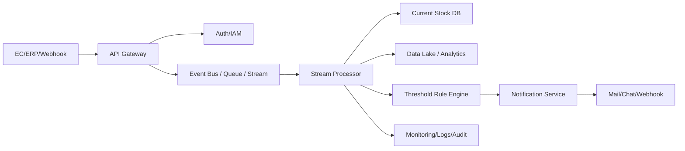

# 2026-03-18 10:15 Cloud Engineer Magazine
[[Home]]

#cloud #aws #oci #gcp #architecture #daily

## 1) 今日のアプリ
**EC向け「在庫しきい値アラート + 自動発注提案」アプリ**
- 複数ショップ/倉庫の在庫を集約
- SKUごとにしきい値監視（欠品前アラート）
- 売上トレンドから補充数量を提案
- 将来は発注API連携（ERP/サプライヤ）

---

## 2) 要件整理（機能要件/非機能要件）
### 機能要件
- 在庫更新イベントの取り込み（API/CSV/Webhook）
- SKU単位の在庫計算としきい値判定
- 通知（メール/チャット/Webhook）
- ダッシュボード（在庫推移・欠品予測）

### 非機能要件
- **可用性**: 通知遅延を最小化。イベント損失ゼロ（少なくとも1回処理）
- **性能**: 在庫更新から30秒以内にアラート判定（P95）
- **セキュリティ**: 最小権限IAM、KMS暗号化、監査ログ、テナント分離
- **コスト**: 初期はサーバレス中心、成長時はストリーミング/DBを段階的最適化

---

## 3) 推奨アーキテクチャ（なぜその構成か）
**イベント駆動 + マネージド時系列/OLTPハイブリッド**
- 更新イベントをメッセージング基盤に集約
- ストリーム処理で在庫集計・しきい値判定
- 結果をOLTP DB（現在値）と分析基盤（履歴）へ分離保存

**この構成を選ぶ理由**
- バースト時でもキュー/ストリームで平準化できる
- 通知処理を疎結合化でき、障害局所化が容易
- 現在値と履歴を分離し、性能とコストを両立しやすい

---

## 4) クラウド別実装マップ
### AWS での実装サービス
- 入口API: **Amazon API Gateway**
- 認証: **Amazon Cognito** / **IAM**
- イベント取込: **Amazon EventBridge**（SaaS連携）+ **Amazon SQS**
- ストリーム処理: **AWS Lambda**（軽量）または **Amazon Kinesis Data Streams + Lambda**
- 現在値DB: **Amazon DynamoDB**
- 履歴分析: **Amazon S3 + Amazon Athena**
- 通知: **Amazon SNS**
- 監視/監査: **CloudWatch / X-Ray / CloudTrail**

### OCI での実装サービス
- 入口API: **OCI API Gateway**
- 認証: **OCI IAM**
- イベント取込: **OCI Events** + **OCI Streaming** または **OCI Queue**
- 処理: **OCI Functions**
- 現在値DB: **OCI NoSQL Database**
- 履歴分析: **Object Storage + Data Flow (Spark) / Autonomous Database**
- 通知: **OCI Notifications**
- 監視/監査: **Monitoring / Logging / Audit**

### GCP での実装サービス
- 入口API: **API Gateway**
- 認証: **Identity Platform** または **IAM + IAP**
- イベント取込: **Eventarc** + **Pub/Sub**
- 処理: **Cloud Run**（または Cloud Functions）
- 現在値DB: **Firestore**（高スループットなら Bigtable 検討）
- 履歴分析: **Cloud Storage + BigQuery**
- 通知: **Pub/Sub push + Cloud Run通知ワーカー**
- 監視/監査: **Cloud Monitoring / Cloud Logging / Cloud Audit Logs**

**トレードオフ（短評）**
- 低運用負荷重視: AWS Lambda / OCI Functions / Cloud Run が有利
- 高スループット重視: Kinesis・OCI Streaming・Pub/Sub を中心に設計
- 分析即応性重視: BigQuery と Athena はクエリ運用が軽く、ADBはSQL資産活用に強み

---

## 5) システム構成図（Mermaidで簡易図）

---

## 6) データフロー/認証・認可/監視運用の要点
- **データフロー**: 受信イベントに idempotency key（event_id）を付与し重複処理を抑止。失敗イベントはDLQへ。
- **認証・認可**:
  - テナント単位で権限境界を分離（プロジェクト/コンパートメント/アカウント設計）
  - ワーカー権限は「特定トピック購読」「特定テーブル更新」の最小権限
  - KMS鍵は環境別（dev/stg/prod）に分離し、鍵利用を監査
- **監視運用**:
  - SLI: イベント遅延、通知成功率、重複処理率、DLQ件数
  - アラート: しきい値判定遅延（P95超過）、DLQ増加、通知失敗率上昇

---

## 7) コスト最適化ポイント（初期・成長期）
### 初期
- 常時稼働サーバを持たず、サーバレス中心
- 履歴データはオブジェクトストレージへ集約し、クエリ時のみ課金
- 通知チャネルを絞り、不要な再送を抑制

### 成長期
- ホットSKUのみ高速DB、コールドSKUは低コスト層へ
- ストリーム処理をマイクロバッチ化して実行回数を削減
- 予約/コミット割引（Savings Plans / CUD相当）を段階導入

---

## 8) 障害時の設計（DR/バックアップ/フェイルオーバー）
- **DR方針**: まず同一クラウド内マルチAZ、次にリージョンDR（Pilot Light）
- **バックアップ**:
  - DB PITR（ポイントインタイムリカバリ）
  - データレイクはバージョニング + ライフサイクル
- **フェイルオーバー**:
  - APIはDNS/ロードバランサで切替
  - 通知ワーカーは再実行可能な冪等設計
- **目標例**: RPO 5分、RTO 30分（中規模EC想定）

---

## 9) 学習ポイント（今日覚えるクラウド機能）
- **AWS**: EventBridge + SQS + Lambda の疎結合イベント処理パターン
- **OCI**: Events/Streaming/Functions の組み合わせとコンパートメント分離
- **GCP**: Pub/Sub + Cloud Run + BigQuery のリアルタイム〜分析連携

---

## 10) 30〜60分ミニ演習
**お題**: 「在庫更新イベントから欠品アラートを出す最小構成」を1クラウドで作る
1. APIエンドポイントを1つ作成（在庫更新JSON受信）
2. イベントをキュー/トピックへ投入
3. サーバレス関数で `stock < threshold` 判定
4. 成立時に通知（メール or Webhook）
5. 失敗時DLQとアラート1つ追加

**達成条件**
- 3件のテストイベントで、正常2件・アラート1件を確認
- 実行ログから event_id 単位で追跡できる

---

## 11) 公式ドキュメント参照リンク（AWS/OCI/GCP）
### AWS
- Well-Architected Framework: https://docs.aws.amazon.com/wellarchitected/latest/framework/welcome.html
- Amazon EventBridge: https://docs.aws.amazon.com/eventbridge/
- Amazon SQS: https://docs.aws.amazon.com/AWSSimpleQueueService/latest/SQSDeveloperGuide/welcome.html
- AWS Lambda: https://docs.aws.amazon.com/lambda/latest/dg/welcome.html
- Amazon DynamoDB: https://docs.aws.amazon.com/amazondynamodb/

### OCI
- OCI Architecture Center: https://docs.oracle.com/en-us/iaas/Content/Architecture/Concepts/architecturecenter.htm
- OCI Events: https://docs.oracle.com/en-us/iaas/Content/Events/home.htm
- OCI Streaming: https://docs.oracle.com/en-us/iaas/Content/Streaming/home.htm
- OCI Functions: https://docs.oracle.com/en-us/iaas/Content/Functions/home.htm
- OCI NoSQL: https://docs.oracle.com/en-us/iaas/nosql-database/

### GCP
- Google Cloud Architecture Framework: https://docs.cloud.google.com/architecture/framework
- Pub/Sub: https://docs.cloud.google.com/pubsub/docs/overview
- Cloud Run: https://docs.cloud.google.com/run/docs/overview/what-is-cloud-run
- BigQuery: https://docs.cloud.google.com/bigquery/docs/introduction
- Cloud Monitoring: https://docs.cloud.google.com/monitoring/docs
