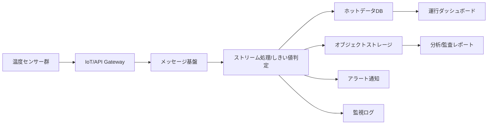

# Cloud Engineer Magazine — 2026-03-19
Tags: #cloud #aws #oci #gcp #architecture #daily
Link: [[Home]]

## 1) 今日のアプリ
**コールドチェーン監視アプリ（食品・医薬品向け）**

配送中の温度センサーからデータを収集し、しきい値逸脱をリアルタイム検知。逸脱時は運行担当へ通知し、監査向けに改ざん耐性のあるログを保存する。

---

## 2) 要件整理（機能要件/非機能要件）
### 機能要件
- センサーデータ（温度/湿度/GPS）を数秒〜数十秒間隔で収集
- しきい値超過時の即時アラート（メール/チャット/Webhook）
- 配送単位のダッシュボード表示（現在値・履歴・逸脱履歴）
- 監査レポート出力（CSV/PDF）

### 非機能要件
- **可用性**: 99.9%以上（リージョン内冗長、重要データはクロスリージョン保全）
- **性能**: 受信〜アラート通知まで P95 5秒以内
- **セキュリティ**: デバイス認証、通信暗号化、最小権限IAM、監査ログ
- **コスト**: 初期はサーバレス中心、成長時はストレージ階層化とパイプライン最適化

---

## 3) 推奨アーキテクチャ（なぜその構成か）
**方針: イベント駆動 + マネージド時系列保管 + 可視化分離**

- IoTゲートウェイでデバイス認証・接続管理を集約
- ルールエンジン/ストリーム処理でしきい値判定を即時化
- 生データはオブジェクトストレージへ蓄積（安価・長期保管）
- 直近参照はNoSQL/時系列DBへ（低レイテンシ）
- ダッシュボード系は分析基盤と分離して運用影響を抑える

**理由**
- バースト流量に強く、トラフィック増減に追従しやすい
- 監査要件（保存・追跡）とリアルタイム要件を両立
- サーバ運用負担を減らし、日次運用を小さくできる

---

## 4) クラウド別実装マップ
### AWS での実装サービス
- デバイス接続: **AWS IoT Core**
- ストリーム/判定: **AWS IoT Rules** → **AWS Lambda**
- 保存（生データ）: **Amazon S3**
- ホットデータ: **Amazon DynamoDB**（または Amazon Timestream）
- 通知: **Amazon SNS**
- 可視化: **Amazon QuickSight**
- 監視/監査: **Amazon CloudWatch**, **AWS CloudTrail**
- 秘密情報: **AWS Secrets Manager**, **AWS KMS**

### OCI での実装サービス
- デバイス受信/API入口: **API Gateway** + **Functions**
- ストリーム: **OCI Streaming**
- 処理: **OCI Functions**
- 保存（生データ）: **Object Storage**
- ホットデータ: **Autonomous Database (JSON/Transaction Processing)**
- 通知: **Notifications**
- 可視化: **Oracle Analytics Cloud**（または ADB内分析）
- 監視/監査: **Monitoring**, **Logging**, **Audit**
- 鍵管理: **Vault (KMS)**

### GCP での実装サービス
- デバイス入口: **API Gateway** / **Cloud Run**
- ストリーム: **Pub/Sub**
- 処理: **Dataflow**（または Cloud Run jobs/Cloud Functions）
- 保存（生データ）: **Cloud Storage**
- ホットデータ: **Bigtable**（または Firestore）
- 通知: **Cloud Monitoring Alerting** + Webhook/メール
- 可視化: **Looker Studio** / **BigQuery**
- 監視/監査: **Cloud Monitoring**, **Cloud Logging**, **Cloud Audit Logs**
- 鍵管理: **Cloud KMS**, 機密情報は **Secret Manager**

**トレードオフ（例）**
- AWS: IoT専用機能が厚く実装が速い
- OCI: 既存Oracle資産との親和性が高い
- GCP: Pub/Sub + Dataflowで大規模ストリーム処理に強い

---

## 5) システム構成図（Mermaid）

---

## 6) データフロー/認証・認可/監視運用の要点
- **データフロー**: 受信→正規化→しきい値判定→通知、同時に生データ保存
- **認証・認可**:
  - デバイスごとの証明書/トークン管理
  - IAMロールは機能単位で分離（ingest/processing/readonly）
  - 人間ユーザーはSSO + RBAC（運行担当/監査担当）
- **監視運用**:
  - 監視指標: 受信遅延、処理失敗率、通知失敗率
  - SLOを定義しアラート閾値を設定
  - 監査ログは改ざん防止設定で長期保管

---

## 7) コスト最適化ポイント（初期・成長期）
### 初期
- サーバレス優先（Lambda/Functions/Cloud Run）でアイドルコスト削減
- 保存はオブジェクトストレージ中心、必要最小限のみホットDB

### 成長期
- ライフサイクルルールで低頻度アクセス層/アーカイブへ自動移行
- メッセージのバッチ化・圧縮で転送/処理コスト最適化
- ダッシュボード向け集計テーブルを事前計算しクエリコスト抑制

---

## 8) 障害時の設計（DR/バックアップ/フェイルオーバー）
- **DR**: 重要メタデータはクロスリージョン複製
- **バックアップ**: DBは日次スナップショット + PITR（可能サービス）
- **フェイルオーバー**:
  - 入口DNS/グローバルLBで切替
  - 非同期複製前提で RPO/RTO を明文化（例: RPO 5分, RTO 30分）
- **運用**: 四半期ごとに復旧訓練（Runbook更新）

---

## 9) 学習ポイント（今日覚えるクラウド機能）
- **AWS IoT Core Rules** でルーティングと変換をコード最小で実装
- **OCI Streaming + Functions** でイベント駆動パイプラインを構築
- **GCP Pub/Sub + Dataflow** でリアルタイム分析をスケーラブルに実装
- 3クラウド共通で「最小権限IAM」「KMS暗号化」「監査ログ有効化」を初期設定にする

---

## 10) 30〜60分ミニ演習
1. サンプル温度データJSONを1分ごとに10件投入
2. しきい値（例: 8℃超）でアラートを1本発火
3. 生データをオブジェクトストレージへ保存
4. ダッシュボードで「最新温度」「直近1時間平均」を可視化
5. IAMポリシーを見直し、「書き込み専用ロール」「閲覧専用ロール」を分離

**ゴール**: 「取り込み→判定→通知→保存→可視化」を一気通貫で体験する

---

## 11) 公式ドキュメント参照リンク（AWS/OCI/GCP）
### AWS
- AWS IoT Core: https://docs.aws.amazon.com/iot/
- AWS Lambda: https://docs.aws.amazon.com/lambda/
- Amazon DynamoDB: https://docs.aws.amazon.com/dynamodb/
- Amazon S3: https://docs.aws.amazon.com/s3/
- Amazon CloudWatch: https://docs.aws.amazon.com/cloudwatch/

### OCI
- OCI Streaming: https://docs.oracle.com/en-us/iaas/Content/Streaming/home.htm
- OCI Functions: https://docs.oracle.com/en-us/iaas/Content/Functions/home.htm
- OCI Object Storage: https://docs.oracle.com/en-us/iaas/Content/Object/home.htm
- OCI Monitoring: https://docs.oracle.com/en-us/iaas/Content/Monitoring/home.htm
- OCI Audit: https://docs.oracle.com/en-us/iaas/Content/Audit/home.htm

### GCP
- Pub/Sub: https://cloud.google.com/pubsub/docs
- Dataflow: https://cloud.google.com/dataflow/docs
- Cloud Storage: https://cloud.google.com/storage/docs
- Cloud Monitoring: https://cloud.google.com/monitoring/docs
- Cloud Audit Logs: https://cloud.google.com/logging/docs/audit
