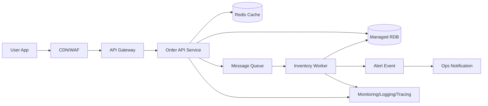

# 2026-03-21 Cloud Engineer Magazine
#cloud #aws #oci #gcp #architecture #daily
[[Home]]

## 1) 今日のアプリ
**アプリ名:** リアルタイム在庫アラート付き D2C EC バックエンド（API + 非同期在庫更新）

**ねらい:**
- 商品閲覧・注文は低レイテンシ
- 在庫更新はイベント駆動でスパイク耐性
- 欠品/過剰販売を防ぐ

> 今日の視点: **マルチクラウド比較（AWS / OCI / GCP）**

---

## 2) 要件整理（機能要件/非機能要件）
### 機能要件
- 商品一覧/詳細 API
- 注文作成 API
- 在庫引当（楽観ロック or 条件付き更新）
- 在庫閾値アラート通知（運用者向け）

### 非機能要件
- **可用性:** 注文APIはAZ障害に耐える（マルチAZ前提）
- **性能:** p95 レスポンス 200ms 目標（閲覧系）
- **セキュリティ:** 最小権限IAM、KMS暗号化、秘密情報はマネージドSecrets
- **コスト:** 通常時は小さく、セール時のみ自動スケール

---

## 3) 推奨アーキテクチャ（なぜその構成か）
**構成方針:**
- フロント向けAPIはマネージドAPIゲートウェイ + コンテナ実行基盤
- 注文確定後の在庫更新はメッセージキュー経由で非同期化
- 在庫データはトランザクション性重視のマネージドRDB
- 監視・通知を標準サービスで統合

**理由:**
1. 同期処理を最小化し、注文APIの体感速度を守る
2. キューでバースト吸収し、在庫更新ワーカーを水平スケール
3. RDBで整合性を担保し、在庫競合時の制御がしやすい
4. マネージド中心で運用負荷を下げる

---

## 4) クラウド別実装マップ
### AWS での実装サービス
- API公開: **Amazon API Gateway**
- アプリ実行: **Amazon ECS on Fargate**
- キュー: **Amazon SQS**
- DB: **Amazon Aurora (MySQL/PostgreSQL互換)**
- キャッシュ: **Amazon ElastiCache (Redis)**
- 認証: **Amazon Cognito**（顧客向け）+ **IAM**（サービス間）
- 監視: **Amazon CloudWatch** + **AWS X-Ray**
- 秘密情報: **AWS Secrets Manager**

### OCI での実装サービス
- API公開: **OCI API Gateway**
- アプリ実行: **OCI Container Instances**（または OKE）
- キュー: **OCI Queue**
- DB: **OCI Base Database Service (MySQL/HeatWave or PostgreSQL)**
- キャッシュ: **OCI Cache (Redis)**
- 認証: **OCI IAM**（必要に応じ IDCS/Identity Domains）
- 監視: **OCI Monitoring** + **Logging** + **Alarms**
- 秘密情報: **OCI Vault**

### GCP での実装サービス
- API公開: **API Gateway**
- アプリ実行: **Cloud Run**
- キュー: **Pub/Sub**
- DB: **Cloud SQL**
- キャッシュ: **Memorystore for Redis**
- 認証: **Identity and Access Management (IAM)**（ユーザーはIdentity Platformも選択肢）
- 監視: **Cloud Monitoring** + **Cloud Logging** + **Cloud Trace**
- 秘密情報: **Secret Manager**

**トレードオフ（短評）**
- サーバレス志向なら GCP Cloud Run + Pub/Sub がシンプル
- AWSは周辺機能が豊富で選択肢が多い（設計自由度高いが判断コスト増）
- OCIは価格性能比と統合管理が魅力、既存Oracle資産連携に強み

---

## 5) システム構成図（Mermaid）

---

## 6) データフロー/認証・認可/監視運用の要点
### データフロー
1. 商品参照: API → Redisヒット優先、ミス時RDB参照
2. 注文作成: APIで注文レコード作成 → キューへ在庫更新イベント投入
3. 在庫更新: ワーカーがイベント処理、条件付き更新で在庫引当
4. 閾値判定: 在庫しきい値以下なら通知イベント発行

### 認証・認可
- 顧客認証はOIDC/OAuth2ベース（Cognito / Identity Platform 等）
- サービス間アクセスはIAMロール/サービスアカウントで最小権限
- DB資格情報はSecrets Manager/OCI Vault/Secret Managerで管理
- 監査ログを有効化（API操作・IAM変更）

### 監視運用
- SLI例: 注文API成功率、p95レイテンシ、キュー滞留時間、在庫更新遅延
- アラート: エラーレート、DB接続飽和、DLQ増加
- 分散トレースでボトルネック特定

---

## 7) コスト最適化ポイント（初期・成長期）
### 初期
- 小さなインスタンス/最小コンテナ数で開始
- 開発・検証環境は稼働時間制御
- ログ保持期間を短めに設定

### 成長期
- 読み取り負荷をRedisへオフロード
- DBはリードレプリカ/ストレージ自動拡張を段階導入
- キュー処理を需要連動オートスケール
- 予約/コミットメント（Savings Plans 等）を利用検討

---

## 8) 障害時の設計（DR/バックアップ/フェイルオーバー）
- **DR方針:** まずリージョン内マルチAZ、次にクロスリージョン
- **バックアップ:** RDB自動バックアップ + PITR（可能な範囲で）
- **フェイルオーバー:** マネージドDBの自動フェイルオーバー機能を有効化
- **メッセージ保全:** キューの再試行 + DLQ（デッドレターキュー）
- **復旧演習:** 四半期ごとに復旧手順（Runbook）を検証

---

## 9) 学習ポイント（今日覚えるクラウド機能）
1. **非同期化（Queue/PubSub）**でAPI応答性と耐障害性を両立
2. **最小権限IAM**は「人」と「サービス間」で分けて設計
3. **DLQ運用**は“失敗を見える化”する実装上の要
4. **マネージドRDB + キャッシュ**の責務分離が性能/整合性の鍵

---

## 10) 30〜60分ミニ演習
**お題:** 「注文API + 在庫更新非同期ワーカー」の最小構成を1クラウドで作る

### 手順（45分目安）
1. APIエンドポイント `/orders` を1つ作成（ダミー可）
2. APIからキューへメッセージ投入
3. ワーカーでメッセージ受信し、ログに在庫更新処理を出力
4. 失敗時にDLQへ送る設定を有効化
5. メトリクス（キュー滞留/処理失敗）をダッシュボード化

**達成条件**
- API呼び出し→キュー→ワーカー処理まで確認
- 1回失敗を意図的に発生させ、DLQを確認

---

## 11) 公式ドキュメント参照リンク（AWS/OCI/GCP）
### AWS
- AWS ドキュメント: https://docs.aws.amazon.com/
- Amazon API Gateway: https://docs.aws.amazon.com/apigateway/
- Amazon ECS: https://docs.aws.amazon.com/ecs/
- Amazon SQS: https://docs.aws.amazon.com/sqs/
- Amazon Aurora: https://docs.aws.amazon.com/aurora/
- AWS Well-Architected Framework: https://docs.aws.amazon.com/wellarchitected/

### OCI
- OCI ドキュメント: https://docs.oracle.com/en-us/iaas/Content/home.htm
- API Gateway: https://docs.oracle.com/en-us/iaas/Content/APIGateway/home.htm
- Queue: https://docs.oracle.com/en-us/iaas/Content/queue/home.htm
- Container Instances: https://docs.oracle.com/en-us/iaas/Content/container-instances/home.htm
- Monitoring: https://docs.oracle.com/en-us/iaas/Content/Monitoring/home.htm
- Vault: https://docs.oracle.com/en-us/iaas/Content/KeyManagement/home.htm

### GCP
- Google Cloud ドキュメント: https://docs.cloud.google.com/docs
- API Gateway: https://docs.cloud.google.com/api-gateway/docs
- Cloud Run: https://docs.cloud.google.com/run/docs
- Pub/Sub: https://docs.cloud.google.com/pubsub/docs
- Cloud SQL: https://docs.cloud.google.com/sql/docs
- Architecture Framework: https://docs.cloud.google.com/architecture/framework

---

**明日の予告:** IoTセンサーデータ収集アプリ（時系列データ基盤と可視化、単一クラウド深掘り版）
