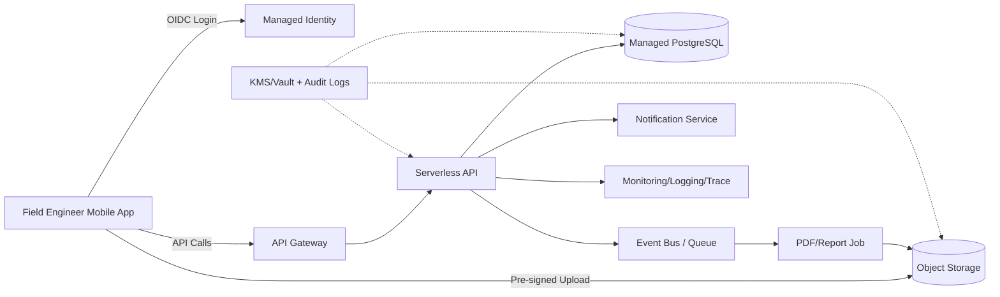

[[Home]]

# Cloud Engineer Magazine（2026-03-22）

## 1) 今日のアプリ
**現場向け「設備点検レポート SaaS」**（写真付き点検、音声メモ、オフライン一時保存、報告書PDF自動生成）

- 想定ユーザー: 保守会社のフィールドエンジニア（100〜2,000人）
- 特徴: モバイル中心、朝夕にアクセス集中、画像アップロード多め

---

## 2) 要件整理（機能要件/非機能要件）

### 機能要件
- 点検フォーム入力（テンプレート可変）
- 写真・動画のアップロード
- 音声メモのテキスト化（任意）
- 承認ワークフロー（担当→管理者）
- PDF出力・メール配布

### 非機能要件
- **可用性**: 業務時間帯 99.9%以上、AZ障害で継続
- **性能**: API p95 < 300ms、画像アップロード再試行対応
- **セキュリティ**: SSO/OIDC、最小権限IAM、保存時暗号化、監査ログ
- **コスト**: 初期はサーバレス中心、成長時に一部コンテナ常時稼働へ最適化

---

## 3) 推奨アーキテクチャ（なぜその構成か）

**推奨方針: 「サーバレスAPI + オブジェクトストレージ + マネージドDB」**

- 変動トラフィックに追随しやすく、初期コストを抑えやすい
- 画像・添付ファイルはオブジェクトストレージで安価にスケール
- 認証をマネージドID基盤に寄せ、アプリ側の実装負担とリスクを削減
- イベント駆動で「PDF生成」「通知」「監査連携」を非同期化し、API応答を高速化

**トレードオフ**
- サーバレスはコールドスタートと実行時間制約がある
- 長時間処理（重い画像変換など）はコンテナジョブへ逃がす設計が有効

---

## 4) クラウド別実装マップ

### AWS
- フロント/API: Amazon API Gateway + AWS Lambda
- 認証: Amazon Cognito（OIDC/SAML連携）
- DB: Amazon Aurora Serverless v2（PostgreSQL互換）
- ファイル: Amazon S3（署名付きURLアップロード）
- 非同期: Amazon EventBridge / Amazon SQS
- PDFバッチ: AWS Fargate（必要時）
- 監視: Amazon CloudWatch + AWS X-Ray
- 鍵管理/監査: AWS KMS + AWS CloudTrail

### OCI
- フロント/API: OCI API Gateway + OCI Functions
- 認証: OCI Identity Domains
- DB: OCI Autonomous Database（JSON/トランザクション併用可）
- ファイル: Object Storage
- 非同期: OCI Queue + Events
- PDFバッチ: Container Instances もしくは OKE Job
- 監視: OCI Monitoring + Logging + Application Performance Monitoring
- 鍵管理/監査: OCI Vault + Audit

### GCP
- フロント/API: API Gateway + Cloud Run（または Cloud Functions）
- 認証: Identity Platform / IAM（企業ID連携はCloud Identity側も検討）
- DB: Cloud SQL for PostgreSQL（将来はSpanner検討）
- ファイル: Cloud Storage
- 非同期: Pub/Sub + Eventarc
- PDFバッチ: Cloud Run Jobs
- 監視: Cloud Monitoring + Cloud Logging + Cloud Trace
- 鍵管理/監査: Cloud KMS + Cloud Audit Logs

---

## 5) システム構成図（Mermaid）

---

## 6) データフロー/認証・認可/監視運用の要点

### データフロー
1. モバイルがID基盤でログインしトークン取得
2. APIで点検メタデータ保存（DB）
3. 画像は署名付きURLで直接オブジェクトストレージへ
4. 完了イベントでPDF生成ジョブ起動
5. 出力PDF保存後、通知（メール/チャット）

### 認証・認可
- APIはJWT検証を必須化
- RBAC（作業者/承認者/監査者）をクレーム＋DBポリシーで二重管理
- IAMは**最小権限**（関数ごとに実行ロール分離）

### 監視運用
- SLI: API成功率、p95レイテンシ、ジョブ成功率
- アラート: 5xx増加、キュー滞留、DB接続逼迫
- 監査: 管理操作と権限変更をAudit/Trailで定期レビュー

---

## 7) コスト最適化ポイント（初期・成長期）

### 初期
- サーバレス中心でアイドル課金を最小化
- ストレージはライフサイクルで低頻度層へ自動移行
- 開発/検証環境は夜間停止

### 成長期
- 高頻度APIのみ常時コンテナ化（予測可能コスト）
- DBはリードレプリカ/接続プールでスケール、過剰スペック回避
- CDN + 画像サムネイルで転送量最適化

---

## 8) 障害時の設計（DR/バックアップ/フェイルオーバー）

- **RPO/RTO目安**: RPO 15分、RTO 60分
- DB: 自動バックアップ + PITR、有事は別リージョンへリストア
- オブジェクト: クロスリージョンレプリケーション（重要バケット）
- API: IaCで別リージョン再デプロイ可能に
- Runbook整備: 「IDP障害時」「DB遅延時」「キュー滞留時」を訓練

---

## 9) 学習ポイント（今日覚えるクラウド機能）

- **AWS**: S3署名付きURLでアプリ経由アップロードを回避し、API負荷とリスクを下げる
- **OCI**: Identity Domains + API Gateway + Functions で一貫したゼロトラスト入口を作る
- **GCP**: Eventarc/Pub/Sub でイベント駆動を標準化し、疎結合化を進める

---

## 10) 30〜60分ミニ演習

**演習: 「写真付き点検登録API」を1本作る（任意クラウド）**

1. APIエンドポイント `POST /inspections` を作成
2. DBに `inspection_id, site_id, status, created_by` を保存
3. 画像アップロード用の署名付きURL発行APIを追加
4. 最小権限IAMを設定（API実行ロールとストレージ書込ロール分離）
5. メトリクス（成功率/レイテンシ）をダッシュボード表示

完了条件:
- 200件の簡易負荷でエラー率1%未満
- 監査ログで管理操作を追跡できる

---

## 11) 公式ドキュメント参照リンク（AWS/OCI/GCP）

### AWS
- Well-Architected Framework: https://docs.aws.amazon.com/wellarchitected/latest/framework/welcome.html
- Amazon API Gateway: https://docs.aws.amazon.com/apigateway/
- AWS Lambda: https://docs.aws.amazon.com/lambda/
- Amazon S3: https://docs.aws.amazon.com/s3/
- Amazon Cognito: https://docs.aws.amazon.com/cognito/
- Aurora Serverless v2: https://docs.aws.amazon.com/AmazonRDS/latest/AuroraUserGuide/aurora-serverless-v2.html
- AWS KMS: https://docs.aws.amazon.com/kms/
- AWS CloudTrail: https://docs.aws.amazon.com/cloudtrail/

### OCI
- OCI Architecture Center: https://docs.oracle.com/en-us/iaas/Content/Architecture/home.htm
- API Gateway: https://docs.oracle.com/en-us/iaas/Content/APIGateway/home.htm
- Functions: https://docs.oracle.com/en-us/iaas/Content/Functions/home.htm
- Identity and Access Management / Identity Domains: https://docs.oracle.com/en-us/iaas/Content/Identity/home.htm
- Object Storage: https://docs.oracle.com/en-us/iaas/Content/Object/home.htm
- Autonomous Database: https://docs.oracle.com/en-us/iaas/autonomous-database/
- Vault: https://docs.oracle.com/en-us/iaas/Content/KeyManagement/home.htm
- Audit: https://docs.oracle.com/en-us/iaas/Content/Audit/home.htm

### GCP
- Google Cloud Architecture Framework: https://docs.cloud.google.com/architecture/framework
- API Gateway: https://docs.cloud.google.com/api-gateway
- Cloud Run: https://docs.cloud.google.com/run
- Cloud Storage: https://docs.cloud.google.com/storage
- Cloud SQL: https://docs.cloud.google.com/sql
- Pub/Sub: https://docs.cloud.google.com/pubsub
- Eventarc: https://docs.cloud.google.com/eventarc
- Cloud KMS: https://docs.cloud.google.com/kms
- Cloud Audit Logs: https://docs.cloud.google.com/logging/docs/audit
