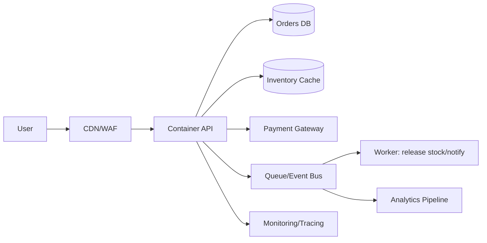

#cloud #aws #oci #gcp #architecture #daily
[[Home]]

# Cloud Engineer Magazine（2026-03-23）

## 1) 今日のアプリ
**フラッシュセール対応「在庫引当付き注文API」**

- 想定: セール時に通常の20〜50倍トラフィック
- 目的: 「売り越し防止」と「高速決済導線」を両立
- 今日の視点: **マルチクラウド比較（AWS/OCI/GCPで同等設計を作る）**

---

## 2) 要件整理（機能要件/非機能要件）

### 機能要件
- 商品表示、カート投入、注文作成
- 在庫の仮引当（TTL付き）→ 決済成功で確定
- 決済失敗/タイムアウト時の在庫戻し
- 注文イベントを下流（配送/分析）へ配信

### 非機能要件
- **可用性**: セール時間帯 99.95%、単一AZ障害では継続
- **性能**: API p95 < 200ms、在庫引当API p99 < 120ms
- **セキュリティ**: 最小権限IAM、WAF、保存時暗号化、監査ログ必須
- **コスト**: 平常時は小さく、ピーク時のみ自動スケール

---

## 3) 推奨アーキテクチャ（なぜその構成か）

**推奨: 「コンテナAPI + キャッシュ在庫 + RDB確定 + 非同期イベント」**

- 在庫判定のホットパスをインメモリ（Redis系）へ寄せて低遅延化
- 注文確定はRDBのトランザクションで整合性を担保
- 決済・通知・分析連携はイベント駆動でAPIから分離
- API層はマネージドコンテナで急激なスパイクに追随

**トレードオフ**
- Redis中心は速いが、永続整合性の境界を明確に設計する必要
- RDB単体で全処理を行うと整合性は高いが、ピーク時の待ちが増えやすい

---

## 4) クラウド別実装マップ

### AWS での実装サービス
- Edge保護: Amazon CloudFront + AWS WAF + AWS Shield
- API: Amazon EKS または Amazon ECS on Fargate + Application Load Balancer
- 在庫キャッシュ: Amazon ElastiCache for Redis
- 注文DB: Amazon Aurora PostgreSQL
- 非同期: Amazon SQS（在庫戻し/通知）+ Amazon EventBridge
- 監視: Amazon CloudWatch + AWS X-Ray
- IAM/鍵/監査: IAM, AWS KMS, AWS CloudTrail

### OCI での実装サービス
- Edge保護: OCI Load Balancer + OCI WAF
- API: OKE（Oracle Container Engine for Kubernetes）
- 在庫キャッシュ: OCI Cache (Redis)
- 注文DB: OCI Autonomous Database（Transaction Processing）
- 非同期: OCI Queue + OCI Events + OCI Streaming（分析連携）
- 監視: OCI Monitoring + Logging + Application Performance Monitoring
- IAM/鍵/監査: OCI IAM, OCI Vault, OCI Audit

### GCP での実装サービス
- Edge保護: Cloud Load Balancing + Cloud Armor + reCAPTCHA Enterprise（必要時）
- API: GKE Autopilot または Cloud Run
- 在庫キャッシュ: Memorystore for Redis
- 注文DB: Cloud SQL for PostgreSQL（高成長でSpanner検討）
- 非同期: Pub/Sub + Eventarc + Cloud Tasks（リトライ制御）
- 監視: Cloud Monitoring + Cloud Logging + Cloud Trace
- IAM/鍵/監査: IAM, Cloud KMS, Cloud Audit Logs

---

## 5) システム構成図（Mermaid）

---

## 6) データフロー/認証・認可/監視運用の要点

- **データフロー**: 
  1. 注文開始で在庫をRedisにTTL仮引当
  2. 決済成功でRDB確定・在庫減算確定
  3. 決済失敗/TTL切れで非同期ワーカーが在庫解放
- **認証・認可**:
  - ユーザー認証はOIDC
  - サービス間認可はIAMロール/サービスアカウントで**最小権限**
  - DB接続情報はSecrets管理（KMS/Vault暗号化）
- **監視運用**:
  - SLI: API遅延、引当失敗率、決済成功率、在庫不整合件数
  - アラート: エラーレート閾値 + SLOバーンレート

---

## 7) コスト最適化ポイント（初期・成長期）

- **初期**:
  - APIは小さめオートスケール最小台数
  - DBは最小サイズ＋ストレージ自動拡張
  - ログ保持期間を短め（要件に合わせる）
- **成長期**:
  - Savings Plans/Committed Use/Reserved Capacityの適用
  - Redis/DBの読み取り分離、重い分析はOLTPから分離
  - セール予測に合わせた事前スケール

---

## 8) 障害時の設計（DR/バックアップ/フェイルオーバー）

- マルチAZ構成を基本（API/DB/Redis）
- DBは自動バックアップ + PITR（Point-in-Time Recovery）
- キューは再処理可能な冪等設計（注文IDで重複排除）
- リージョン障害対策:
  - RTO/RPO要件に応じてクロスリージョンレプリカ
  - DNS/Global LBでフェイルオーバー手順を定期演習

---

## 9) 学習ポイント（今日覚えるクラウド機能）

- **AWS**: ElastiCache Redis + SQS可視性タイムアウト設計
- **OCI**: QueueとEventsの使い分け、Autonomous DBの運用軽減
- **GCP**: Pub/Sub再配信設計、Cloud Tasksで制御された再試行

---

## 10) 30〜60分ミニ演習

1. 1つのクラウドを選び、以下を紙に設計
   - 注文API
   - 在庫仮引当（TTL）
   - 決済失敗時の在庫戻しフロー
2. 「二重注文」発生時の冪等キー設計を書く
3. 監視指標4つとアラート条件2つを決める

**ゴール**: 「速い」だけでなく「売り越しを防げる」設計を説明できること。

---

## 11) 公式ドキュメント参照リンク（AWS/OCI/GCP）

### AWS
- Well-Architected Framework: https://docs.aws.amazon.com/wellarchitected/latest/framework/welcome.html
- Amazon ECS: https://docs.aws.amazon.com/ecs/
- ElastiCache for Redis: https://docs.aws.amazon.com/AmazonElastiCache/latest/dg/WhatIs.html
- Amazon SQS: https://docs.aws.amazon.com/AWSSimpleQueueService/latest/SQSDeveloperGuide/welcome.html
- Aurora: https://docs.aws.amazon.com/AmazonRDS/latest/AuroraUserGuide/CHAP_AuroraOverview.html

### OCI
- OCI Architecture Center: https://docs.oracle.com/en/solutions/
- OKE: https://docs.oracle.com/en-us/iaas/Content/ContEng/home.htm
- OCI Queue: https://docs.oracle.com/en-us/iaas/Content/queue/home.htm
- Autonomous Database: https://docs.oracle.com/en-us/iaas/autonomous-database-serverless/doc/
- OCI WAF: https://docs.oracle.com/en-us/iaas/Content/WAF/home.htm

### GCP
- Architecture Framework: https://docs.cloud.google.com/architecture/framework
- GKE: https://docs.cloud.google.com/kubernetes-engine/docs
- Cloud Run: https://docs.cloud.google.com/run/docs
- Memorystore for Redis: https://docs.cloud.google.com/memorystore/docs/redis
- Pub/Sub: https://docs.cloud.google.com/pubsub/docs/overview
- Cloud SQL: https://docs.cloud.google.com/sql/docs
