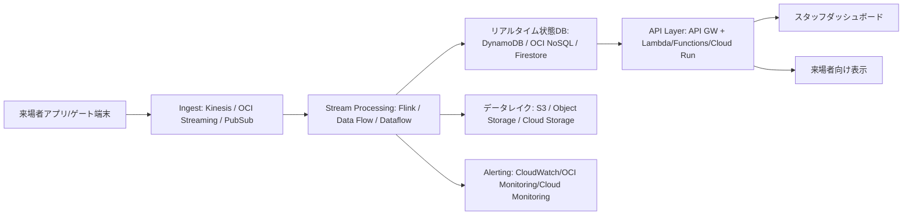

# 2026-03-24 10:15 Cloud Engineer Magazine
[[Home]]

#cloud #aws #oci #gcp #architecture #daily

## 1) 今日のアプリ
**イベント向け「リアルタイム混雑可視化アプリ」**

会場内の各エリア（受付、セッション会場、物販、休憩所）の混雑度を、スタッフ用ダッシュボードと来場者向けモバイル画面にリアルタイム表示する。

- スマホ位置情報（同意済み）やゲート通過ログを収集
- 1分未満遅延で混雑度更新
- 閾値超過時にスタッフへ通知

> 今日の視点: **マルチクラウド比較（AWS/OCI/GCP いずれでも実装可能な標準構成）**

---

## 2) 要件整理（機能要件/非機能要件）
### 機能要件
- 位置・通過イベントの取り込み（ピーク時: 5,000 events/sec）
- エリア別混雑スコア算出（ストリーミング集計）
- Web/モバイルへの配信（API + push）
- 管理画面（閾値設定、アラート管理）

### 非機能要件
- **可用性**: 稼働率 99.9% 以上、単一AZ障害で継続
- **性能**: 取り込みから表示まで P95 30秒以内
- **セキュリティ**: 最小権限IAM、暗号化（保存時/転送時）、監査ログ
- **コスト**: 通常時は低コスト、イベント当日だけスケールアウト

---

## 3) 推奨アーキテクチャ（なぜその構成か）
**イベント駆動 + マネージド基盤**を採用。

- 取り込み層: 高スループットなマネージドメッセージング
- 処理層: ストリーム処理でウィンドウ集計
- 提供層: 低レイテンシDB + API
- 運用層: メトリクス/ログ/トレース + アラート

**理由**
1. 突発トラフィックに強い（自動スケール）
2. サーバ管理を減らし運用負荷を低減
3. IAMとKMSで secure-by-default を実現しやすい

---

## 4) クラウド別実装マップ
### AWS での実装サービス
- Ingest: **Amazon Kinesis Data Streams**
- Stream処理: **Amazon Managed Service for Apache Flink**
- API: **Amazon API Gateway** + **AWS Lambda**
- データ: **Amazon DynamoDB**（現在値）+ **Amazon S3**（履歴保管）
- 認証: **Amazon Cognito**
- 監視: **Amazon CloudWatch** + **AWS X-Ray**
- 秘密情報/鍵: **AWS KMS** + **AWS Secrets Manager**

### OCI での実装サービス
- Ingest: **OCI Streaming**
- Stream処理: **OCI Data Flow (Apache Spark)** または Functions連携
- API: **OCI API Gateway** + **OCI Functions**
- データ: **OCI NoSQL Database**（現在値）+ **Object Storage**（履歴）
- 認証: **OCI IAM**（必要に応じて Identity Domains）
- 監視: **OCI Monitoring** + **Logging** + **Logging Analytics**
- 鍵管理: **OCI Vault**

### GCP での実装サービス
- Ingest: **Pub/Sub**
- Stream処理: **Dataflow (Apache Beam)**
- API: **API Gateway** + **Cloud Run**
- データ: **Firestore/Bigtable（用途別）** + **Cloud Storage**
- 認証: **Identity Platform** または IAM連携
- 監視: **Cloud Monitoring** + **Cloud Logging** + **Cloud Trace**
- 鍵管理: **Cloud KMS** + **Secret Manager**

**トレードオフ（短評）**
- 低運用で始めるなら: GCP（Pub/Sub + Dataflow + Cloud Run）
- AWS既存資産が多いなら: Kinesis/Flink連携が自然
- OCI中心のコスト最適化やOracle資産連携があるなら: OCI Streaming + NoSQL が有効

---

## 5) システム構成図（Mermaid）

---

## 6) データフロー/認証・認可/監視運用の要点
- **データフロー**: 端末→Ingest→ストリーム集計→現在値DB更新→API配信、同時に履歴をオブジェクトストレージへ保存
- **認証・認可**:
  - 管理者画面はOIDC連携
  - サービス間はIAMロール/動的グループ/サービスアカウントで最小権限
  - 端末キーはSecrets Manager/Vault/Secret Managerで保護
- **監視運用**:
  - SLI: 取り込み遅延、集計遅延、API P95
  - SLO逸脱で自動通知
  - 監査ログ（API呼び出し/IAM変更）を長期保存

---

## 7) コスト最適化ポイント（初期・成長期）
### 初期
- サーバレス中心（Lambda/Functions/Cloud Run）で固定費を圧縮
- 保存はライフサイクル設定で低頻度層へ自動移行
- 開発/検証は小容量ストリームで開始

### 成長期
- ストリーム処理を予約/コミットメント割引へ移行（各クラウドの割引制度）
- 高頻度アクセスデータのみ高速DB、履歴は安価ストレージへ
- ダッシュボード更新頻度を要件に合わせて最適化

---

## 8) 障害時の設計（DR/バックアップ/フェイルオーバー）
- **DR方針**: 同一リージョン内マルチAZを基本、重要イベント時はクロスリージョン複製を有効化
- **バックアップ**:
  - 現在値DBの定期バックアップ
  - オブジェクトストレージはバージョニング + イミュータブル設定（可能な範囲）
- **フェイルオーバー**:
  - APIはヘルスチェック + 自動切替
  - ストリームコンシューマ障害時はチェックポイント再開
- **目標例**: RPO 5分、RTO 30分

---

## 9) 学習ポイント（今日覚えるクラウド機能）
1. **ストリーム処理のチェックポイント設計**（再処理と重複排除）
2. **最小権限IAM**（実行ロールを用途別に分離）
3. **メトリクス駆動運用**（遅延SLIを中心にアラート設計）

---

## 10) 30〜60分ミニ演習
**お題:** 「混雑度API」を最小構成で作る

1. Ingestトピック/ストリームを1つ作成
2. サンプルイベント（JSON）を投入
3. 関数（Lambda/Functions/Cloud Run）で集計値をNoSQLへ書き込み
4. GET `/areas/{id}/crowd` APIを公開
5. 監視アラートを1つ設定（処理遅延しきい値）

完了条件:
- 3エリア以上の混雑度がAPIで取得できる
- 遅延アラートのテスト通知を確認できる

---

## 11) 公式ドキュメント参照リンク（AWS/OCI/GCP）
### AWS
- Well-Architected Framework: https://docs.aws.amazon.com/wellarchitected/latest/framework/welcome.html
- Amazon Kinesis Data Streams: https://docs.aws.amazon.com/streams/latest/dev/introduction.html
- Managed Service for Apache Flink: https://docs.aws.amazon.com/managed-flink/latest/java/what-is.html
- API Gateway: https://docs.aws.amazon.com/apigateway/latest/developerguide/welcome.html
- DynamoDB: https://docs.aws.amazon.com/amazondynamodb/latest/developerguide/Introduction.html

### OCI
- OCI Architecture Center: https://docs.oracle.com/en-us/iaas/Content/Architecture/Reference-Architectures/reference-architectures.htm
- OCI Streaming: https://docs.oracle.com/en-us/iaas/Content/Streaming/home.htm
- OCI Data Flow: https://docs.oracle.com/en-us/iaas/data-flow/using/home.htm
- OCI API Gateway: https://docs.oracle.com/en-us/iaas/Content/APIGateway/home.htm
- OCI NoSQL Database: https://docs.oracle.com/en-us/iaas/nosql-database/index.html

### GCP
- Google Cloud Architecture Framework: https://docs.cloud.google.com/architecture/framework
- Pub/Sub: https://docs.cloud.google.com/pubsub/docs/overview
- Dataflow: https://docs.cloud.google.com/dataflow/docs/overview
- API Gateway: https://docs.cloud.google.com/api-gateway/docs
- Firestore: https://docs.cloud.google.com/firestore/docs/overview
