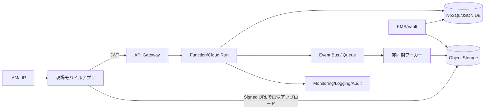

# Cloud Engineer Magazine — 2026-03-25
Tags: #cloud #aws #oci #gcp #architecture #daily  
Links: [[Home]]

## 1) 今日のアプリ
**建設・設備向け「写真付き点検報告アプリ」**（モバイル）  
- 作業員が現場で写真・チェックリスト・コメントを登録
- オフライン時は端末保持、オンライン復帰で同期
- 管理者はWebダッシュボードで進捗・不備を確認

## 2) 要件整理（機能要件/非機能要件）
### 機能要件
- 点検項目の取得、回答保存、写真アップロード
- 作業員/管理者ロール分離
- 日次レポート出力（CSV/PDF）

### 非機能要件
- **可用性**: 業務時間帯に高可用（API/DB マルチAZ相当）
- **性能**: 画像アップロード時でもAPI P95 < 300ms（画像本体はオブジェクトストレージ直送）
- **セキュリティ**: 最小権限IAM、保存時暗号化、監査ログ
- **コスト**: 初期はサーバレス中心、利用増で一部を定常基盤へ

## 3) 推奨アーキテクチャ（なぜその構成か）
**方針: APIはサーバレス、画像はオブジェクトストレージ、分析は後段バッチ**  
- モバイル→API Gateway相当→関数実行→トランザクションDB
- 画像は**署名付きURL**で直接オブジェクトストレージへ（API帯域を節約）
- 変更イベントで非同期処理（サムネイル生成・通知）
- 監査・運用は統合ログ＋メトリクス＋アラート

**採用理由**
- 初期の負荷変動に強い（過剰プロビジョニング不要）
- 画像転送を分離し、APIレイテンシとコストを安定化
- IAMとKMSで secure-by-default を実装しやすい

## 4) クラウド別実装マップ
### AWS での実装サービス
- 認証: **Amazon Cognito**（User Pool + JWT）
- API: **Amazon API Gateway**
- アプリ処理: **AWS Lambda**
- DB: **Amazon DynamoDB**（点検データ）
- 画像保存: **Amazon S3**（pre-signed URL）
- 非同期: **Amazon EventBridge / SQS**
- 監視: **Amazon CloudWatch / AWS CloudTrail**
- 鍵管理: **AWS KMS**

### OCI での実装サービス
- 認証: **OCI IAM**（ID管理、ポリシー）
- API: **OCI API Gateway**
- アプリ処理: **OCI Functions**
- DB: **Autonomous JSON Database**（または Autonomous Transaction Processing）
- 画像保存: **Object Storage**（Pre-Authenticated Request）
- 非同期: **OCI Streaming / Notifications**
- 監視: **OCI Monitoring / Logging / Audit**
- 鍵管理: **OCI Vault**

### GCP での実装サービス
- 認証: **Identity Platform**（または Firebase Authentication）
- API: **API Gateway**
- アプリ処理: **Cloud Run**（または Cloud Functions）
- DB: **Firestore**（点検データ）
- 画像保存: **Cloud Storage**（Signed URL）
- 非同期: **Pub/Sub**
- 監視: **Cloud Monitoring / Cloud Logging / Cloud Audit Logs**
- 鍵管理: **Cloud KMS**

## 5) システム構成図（Mermaid）

## 6) データフロー/認証・認可/監視運用の要点
- **データフロー**: メタデータはAPI経由、画像本体はストレージ直送
- **認証・認可**:
  - モバイルログイン後にJWT付与
  - API側でJWT検証 + ロール（作業員/管理者）ごとにアクセス制御
  - バックエンド権限は実行ロールに限定（最小権限）
- **監視運用**:
  - RED指標（Rate/Error/Duration）をダッシュボード化
  - 4xx/5xx急増、キュー滞留、関数失敗率でアラート
  - 監査ログは改ざん耐性を考慮して長期保管

## 7) コスト最適化ポイント（初期・成長期）
- **初期**:
  - サーバレス徹底（Lambda/Functions/Cloud Run）
  - オブジェクトストレージのライフサイクルで低頻度層へ移行
  - 開発/検証環境は自動停止
- **成長期**:
  - 高頻度APIは予約/コミットメント系割引を検討
  - 画像サムネイル生成をバッチ化し実行回数を削減
  - DBアクセスパターンを見直し（GSI/インデックス過多の抑制）

## 8) 障害時の設計（DR/バックアップ/フェイルオーバー）
- API/実行基盤はマネージド冗長を利用（AZ分散）
- DBはポイントインタイムリカバリ有効化
- オブジェクトストレージはバージョニング + クロスリージョン複製（重要データのみ）
- RTO/RPOを定義（例: RTO 60分、RPO 15分）し、四半期ごとに復旧訓練

## 9) 学習ポイント（今日覚えるクラウド機能）
1. 署名付きURL（S3/OCI Object Storage/GCS）で安全に直接アップロード
2. サーバレス + イベント駆動でスパイク吸収
3. IAMの最小権限設計（実行ロール分離、監査ログ必須）

## 10) 30〜60分ミニ演習
**お題**: 「画像直送アップロード」を1クラウドで実装して比較メモ作成
1. APIで署名付きURLを発行
2. curlで画像アップロード
3. DBにメタデータ保存（ファイルキー、作業ID、時刻）
4. 失敗ケース（期限切れURL、権限不足）を再現
5. 学びを3行で記録（性能/セキュリティ/運用）

## 11) 公式ドキュメント参照リンク（AWS/OCI/GCP）
### AWS
- API Gateway: https://docs.aws.amazon.com/apigateway/
- Lambda: https://docs.aws.amazon.com/lambda/
- DynamoDB: https://docs.aws.amazon.com/dynamodb/
- S3 Pre-signed URL: https://docs.aws.amazon.com/AmazonS3/latest/userguide/ShareObjectPreSignedURL.html
- Cognito: https://docs.aws.amazon.com/cognito/
- CloudWatch: https://docs.aws.amazon.com/cloudwatch/
- KMS: https://docs.aws.amazon.com/kms/

### OCI
- API Gateway: https://docs.oracle.com/en-us/iaas/Content/APIGateway/home.htm
- Functions: https://docs.oracle.com/en-us/iaas/Content/Functions/home.htm
- Object Storage (Pre-Authenticated Requests): https://docs.oracle.com/en-us/iaas/Content/Object/Tasks/usingpreauthenticatedrequests.htm
- Monitoring: https://docs.oracle.com/en-us/iaas/Content/Monitoring/home.htm
- Logging: https://docs.oracle.com/en-us/iaas/Content/Logging/home.htm
- Vault: https://docs.oracle.com/en-us/iaas/Content/KeyManagement/home.htm

### GCP
- API Gateway: https://docs.cloud.google.com/api-gateway/docs
- Cloud Run: https://docs.cloud.google.com/run/docs
- Firestore: https://docs.cloud.google.com/firestore/docs
- Cloud Storage Signed URLs: https://docs.cloud.google.com/storage/docs/access-control/signed-urls
- Pub/Sub: https://docs.cloud.google.com/pubsub/docs
- Cloud Monitoring: https://docs.cloud.google.com/monitoring/docs
- Cloud KMS: https://docs.cloud.google.com/kms/docs

---
**トレードオフ一言メモ**  
- AWS: サービス連携の選択肢が広く拡張しやすい一方、構成自由度が高く設計責任も重い。  
- OCI: コスト効率とシンプル設計がしやすい一方、チームの既存知見が少ない場合は学習コストが出る。  
- GCP: Cloud Run/Firestoreで開発速度が高い一方、厳密なRDB要件では別サービス選定が必要。
