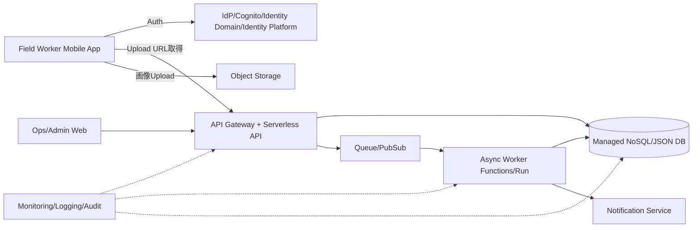

# Cloud Engineer Magazine — 2026-03-26
#cloud #aws #oci #gcp #architecture #daily
[[Home]]

## 1) 今日のアプリ
**現場写真付き・設備点検レポートアプリ（モバイル対応）**

- 作業員がスマホで点検結果を入力（チェック項目、写真、位置情報、コメント）
- オフライン時は端末保存、オンライン復帰で同期
- 管理者はWebダッシュボードで進捗・異常検知・是正指示

---

## 2) 要件整理（機能要件/非機能要件）

### 機能要件
- 点検テンプレート管理（設備ごと）
- 点検結果登録（画像アップロード含む）
- 異常時の即時通知（メール/チャット連携）
- 履歴検索（設備ID・期間・拠点）

### 非機能要件
- **可用性**: 営業時間中の継続利用（マルチAZ前提）
- **性能**: 画像アップロード時でもAPI P95 < 300ms（メタデータ処理）
- **セキュリティ**: 端末・API・ストレージを暗号化、最小権限IAM
- **コスト**: 初期はサーバレス中心、利用増に応じて段階的最適化

---

## 3) 推奨アーキテクチャ（なぜその構成か）

**推奨方針: APIサーバレス + オブジェクトストレージ + マネージドDB + 非同期処理**

理由:
1. **変動トラフィックに強い**（点検時間帯に集中）
2. **運用負荷が低い**（OS/ミドル管理を減らせる）
3. **画像処理を非同期化**し、ユーザー操作の体感を維持できる
4. **段階的スケール**しやすい（初期は従量課金、成長後に予約/コミット最適化）

---

## 4) クラウド別実装マップ

### AWS での実装サービス
- フロント: S3 + CloudFront
- 認証: Amazon Cognito（ユーザープール）
- API: API Gateway + AWS Lambda
- DB: Amazon DynamoDB（点検メタデータ）
- 画像保存: Amazon S3（SSE有効）
- 非同期: Amazon SQS + Lambda
- 監視: CloudWatch + X-Ray + CloudTrail
- 秘密情報: AWS Secrets Manager

**トレードオフ**: DynamoDBは高スケールに強いが、クエリ設計を先に固める必要あり。

### OCI での実装サービス
- フロント: Object Storage + CDN
- 認証: OCI IAM Identity Domains
- API: API Gateway + OCI Functions
- DB: Autonomous JSON Database（または ATP）
- 画像保存: Object Storage（暗号化）
- 非同期: OCI Queue + Functions
- 監視: OCI Monitoring + Logging + Events
- 秘密情報: OCI Vault

**トレードオフ**: Autonomous系は運用容易だが、ワークロード特性によってはコスト評価が重要。

### GCP での実装サービス
- フロント: Cloud Storage + Cloud CDN
- 認証: Identity Platform（または Firebase Authentication）
- API: API Gateway + Cloud Run（または Cloud Functions）
- DB: Firestore（ドキュメント）
- 画像保存: Cloud Storage（CMEK検討可）
- 非同期: Pub/Sub + Cloud Run
- 監視: Cloud Monitoring + Cloud Logging + Cloud Trace + Audit Logs
- 秘密情報: Secret Manager

**トレードオフ**: Firestoreは開発速度が高い一方、複雑集計はBigQuery連携など設計が必要。

---

## 5) システム構成図（Mermaid）

---

## 6) データフロー/認証・認可/監視運用の要点

### データフロー
1. モバイルが認証トークン取得
2. APIが署名付きURLを発行
3. 画像はクライアントから直接Object Storageへ
4. メタデータのみAPIでDBへ保存
5. 非同期ワーカーが画像検証/サムネイル生成/通知

### 認証・認可
- JWT/OIDCベース認証
- APIごとに**最小権限IAMロール**を分離（Upload専用、参照専用、管理者）
- ストレージバケットは公開禁止、必要時のみ期限付きURL
- KMS管理鍵（または同等機能）で暗号化キー統制

### 監視運用
- SLI例: API成功率、P95レイテンシ、キュー滞留時間
- アラート例: エラー率急増、DLQ件数、認証失敗スパイク
- 監査: API呼び出し・権限変更・鍵操作を監査ログ化

---

## 7) コスト最適化ポイント（初期・成長期）

### 初期
- サーバレス中心（常時稼働VMを避ける）
- オブジェクトストレージのライフサイクルで低頻度層へ移行
- ログ保持期間を用途別に短/中/長で分離

### 成長期
- 高頻度APIはコンテナ常駐（Cloud Run最小インスタンス等）を検討
- リード負荷増はキャッシュ層導入（CloudFront/CDN + APIキャッシュ）
- 予約/コミットメント（Savings Plans/Committed Use等）を適用

---

## 8) 障害時の設計（DR/バックアップ/フェイルオーバー）

- **RPO/RTO定義**: 例 RPO 15分 / RTO 1時間
- DBバックアップの自動化と定期リストア訓練
- オブジェクトストレージはバージョニング + クロスリージョン複製を検討
- キュー再処理（DLQ）手順をRunbook化
- 重要APIはリージョン障害時のDNS/トラフィック切替計画を準備

---

## 9) 学習ポイント（今日覚えるクラウド機能）

- **Presigned URL / Signed URL**で大容量アップロードをAPI分離
- **イベント駆動（Queue/PubSub）**で同期APIを軽量化
- **監査ログ + 最小権限IAM**で secure-by-default を実現

---

## 10) 30〜60分ミニ演習

1. 任意クラウドで「APIがアップロード用URLを返す」エンドポイントを作る
2. ストレージへ直接アップロードし、DBにメタデータ保存
3. 失敗時にDLQへ送る設定を追加
4. 最後に「誰が何をアップロードしたか」をログで追跡

**ゴール**: 「同期API最小化 + 非同期処理 + 監査可能」の基本形を体験する。

---

## 11) 公式ドキュメント参照リンク（AWS/OCI/GCP）

### AWS
- Well-Architected Framework: https://docs.aws.amazon.com/wellarchitected/latest/framework/welcome.html
- Amazon API Gateway: https://docs.aws.amazon.com/apigateway/
- AWS Lambda: https://docs.aws.amazon.com/lambda/
- Amazon S3: https://docs.aws.amazon.com/s3/
- Amazon DynamoDB: https://docs.aws.amazon.com/dynamodb/
- Amazon SQS: https://docs.aws.amazon.com/sqs/
- Amazon Cognito: https://docs.aws.amazon.com/cognito/
- AWS IAM: https://docs.aws.amazon.com/iam/

### OCI
- OCI Architecture Center: https://docs.oracle.com/en-us/iaas/Content/Architecture/home.htm
- API Gateway: https://docs.oracle.com/en-us/iaas/Content/APIGateway/home.htm
- Functions: https://docs.oracle.com/en-us/iaas/Content/Functions/home.htm
- Object Storage: https://docs.oracle.com/en-us/iaas/Content/Object/home.htm
- Queue: https://docs.oracle.com/en-us/iaas/Content/queue/home.htm
- Monitoring: https://docs.oracle.com/en-us/iaas/Content/Monitoring/home.htm
- Vault: https://docs.oracle.com/en-us/iaas/Content/KeyManagement/home.htm
- Identity and Access Management: https://docs.oracle.com/en-us/iaas/Content/Identity/home.htm

### GCP
- Google Cloud Architecture Framework: https://docs.cloud.google.com/architecture/framework
- API Gateway: https://docs.cloud.google.com/api-gateway/docs
- Cloud Run: https://docs.cloud.google.com/run/docs
- Cloud Storage: https://docs.cloud.google.com/storage/docs
- Firestore: https://docs.cloud.google.com/firestore/docs
- Pub/Sub: https://docs.cloud.google.com/pubsub/docs
- Cloud Monitoring: https://docs.cloud.google.com/monitoring/docs
- IAM overview: https://docs.cloud.google.com/iam/docs/overview
