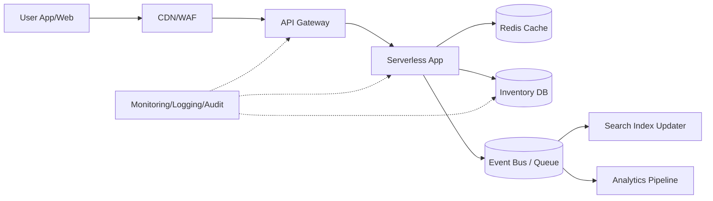

# Cloud Engineer Magazine (2026-03-28 10:15 JST)
#cloud #aws #oci #gcp #architecture #daily
[[Home]]

## 1) 今日のアプリ
**フラッシュセール向け「在庫・価格リアルタイム更新アプリ」**（EC運営者向け）
- 店舗管理画面で在庫/価格を更新すると、数秒以内に購入APIと商品ページへ反映
- セール時の高トラフィック（平常時の10〜50倍）を吸収

## 2) 要件整理
### 機能要件
- 商品在庫・価格の更新API
- 購入時の在庫引当（売り越し防止）
- 管理者向け一括更新（CSV/バッチ）
- 更新イベントの配信（検索インデックス・分析基盤へ）

### 非機能要件
- **可用性**: 99.95%以上、単一AZ障害で継続
- **性能**: 更新反映P95 < 3秒、購入API P95 < 300ms
- **セキュリティ**: 最小権限IAM、管理系APIはMFA前提、暗号化 at-rest/in-transit
- **コスト**: 平常時はサーバレス中心、セール時のみオートスケール

## 3) 推奨アーキテクチャ（なぜその構成か）
**イベント駆動 + キャッシュ前段 + 強整合トランザクションDB**
- 更新要求はAPI層で受け、在庫マスターDBへトランザクション書き込み
- 変更イベントをメッセージングへ発行し、検索/分析へ非同期反映
- 購入系はキャッシュ参照 + 最終的にDBで条件付き更新（楽観ロック）

理由:
- 同期処理を最小化してピーク耐性を確保
- 在庫引当はDB側の条件付き更新で整合性を担保
- 検索/分析更新を非同期に分離し、ユーザー操作のレイテンシを保護

## 4) クラウド別実装マップ
### AWS
- API: **Amazon API Gateway** + **AWS Lambda**
- 在庫DB: **Amazon DynamoDB**（条件付き書き込み）
- キャッシュ: **Amazon ElastiCache (Redis)**
- イベント: **Amazon EventBridge** / **Amazon SQS**
- 認証: **Amazon Cognito**（管理者）
- 監視: **Amazon CloudWatch**, **AWS X-Ray**, **AWS CloudTrail**

### OCI
- API: **OCI API Gateway** + **Oracle Functions**
- 在庫DB: **Autonomous JSON Database**（JSON中心）または **Autonomous Transaction Processing**
- キャッシュ: **OCI Cache (Redis)**
- イベント: **OCI Streaming** + **OCI Queue**
- 認証: **OCI IAM**（Identity Domains）
- 監視: **OCI Monitoring**, **Logging**, **Audit**

### GCP
- API: **API Gateway** + **Cloud Run**（または Cloud Functions）
- 在庫DB: **Cloud Spanner**（高整合・水平分割）または **Firestore**（要件次第）
- キャッシュ: **Memorystore for Redis**
- イベント: **Pub/Sub**
- 認証: **Identity Platform** または **IAM + IAP**（管理画面）
- 監視: **Cloud Monitoring**, **Cloud Logging**, **Cloud Audit Logs**, **Cloud Trace**

## 5) システム構成図（Mermaid）

## 6) データフロー / 認証・認可 / 監視運用の要点
- **データフロー**: 更新API成功後にイベント発行。失敗時はDLQへ退避し再処理。
- **認証・認可**:
  - 管理者はOIDC/OAuth2 + MFA
  - サービス間通信は短期クレデンシャル（IAM Role/Service Account/Dynamic Group）
  - DB/Queueへの権限はアプリ単位で最小化
- **監視運用**:
  - SLI: API成功率、P95遅延、在庫不整合件数、キュー滞留
  - SLO違反で自動アラート（Pager/ChatOps）
  - 監査ログは改ざん防止ストレージへ保管

## 7) コスト最適化ポイント（初期・成長期）
- **初期**:
  - サーバレス中心（Lambda/Functions/Cloud Run）でアイドルコスト最小化
  - 小さいRedisノード + TTL最適化
  - ログ保持期間を短めに設定し、重要ログのみ長期保管
- **成長期**:
  - 読み取りはキャッシュヒット率改善（商品別TTL調整）
  - DBのホットパーティション回避（キー設計見直し）
  - 予約/コミットメント割引（Savings Plans, CUD等）を段階導入

## 8) 障害時の設計（DR/バックアップ/フェイルオーバー）
- マルチAZ構成を基本、RTO/RPOを先に定義
- DBはポイントインタイムリカバリ有効化
- キュー/ストリームは再処理可能な保持期間を確保
- リージョン障害に備え、
  - コアデータはクロスリージョン複製
  - DNS/Global LBでフェイルオーバー
- 定期的にゲームデーで復旧手順を検証

## 9) 学習ポイント（今日覚えるクラウド機能）
1. **条件付き書き込み（楽観ロック）**で売り越しを防ぐ
2. **DLQ設計**でイベント駆動の運用性を上げる
3. **最小権限IAM**をAPI・実行基盤・データ層で分離する

## 10) 30〜60分ミニ演習
1. 任意クラウドで「在庫更新API」を1本作る
2. 条件付き更新（version または在庫>0条件）を実装
3. 更新イベントをキュー/トピックへ発行
4. 失敗イベントをDLQへ送る設定
5. ダッシュボードに「API遅延」「エラー率」「キュー滞留」を可視化

**ゴール**: 売り越し防止 + 非同期更新 + 可観測性の3点を最小構成で体験

## 11) 公式ドキュメント参照リンク（AWS/OCI/GCP）
### AWS（公式）
- API Gateway: https://docs.aws.amazon.com/apigateway/
- Lambda: https://docs.aws.amazon.com/lambda/
- DynamoDB（条件式）: https://docs.aws.amazon.com/amazondynamodb/latest/developerguide/Expressions.ConditionExpressions.html
- EventBridge: https://docs.aws.amazon.com/eventbridge/
- SQS + DLQ: https://docs.aws.amazon.com/AWSSimpleQueueService/latest/SQSDeveloperGuide/sqs-dead-letter-queues.html
- Well-Architected: https://docs.aws.amazon.com/wellarchitected/

### OCI（公式）
- OCI API Gateway: https://docs.oracle.com/en-us/iaas/Content/APIGateway/home.htm
- Oracle Functions: https://docs.oracle.com/en-us/iaas/Content/Functions/home.htm
- OCI Streaming: https://docs.oracle.com/en-us/iaas/Content/Streaming/home.htm
- OCI Queue: https://docs.oracle.com/en-us/iaas/Content/queue/home.htm
- OCI Monitoring: https://docs.oracle.com/en-us/iaas/Content/Monitoring/home.htm
- OCI IAM: https://docs.oracle.com/en-us/iaas/Content/Identity/home.htm

### GCP（公式）
- API Gateway: https://cloud.google.com/api-gateway/docs
- Cloud Run: https://cloud.google.com/run/docs
- Cloud Spanner: https://cloud.google.com/spanner/docs
- Pub/Sub: https://cloud.google.com/pubsub/docs
- Memorystore for Redis: https://cloud.google.com/memorystore/docs/redis
- Cloud Monitoring: https://cloud.google.com/monitoring/docs
