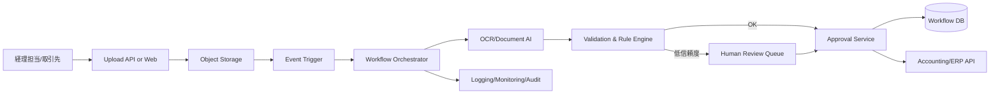

# Cloud Engineer Magazine (2026-03-29 10:15 JST)
#cloud #aws #oci #gcp #architecture #daily
[[Home]]

## 1) 今日のアプリ
**B2B向け「マルチテナント請求書OCR & 承認ワークフロー」アプリ**
- 取引先から届くPDF請求書を自動取り込み
- OCRで項目抽出（請求日/金額/税/支払期日）し、承認フローへ自動ルーティング
- 会計システム連携用にAPI/CSV出力

> 昨日のリアルタイム在庫アプリとは別テーマとして、今日は**文書処理 + ワークフロー**にフォーカス。

## 2) 要件整理（機能要件/非機能要件）
### 機能要件
- 請求書アップロード（Web/API/SFTP）
- OCR + フィールド抽出 + 信頼度スコア
- しきい値未満は人手確認キューへ
- 金額・部門・取引先ルールで承認経路を分岐
- 承認後に会計システムへ連携（API or バッチ）
- テナントごとのデータ分離

### 非機能要件
- **可用性**: 99.9% 以上（業務時間帯優先）
- **性能**: 1ファイル平均30秒以内で抽出完了、ピーク時は毎分200件取り込み
- **セキュリティ**: 最小権限IAM、KMS鍵で暗号化、監査ログ長期保管、PIIマスキング
- **コスト**: OCR課金を抑えるためページ前処理/再実行制御、夜間バッチで重処理集約

## 3) 推奨アーキテクチャ（なぜその構成か）
**オブジェクトストレージ起点のイベント駆動 + ステートマシン制御**
- 請求書をオブジェクトストレージに保存し、イベントで処理開始
- OCR、検証、承認依頼、会計連携をワークフローで明示化
- 抽出結果はトランザクションDB、元ファイルはストレージに保持
- 信頼度が低い場合のみ人手確認へ分岐（Human-in-the-loop）

理由:
- 文書処理は失敗・再実行が多いため、ステップ管理可能なワークフローが運用しやすい
- ストレージ + 非同期処理でスパイク耐性を確保
- テナント分離（バケット/プレフィックス/暗号鍵/IAM条件）を実装しやすい

## 4) クラウド別実装マップ
### AWS での実装サービス
- 取込: **Amazon S3** + **S3 Event Notifications**
- OCR: **Amazon Textract**
- ワークフロー: **AWS Step Functions**
- 実行基盤: **AWS Lambda**
- データ: **Amazon DynamoDB**（抽出結果/状態）
- 認証認可: **AWS IAM**, ユーザー認証は **Amazon Cognito**
- 監査監視: **AWS CloudTrail**, **Amazon CloudWatch**

**Trade-off**: Textractは帳票OCRに強いが、複雑帳票では後処理ロジック（Lambda）が必要。

### OCI での実装サービス
- 取込: **OCI Object Storage** + **Events**
- OCR/AI: **OCI Document Understanding**
- ワークフロー: **OCI Workflow**
- 実行基盤: **Oracle Functions**
- データ: **Autonomous Transaction Processing** または **Autonomous JSON Database**
- 認証認可: **OCI IAM (Identity Domains)**
- 監査監視: **OCI Audit**, **Monitoring**, **Logging**

**Trade-off**: OCIは統合ガバナンスが組みやすい一方、既存SaaS連携は実装時にSDK/接続検証を早めに実施したい。

### GCP での実装サービス
- 取込: **Cloud Storage** + **Eventarc**
- OCR: **Document AI**
- ワークフロー: **Workflows**
- 実行基盤: **Cloud Run**（または Cloud Functions）
- データ: **Firestore**（業務ワークフロー向け）または **Cloud SQL**
- 認証認可: **Cloud IAM**, 外部ユーザーは **Identity Platform**
- 監査監視: **Cloud Audit Logs**, **Cloud Monitoring**, **Cloud Logging**

**Trade-off**: Document AIの抽出精度は高いが、プロセッサ選定と評価データ整備を先に行うと再学習コストを抑えられる。

## 5) システム構成図（Mermaidで簡易図）

## 6) データフロー/認証・認可/監視運用の要点
- **データフロー**: アップロード直後にハッシュ付与、重複請求書を排除。抽出JSONはバージョン管理。
- **認証・認可**:
  - 人: SSO + MFA
  - サービス間: IAMロール/サービスアカウントで短期認証情報を利用
  - テナント隔離: `tenant_id` をIAM条件・DBパーティションキーに反映
- **監視運用**:
  - SLI: OCR成功率、手動レビュー率、承認リードタイム
  - アラート: OCR失敗率急増、キュー滞留、外部会計API失敗
  - 監査: 誰がどの請求書を閲覧/承認したかを監査ログへ

## 7) コスト最適化ポイント（初期・成長期）
### 初期
- サーバレス中心（Lambda/Functions/Cloud Run）でアイドルコスト最小化
- OCR対象を前処理（空白ページ除去、解像度最適化）してページ課金削減
- 保存ライフサイクルで古い原本を低コスト階層へ

### 成長期
- 高頻度テナントは専用キュー/ワーカーでノイジーネイバー回避
- OCR再実行ルールを厳密化（信頼度閾値 + 差分再処理）
- 監査ログを保管ポリシー別に分離し、保持コストを最適化

## 8) 障害時の設計（DR/バックアップ/フェイルオーバー）
- **DR方針**: RPO 15分、RTO 2時間を目標
- オブジェクトストレージはクロスリージョン複製
- DBは自動バックアップ + PITR（Point-in-Time Recovery）有効化
- ワークフロー状態は永続化し、途中失敗時はステップ単位で再実行
- 外部会計API障害時は送信キューへ退避して再送（指数バックオフ）

## 9) 学習ポイント（今日覚えるクラウド機能）
- **イベント駆動設計**: ストレージイベントから非同期処理を開始する利点
- **マネージドOCR**: 帳票処理の精度・コスト・後処理のバランス
- **ステートマシン運用**: 再実行可能な業務フロー設計
- **最小権限IAM**: 人/サービスで権限境界を分離する実装

## 10) 30〜60分ミニ演習
1. 任意クラウドで「アップロード → OCR → DB保存」最小パイプラインを作る
2. 信頼度 < 0.8 を「要レビュー」に振り分ける条件分岐を追加
3. 監査ログで「誰が承認したか」を追跡できることを確認

**ゴール**: 業務ワークフローを“同期API一発”ではなく、**非同期 + 再実行可能**に設計する感覚を掴む。

## 11) 公式ドキュメント参照リンク（AWS/OCI/GCP）
### AWS
- S3: https://docs.aws.amazon.com/s3/
- Textract: https://docs.aws.amazon.com/textract/
- Step Functions: https://docs.aws.amazon.com/step-functions/
- Lambda: https://docs.aws.amazon.com/lambda/
- IAM: https://docs.aws.amazon.com/iam/
- CloudWatch: https://docs.aws.amazon.com/cloudwatch/

### OCI
- OCI Object Storage: https://docs.oracle.com/en-us/iaas/Content/Object/home.htm
- OCI Document Understanding: https://docs.oracle.com/en-us/iaas/Content/document-understanding/home.htm
- OCI Workflow: https://docs.oracle.com/en-us/iaas/Content/workflow/home.htm
- Oracle Functions: https://docs.oracle.com/en-us/iaas/Content/Functions/home.htm
- OCI IAM: https://docs.oracle.com/en-us/iaas/Content/Identity/home.htm
- OCI Monitoring/Logging/Audit: 
  - https://docs.oracle.com/en-us/iaas/Content/Monitoring/home.htm
  - https://docs.oracle.com/en-us/iaas/Content/Logging/home.htm
  - https://docs.oracle.com/en-us/iaas/Content/Audit/home.htm

### GCP
- Cloud Storage: https://docs.cloud.google.com/storage/docs
- Eventarc: https://docs.cloud.google.com/eventarc/docs
- Document AI: https://docs.cloud.google.com/document-ai/docs
- Workflows: https://docs.cloud.google.com/workflows/docs
- Cloud Run: https://docs.cloud.google.com/run/docs
- IAM: https://docs.cloud.google.com/iam/docs
- Cloud Monitoring/Logging/Audit Logs:
  - https://docs.cloud.google.com/monitoring/docs
  - https://docs.cloud.google.com/logging/docs
  - https://docs.cloud.google.com/logging/docs/audit
