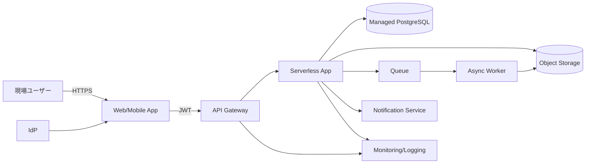

# 2026-03-30 Cloud Engineer Magazine
#cloud #aws #oci #gcp #architecture #daily
[[Home]]

## 1) 今日のアプリ
**建設現場向け「写真付き点検報告アプリ」**
- 現場スタッフがスマホから写真・チェック項目・位置情報を送信
- 管理者がダッシュボードで是正指示、進捗追跡
- 監査向けに証跡を長期保管

> 今日の視点: **マルチクラウド比較（AWS / OCI / GCP で同等構成）**

---

## 2) 要件整理（機能要件 / 非機能要件）
### 機能要件
- 写真アップロード（大容量、再送対応）
- 点検フォーム入力（オフライン時は後送信）
- 案件/現場単位での検索・一覧
- 管理者向け承認ワークフロー
- 監査ログ・変更履歴

### 非機能要件
- **可用性**: 営業時間内ほぼ停止不可（目標 99.9%+）
- **性能**: 写真アップロード開始まで 2 秒以内、一覧 API p95 < 300ms
- **セキュリティ**: 最小権限 IAM、暗号化（保存時/転送時）、監査証跡
- **コスト**: 初期は従量課金優先、成長期は予約/コミットで最適化

---

## 3) 推奨アーキテクチャ（なぜその構成か）
- **フロント**: SPA + モバイル最適化
- **API 層**: マネージド API Gateway + サーバレス実行
- **データ**: 
  - トランザクション: マネージド RDB
  - 写真: オブジェクトストレージ
- **非同期処理**: キュー経由で画像メタ抽出・通知
- **認証**: マネージド IdP（OIDC/OAuth2）
- **監視**: ログ集約 + メトリクス + アラート

**理由**
- 変動負荷（朝夕の報告集中）にサーバレスが適合
- 写真保存はオブジェクトストレージが最安・高耐久
- ワークフロー/通知は非同期化で API 応答を安定化

---

## 4) クラウド別実装マップ
### AWS
- 認証: Amazon Cognito
- API: Amazon API Gateway
- 実行: AWS Lambda
- DB: Amazon Aurora Serverless v2（PostgreSQL互換）
- オブジェクト: Amazon S3
- 非同期: Amazon SQS
- 監視: Amazon CloudWatch + AWS X-Ray
- 監査: AWS CloudTrail

### OCI
- 認証: OCI IAM Identity Domains
- API: OCI API Gateway
- 実行: OCI Functions
- DB: OCI Autonomous Database（Transaction Processing）
- オブジェクト: OCI Object Storage
- 非同期: OCI Queue
- 監視: OCI Monitoring / Logging / Application Performance Monitoring
- 監査: OCI Audit

### GCP
- 認証: Identity Platform（または Cloud Identity + IAP 構成）
- API: API Gateway
- 実行: Cloud Run（または Cloud Functions）
- DB: Cloud SQL for PostgreSQL
- オブジェクト: Cloud Storage
- 非同期: Pub/Sub
- 監視: Cloud Monitoring / Cloud Logging / Cloud Trace
- 監査: Cloud Audit Logs

**トレードオフ（短評）**
- Lambda/Functions/Cloud Run いずれも従量で始めやすい。長時間処理や独自ランタイム要件が強いなら Cloud Run が柔軟。
- Aurora Serverless v2 はスケール追従が強み。Autonomous DB は運用自動化が強み。Cloud SQL は学習コスト低く移行しやすい。

---

## 5) システム構成図（Mermaid）

---

## 6) データフロー / 認証・認可 / 監視運用の要点
### データフロー
1. ユーザー認証後、API に JWT 付きリクエスト
2. 点検データは RDB 保存、写真はオブジェクトストレージへ
3. 写真アップロード完了イベントをキューへ
4. ワーカーがサムネイル生成・メタ情報更新・通知

### 認証・認可
- OIDC/OAuth2 ベース
- API ごとにスコープ分離（read:inspection / write:inspection）
- サービス間は IAM ロール（静的キーを置かない）
- 管理者操作は MFA 必須

### 監視運用
- SLI: API 成功率、p95 レイテンシ、キュー滞留、DB 接続数
- アラート: エラー率急増、キュー遅延、ストレージアクセス失敗
- 監査ログを改ざん耐性ある保管先へ定期エクスポート

---

## 7) コスト最適化ポイント（初期・成長期）
### 初期
- サーバレス中心（常時起動コストを回避）
- 画像はライフサイクルで低頻度層へ自動移行
- 開発/検証環境は夜間停止

### 成長期
- DB は予約/コミット系割引を検討
- CDN キャッシュで API/配信コスト削減
- ログ保持期間を要件ベースで短縮・階層化

---

## 8) 障害時の設計（DR / バックアップ / フェイルオーバー）
- **RPO/RTO 例**: RPO 15分、RTO 60分
- DB: 自動バックアップ + PITR、有事にリージョン間レプリカ昇格
- オブジェクト: バージョニング + クロスリージョン複製
- API/アプリ: IaC で別リージョンへ再展開可能に
- 定期的に復旧訓練（ゲームデー）を実施

---

## 9) 学習ポイント（今日覚えるクラウド機能）
- **AWS**: S3 Pre-signed URL で安全に直接アップロード
- **OCI**: API Gateway + Functions のイベント駆動連携
- **GCP**: Pub/Sub を使った疎結合な非同期処理

---

## 10) 30〜60分ミニ演習
1. 1つクラウドを選び、API + サーバレス関数 + オブジェクトストレージを作成
2. 「点検データ JSON」を POST し、DB ではなくログ出力で受信確認
3. 画像アップロード用の署名URL（または同等機能）を発行
4. 成功/失敗メトリクスを監視画面で確認

**ゴール**: 「同期 API + 非同期アップロード」の最小構成を手で動かす

---

## 11) 公式ドキュメント参照リンク（AWS / OCI / GCP）
### AWS
- Well-Architected Framework: https://docs.aws.amazon.com/wellarchitected/latest/framework/welcome.html
- Amazon API Gateway: https://docs.aws.amazon.com/apigateway/
- AWS Lambda: https://docs.aws.amazon.com/lambda/
- Amazon S3: https://docs.aws.amazon.com/s3/
- Amazon SQS: https://docs.aws.amazon.com/sqs/
- Amazon Cognito: https://docs.aws.amazon.com/cognito/

### OCI
- OCI Architecture Center: https://docs.oracle.com/en-us/iaas/Content/Architecture/home.htm
- OCI API Gateway: https://docs.oracle.com/en-us/iaas/Content/APIGateway/home.htm
- OCI Functions: https://docs.oracle.com/en-us/iaas/Content/Functions/home.htm
- OCI Object Storage: https://docs.oracle.com/en-us/iaas/Content/Object/home.htm
- OCI Queue: https://docs.oracle.com/en-us/iaas/Content/queue/home.htm
- OCI Identity Domains: https://docs.oracle.com/en-us/iaas/Content/Identity/home.htm

### GCP
- Google Cloud Architecture Framework: https://docs.cloud.google.com/architecture/framework
- API Gateway: https://docs.cloud.google.com/api-gateway/docs
- Cloud Run: https://docs.cloud.google.com/run/docs
- Cloud Storage: https://docs.cloud.google.com/storage/docs
- Pub/Sub: https://docs.cloud.google.com/pubsub/docs
- Cloud SQL: https://docs.cloud.google.com/sql/docs
