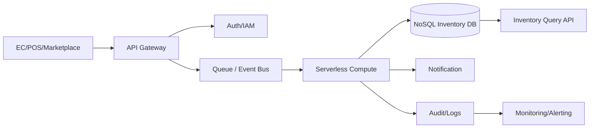

# Cloud Engineer Magazine (2026-03-31 10:15 JST)
[[Home]]

## 1) 今日のアプリ
**中小EC向け「在庫同期・欠品アラートSaaS」**
- 複数チャネル（自社EC・モール・実店舗POS）の在庫を数分以内で同期
- 在庫しきい値割れを通知（Slack/メール/Webhook）
- SKU単位で在庫引当・更新履歴を追跡

> 今日の視点: **マルチクラウド比較（AWS中心実装 + OCI/GCP等価実装）**

---

## 2) 要件整理（機能要件/非機能要件）
### 機能要件
- 在庫更新API（チャネルごとの更新イベント受信）
- 在庫参照API（SKU/倉庫別の現在庫）
- アラート配信（しきい値/異常検知）
- 監査ログ（誰がいつ在庫を変更したか）

### 非機能要件
- **可用性**: 99.9%以上、リージョン障害時はRTO 1時間以内
- **性能**: P95 APIレイテンシ < 200ms、ピーク時 2,000 req/s
- **セキュリティ**: 最小権限IAM、暗号化（at rest/in transit）、監査証跡
- **コスト**: 初期はサーバレス中心、成長時にホットパスを最適化

---

## 3) 推奨アーキテクチャ（なぜその構成か）
**イベント駆動 + マネージドDB + APIゲートウェイ**
- 書き込みはイベントキューへ吸収し、バースト耐性を確保
- 在庫の正本はNoSQL（SKUキー）で低レイテンシ参照
- 通知・分析を非同期化し、API経路を軽量化

**採用理由**
- 在庫同期は突発的バーストが多く、キュー分離が有効
- SKU単位アクセスが多く、キー/属性検索にNoSQLが適合
- サーバレスを軸に初期運用コストと運用負荷を削減

**トレードオフ**
- NoSQLは複雑集計が苦手 → 分析基盤へストリーム連携
- 強整合を広域に求めるほどコスト/遅延増 → 要件に応じて整合性レベルを設計

---

## 4) クラウド別実装マップ
### AWS
- API: **Amazon API Gateway**
- 認証: **Amazon Cognito**（B2Bの場合はOIDC/SAML連携）
- 取り込み: **Amazon SQS** / **Amazon EventBridge**
- 在庫DB: **Amazon DynamoDB**
- 実行基盤: **AWS Lambda**
- 通知: **Amazon SNS**
- 監視: **Amazon CloudWatch**, **AWS X-Ray**, **AWS CloudTrail**
- 秘密情報: **AWS Secrets Manager**, **AWS KMS**

### OCI
- API: **OCI API Gateway**
- 認証: **OCI IAM**（必要に応じてIDドメイン）
- 取り込み: **OCI Queue**, **OCI Events**, **OCI Streaming**
- 在庫DB: **OCI NoSQL Database**
- 実行基盤: **OCI Functions**
- 通知: **OCI Notifications**
- 監視: **OCI Monitoring**, **OCI Logging**, **OCI Audit**
- 鍵管理: **OCI Vault (KMS)**

### GCP
- API: **API Gateway**（またはCloud Endpoints）
- 認証: **Cloud IAM** + Identity Platform（要件に応じ）
- 取り込み: **Pub/Sub**
- 在庫DB: **Firestore (Native mode)** または **Bigtable**
- 実行基盤: **Cloud Run** / **Cloud Functions**
- 通知: Pub/Sub + Cloud Run（メール/Webhook連携）
- 監視: **Cloud Monitoring**, **Cloud Logging**, **Cloud Audit Logs**, **Cloud Trace**
- 秘密情報: **Secret Manager**, **Cloud KMS**

---

## 5) システム構成図（Mermaid）

---

## 6) データフロー/認証・認可/監視運用の要点
### データフロー
1. 外部チャネルが在庫更新をAPI投入
2. APIで署名/JWT検証後、イベントをキューへ格納
3. ワーカーがイベント順序キー（SKU）で処理しDB更新
4. しきい値判定で通知イベント発火

### 認証・認可
- APIはOIDC/JWT前提、機械連携はクライアント資格情報フロー
- IAMロールは「API実行」「更新ワーカー」「監視」の職務分離
- KMS鍵の利用権限を限定（暗号化・復号主体を最小化）

### 監視運用
- SLI: 成功率、P95遅延、キュー滞留時間、在庫反映遅延
- アラート: キュー遅延、DLQ増加、在庫更新失敗率、認証失敗急増
- 監査: API呼び出し・権限変更・鍵利用を監査ログで追跡

---

## 7) コスト最適化ポイント（初期・成長期）
### 初期
- サーバレス優先（従量課金）
- NoSQLはオンデマンドキャパシティで開始
- ログ保持期間を短めに設定し、監査要件分のみ長期保管

### 成長期
- 高頻度SKUをキャッシュ層へ（読み取りコスト削減）
- NoSQLをプロビジョンド化+オートスケール
- キュー再試行/DLQ設計を最適化し無駄実行を削減

---

## 8) 障害時の設計（DR/バックアップ/フェイルオーバー）
- **DR方針**: マルチAZ標準、リージョン障害時はセカンダリへ切替
- **バックアップ**: NoSQLの定期バックアップ + PITR相当機能
- **フェイルオーバー**: DNS/グローバルLBでAPIエンドポイント切替
- **運用**: 四半期ごとに復旧演習（RTO/RPO実測）

---

## 9) 学習ポイント（今日覚えるクラウド機能）
1. **イベント駆動設計**: APIと更新処理をキューで分離する理由
2. **最小権限IAM**: 実行ロールを機能ごとに分割
3. **監査ログ統合**: API/権限/鍵利用を1本の運用導線で確認
4. **NoSQL運用**: パーティションキー設計が性能/コストに直結

---

## 10) 30〜60分ミニ演習
**演習テーマ: SKU在庫更新APIの最小実装**
- 15分: API Gateway + 認証（JWT/OIDC）を作成
- 15分: Queueトリガーでサーバレス関数を実装
- 15分: NoSQLに `sku_id, warehouse_id, quantity, updated_at` を保存
- 15分: しきい値割れで通知（メールまたはWebhook）

**達成条件**
- 10件の更新イベント投入で、在庫参照APIに反映
- しきい値以下SKUで通知1件以上
- 監視ダッシュボードに成功率/遅延が表示

---

## 11) 公式ドキュメント参照リンク（AWS/OCI/GCP）
### AWS
- API Gateway: https://docs.aws.amazon.com/apigateway/
- DynamoDB: https://docs.aws.amazon.com/dynamodb/
- Lambda: https://docs.aws.amazon.com/lambda/
- SQS: https://docs.aws.amazon.com/sqs/
- EventBridge: https://docs.aws.amazon.com/eventbridge/
- Cognito: https://docs.aws.amazon.com/cognito/
- CloudWatch: https://docs.aws.amazon.com/cloudwatch/
- CloudTrail: https://docs.aws.amazon.com/cloudtrail/

### OCI
- API Gateway: https://docs.oracle.com/en-us/iaas/Content/APIGateway/home.htm
- OCI Functions: https://docs.oracle.com/en-us/iaas/Content/Functions/home.htm
- OCI Queue: https://docs.oracle.com/en-us/iaas/Content/queue/home.htm
- OCI Events: https://docs.oracle.com/en-us/iaas/Content/Events/home.htm
- OCI NoSQL: https://docs.oracle.com/en-us/iaas/nosql-database/
- OCI Monitoring: https://docs.oracle.com/en-us/iaas/Content/Monitoring/home.htm
- OCI Logging: https://docs.oracle.com/en-us/iaas/Content/Logging/home.htm
- OCI IAM: https://docs.oracle.com/en-us/iaas/Content/Identity/home.htm

### GCP
- API Gateway: https://docs.cloud.google.com/api-gateway/docs
- Pub/Sub: https://docs.cloud.google.com/pubsub/docs
- Cloud Run: https://docs.cloud.google.com/run/docs
- Firestore: https://docs.cloud.google.com/firestore/docs
- Bigtable: https://docs.cloud.google.com/bigtable/docs
- Cloud IAM: https://docs.cloud.google.com/iam/docs
- Cloud Monitoring: https://docs.cloud.google.com/monitoring/docs
- Cloud Audit Logs: https://docs.cloud.google.com/logging/docs/audit
