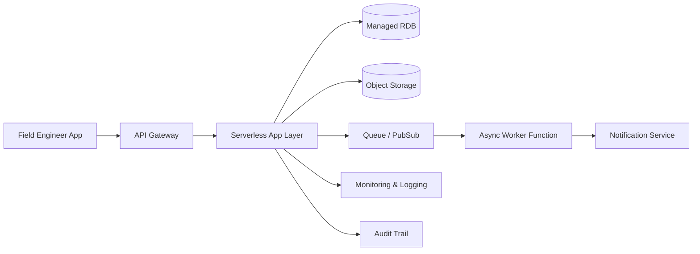

# Cloud Engineer Magazine (2026-04-03)
[[Home]]

## 1) 今日のアプリ
**現場向け「写真付き設備点検アプリ」**
- フィールドエンジニアがモバイルから点検結果を入力
- 写真アップロード、異常判定、チケット起票
- オフライン一時保存→復帰時同期

> 今日の視点: **マルチクラウド比較（AWS/OCI/GCP の同等実装）**

---

## 2) 要件整理
### 機能要件
- 点検項目の入力（チェックリスト/数値/コメント）
- 写真アップロード（複数枚）
- 異常時に自動アラート（メール/チャット/Webhook）
- 点検履歴の検索・閲覧
- 権限別画面（作業者/管理者/監査）

### 非機能要件
- **可用性**: 99.9%以上（業務時間帯の停止最小化）
- **性能**: API p95 < 300ms、写真アップロードの再送制御
- **セキュリティ**: 最小権限 IAM、保存時暗号化、監査ログ
- **コスト**: 初期はサーバレス中心、成長時にホットパス最適化

---

## 3) 推奨アーキテクチャ（なぜその構成か）
- **API層**: マネージドAPIゲートウェイ + サーバレス実行
  - 初期の運用負荷を下げ、アクセス急増に追従しやすい
- **画像保管**: オブジェクトストレージ
  - 安価・高耐久、ライフサイクル管理で長期保管コスト最適化
- **業務データ**: マネージドRDB（トランザクション整合性）
  - 点検票/設備マスタ/ユーザー権限管理に向く
- **非同期処理**: キュー + 関数実行
  - 画像解析・通知・外部連携を疎結合化
- **監視/監査**: メトリクス、ログ、監査証跡を一元化
  - 障害解析とコンプライアンス対応を簡素化

---

## 4) クラウド別実装マップ
### AWS での実装サービス
- API: **Amazon API Gateway**
- アプリ実行: **AWS Lambda**
- 画像保存: **Amazon S3**
- DB: **Amazon Aurora PostgreSQL**（または RDS PostgreSQL）
- 非同期: **Amazon SQS** + Lambda
- 認証: **Amazon Cognito**
- 監視: **Amazon CloudWatch** + **AWS CloudTrail**
- 秘密情報: **AWS Secrets Manager**

### OCI での実装サービス
- API: **OCI API Gateway**
- アプリ実行: **OCI Functions**
- 画像保存: **OCI Object Storage**
- DB: **OCI Base Database Service (PostgreSQL相当構成は要選定)** / もしくは **MySQL HeatWave**
- 非同期: **OCI Queue** + Functions
- 認証: **OCI IAM**（必要に応じて IdP 連携）
- 監視: **OCI Monitoring / Logging / Audit**
- 秘密情報: **OCI Vault**

### GCP での実装サービス
- API: **API Gateway**
- アプリ実行: **Cloud Run**（または Cloud Functions）
- 画像保存: **Cloud Storage**
- DB: **Cloud SQL for PostgreSQL**
- 非同期: **Pub/Sub** + Cloud Run/Functions
- 認証: **Identity Platform** または **IAM + IAP 構成**
- 監視: **Cloud Monitoring / Cloud Logging / Cloud Audit Logs**
- 秘密情報: **Secret Manager**

---

## 5) システム構成図（Mermaid）

---

## 6) データフロー/認証・認可/監視運用の要点
- **データフロー**
  1. モバイルがJWTでAPI呼び出し
  2. 点検データはRDBへ、画像はオブジェクトストレージへ
  3. 異常フラグ時にキュー投入→非同期ワーカーが通知
- **認証・認可**
  - IdP発行トークンをAPIで検証
  - 作業者/管理者/監査ロールを分離
  - ストレージバケット・DB・Secretsへのアクセスは最小権限
- **監視運用**
  - SLI: APIレイテンシ、エラー率、キュー滞留、DB接続率
  - SLO違反予兆でアラート
  - 監査ログは改ざん耐性を考慮して長期保管

---

## 7) コスト最適化ポイント（初期・成長期）
### 初期
- サーバレス優先（常時起動を避ける）
- ストレージライフサイクルで低頻度層/アーカイブへ自動移行
- 開発/検証環境をスケジュール停止

### 成長期
- 画像配信はCDNを追加（転送料・体感速度最適化）
- DBは読み取り負荷に応じてレプリカ検討
- 高頻度処理のみコンテナ常駐化して単価最適化

---

## 8) 障害時の設計（DR/バックアップ/フェイルオーバー）
- RDB: 自動バックアップ + PITR、有事は別AZ/別リージョン復旧手順を定義
- オブジェクト: バージョニング + クロスリージョン複製（必要性とコストを比較）
- API/実行基盤: マルチAZ前提、IaCで再構築可能に
- ランブック: 「DB障害」「キュー滞留」「認証障害」の手順を事前に文書化

---

## 9) 学習ポイント（今日覚えるクラウド機能）
- **AWS**: API Gateway + Lambda + SQS の疎結合パターン
- **OCI**: API Gateway + Functions + Queue + Vault の組み合わせ
- **GCP**: Cloud Run + Pub/Sub + Cloud SQL のイベント駆動設計
- 共通: 「同期は短く、重い処理は非同期へ」が安定運用の基本

---

## 10) 30〜60分ミニ演習
1. 任意クラウドで「点検登録API（POST /inspections）」を1本作る
2. 画像アップロードURL（署名付きURL等）を発行するAPIを追加
3. 異常フラグ=true のときだけキューへイベント送信
4. メトリクス1つ（成功率）とアラート1つを設定

**達成条件**
- 正常系でDB登録 + 画像保存できる
- 異常時のみ非同期イベントが発行される
- 失敗時ログから原因追跡できる

---

## 11) 公式ドキュメント参照リンク（AWS/OCI/GCP）
### AWS
- API Gateway: https://docs.aws.amazon.com/apigateway/
- Lambda: https://docs.aws.amazon.com/lambda/
- S3: https://docs.aws.amazon.com/s3/
- SQS: https://docs.aws.amazon.com/sqs/
- Cognito: https://docs.aws.amazon.com/cognito/
- CloudWatch: https://docs.aws.amazon.com/cloudwatch/
- CloudTrail: https://docs.aws.amazon.com/cloudtrail/
- Secrets Manager: https://docs.aws.amazon.com/secretsmanager/

### OCI
- API Gateway: https://docs.oracle.com/en-us/iaas/Content/APIGateway/home.htm
- Functions: https://docs.oracle.com/en-us/iaas/Content/Functions/home.htm
- Object Storage: https://docs.oracle.com/en-us/iaas/Content/Object/home.htm
- Queue: https://docs.oracle.com/en-us/iaas/Content/queue/home.htm
- Monitoring: https://docs.oracle.com/en-us/iaas/Content/Monitoring/home.htm
- Logging: https://docs.oracle.com/en-us/iaas/Content/Logging/home.htm
- Audit: https://docs.oracle.com/en-us/iaas/Content/Audit/home.htm
- Vault: https://docs.oracle.com/en-us/iaas/Content/KeyManagement/home.htm

### GCP
- API Gateway: https://docs.cloud.google.com/api-gateway/docs
- Cloud Run: https://docs.cloud.google.com/run/docs
- Cloud Storage: https://docs.cloud.google.com/storage/docs
- Cloud SQL: https://docs.cloud.google.com/sql/docs
- Pub/Sub: https://docs.cloud.google.com/pubsub/docs
- Cloud Monitoring: https://docs.cloud.google.com/monitoring/docs
- Cloud Logging: https://docs.cloud.google.com/logging/docs
- Cloud Audit Logs: https://docs.cloud.google.com/logging/docs/audit
- Secret Manager: https://docs.cloud.google.com/secret-manager/docs

---

### ひとことトレードオフ
- AWSは選択肢が多く拡張しやすい反面、設計の自由度が高く標準化ルールが重要。
- OCIはコスト/性能比が魅力な場面が多く、既存Oracle資産との親和性が高い。
- GCPはCloud Run/PubSub中心の実装がシンプルで、運用負荷を抑えやすい。
