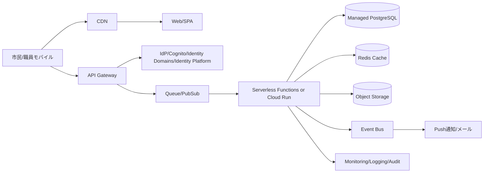

[[Home]]

# Cloud Engineer Magazine (2026-04-04)

## 1) 今日のアプリ
**災害時オフライン対応・避難所混雑可視化アプリ**
- 市民向け: 最寄り避難所の混雑度、物資在庫、水/電源の有無を確認
- 職員向け: モバイルから現地状況を投稿（圏外時は端末内キュー）
- 管理者向け: 全体ダッシュボード、通知配信、監査ログ

## 2) 要件整理（機能/非機能）
**機能要件**
- 避難所情報の閲覧（地図/一覧）
- 現地投稿（混雑率、在庫、写真）
- プッシュ通知（地域別）
- 管理画面で承認フロー（誤情報対策）

**非機能要件**
- 可用性: RTO 30分、RPO 5分（重要データ）
- 性能: ピーク同時 5万ユーザー、更新反映 < 10秒
- セキュリティ: 最小権限IAM、暗号化At-Rest/In-Transit、監査証跡
- コスト: 平時は低コスト、災害時オートスケール

## 3) 推奨アーキテクチャ（なぜその構成か）
**イベント駆動 + マネージドDB + CDN** を採用。
- 読み取り多: CDNキャッシュでレイテンシ/コスト削減
- 書き込みバースト: キューで平滑化し、バックエンドを保護
- 重要データ: マネージドRDBのマルチAZ/バックアップで整合性確保
- 画像: オブジェクトストレージに分離し、DBコストを抑制

## 4) クラウド別実装マップ
### AWS
- フロント: CloudFront + S3（静的配信）
- API: API Gateway + Lambda
- 認証: Amazon Cognito
- データ: Aurora PostgreSQL（Multi-AZ）+ ElastiCache
- 非同期: SQS + EventBridge
- 画像: S3
- 監視/監査: CloudWatch + CloudTrail + AWS Config

### OCI
- フロント: OCI Object Storage + OCI CDN
- API: API Gateway + Functions
- 認証: OCI IAM Identity Domains
- データ: Autonomous Database / OCI PostgreSQL
- 非同期: OCI Queue + Events
- 画像: Object Storage
- 監視/監査: Monitoring + Logging + Audit

### GCP
- フロント: Cloud Storage + Cloud CDN
- API: API Gateway / Cloud Run
- 認証: Identity Platform
- データ: Cloud SQL for PostgreSQL（HA）+ Memorystore
- 非同期: Pub/Sub + Eventarc
- 画像: Cloud Storage
- 監視/監査: Cloud Monitoring + Cloud Logging + Cloud Audit Logs

## 5) システム構成図（Mermaid）

## 6) データフロー/認証・認可/監視運用の要点
- データフロー: 投稿はAPI→キュー→ワーカーでDB反映（スパイク吸収）
- 認証・認可: OIDCベース、職員ロールはRBACで投稿/承認を分離
- セキュア既定: 
  - ストレージ公開禁止（署名付きURLのみ）
  - KMS鍵で暗号化
  - IAMはサービス単位で最小権限
- 監視運用:
  - SLI: API成功率、P95遅延、キュー滞留、DB接続数
  - アラート: エラーレート、バックログ急増、レプリカ遅延

## 7) コスト最適化ポイント（初期・成長期）
**初期**
- サーバーレス中心でアイドルコスト最小化
- CDNキャッシュTTLを長めに設定（更新系のみ短く）

**成長期**
- DBはリードレプリカ追加
- ホットデータをキャッシュへ退避
- ログ保持期間を用途別に最適化（監査は長期、デバッグは短期）

## 8) 障害時の設計（DR/バックアップ/フェイルオーバー）
- DB: 自動バックアップ + PITR、クロスリージョン複製（重要テーブル）
- ストレージ: バージョニング + クロスリージョンレプリケーション
- API: マルチAZ標準、必要に応じマルチリージョン待機
- Runbook: フェイルオーバー手順をIaCと一緒に管理

## 9) 学習ポイント（今日覚えるクラウド機能）
- **AWS**: SQSでバースト吸収しLambda同時実行を守る設計
- **OCI**: Queue + Events + Functionsの疎結合イベント駆動
- **GCP**: Pub/Sub + Eventarcで非同期処理と拡張性を確保

## 10) 30〜60分ミニ演習
1. APIエンドポイントを1本作成（`POST /shelter-status`）
2. 受信データをキューに投入
3. ワーカーでDBに保存（ダミーでも可）
4. 監視メトリクスを1つ可視化（キュー滞留）
5. IAMを見直し: 書き込み権限をワーカーのみに限定

## 11) 公式ドキュメント参照リンク（AWS/OCI/GCP）
**AWS**
- https://docs.aws.amazon.com/apigateway/
- https://docs.aws.amazon.com/lambda/
- https://docs.aws.amazon.com/AmazonS3/
- https://docs.aws.amazon.com/AmazonSQS/
- https://docs.aws.amazon.com/AmazonRDS/
- https://docs.aws.amazon.com/AmazonCloudFront/
- https://docs.aws.amazon.com/cognito/

**OCI**
- https://docs.oracle.com/en-us/iaas/Content/APIGateway/home.htm
- https://docs.oracle.com/en-us/iaas/Content/Functions/home.htm
- https://docs.oracle.com/en-us/iaas/Content/queue/home.htm
- https://docs.oracle.com/en-us/iaas/Content/Object/Concepts/objectstorageoverview.htm
- https://docs.oracle.com/en-us/iaas/Content/Identity/home.htm
- https://docs.oracle.com/en-us/iaas/Content/Logging/home.htm

**GCP**
- https://docs.cloud.google.com/api-gateway/docs
- https://docs.cloud.google.com/run/docs
- https://docs.cloud.google.com/pubsub/docs
- https://docs.cloud.google.com/sql/docs
- https://docs.cloud.google.com/storage/docs
- https://docs.cloud.google.com/cdn/docs
- https://docs.cloud.google.com/monitoring/docs

---
**トレードオフ一言メモ**
- API実行基盤: Lambda/Functionsは運用軽いが長時間処理に不向き、Cloud Runはコンテナ自由度高い
- DB: RDBは整合性に強いが急激な水平分割は難しい。読取負荷はキャッシュ/レプリカで逃がす
- マルチクラウド: 可搬性は上がるが運用複雑性も上がる。まずは責務分離を明確にして導入する
