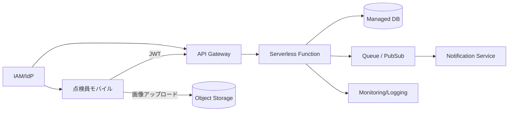

---
tags:
  - cloud
  - aws
  - oci
  - gcp
  - architecture
  - daily
---

# Cloud Engineer Magazine — 2026-04-05
[[Home]]

## 1) 今日のアプリ
**現場写真つき設備点検アプリ（モバイル）**  
点検員がスマホで写真・チェック結果・位置情報を送信し、管理者がダッシュボードで進捗/異常を確認。異常時は即通知。

> 今日の視点: **3クラウド実装マップ比較（マルチクラウド設計の練習）**

---

## 2) 要件整理
### 機能要件
- 点検フォーム入力（チェック項目、コメント、写真）
- オフライン時の一時保存と再送
- 異常判定ルール（例: しきい値超過）
- 管理画面で一覧・検索・集計
- 異常発生時の通知（メール/チャット連携）

### 非機能要件
- **可用性**: 営業時間内の停止を最小化（目標 99.9%）
- **性能**: 画像アップロード体感 3 秒以内（通常回線）
- **セキュリティ**: 最小権限IAM、保存時暗号化、監査ログ
- **コスト**: 初期はサーバレス中心、アクセス増で段階的最適化

---

## 3) 推奨アーキテクチャ（なぜその構成か）
**API + オブジェクトストレージ + サーバレス処理 + マネージドDB** を基本にする。  
理由:
- 変動トラフィックに強い（点検時間帯に集中しやすい）
- 運用負荷が低い（OS/ミドル管理を減らす）
- 画像をDBに直接持たず、オブジェクトストレージでコスト効率を確保
- 非同期処理（キュー/イベント）で通知や画像解析を分離し、障害波及を防ぐ

---

## 4) クラウド別実装マップ
### AWS
- フロント配信: Amazon CloudFront + S3（Web管理画面）
- API: Amazon API Gateway
- 認証: Amazon Cognito
- アプリ処理: AWS Lambda
- DB: Amazon DynamoDB（点検データ）
- 画像保管: Amazon S3
- 非同期/通知: Amazon SQS + Amazon SNS
- 監視: Amazon CloudWatch + AWS CloudTrail
- 鍵管理: AWS KMS

### OCI
- フロント配信: OCI Object Storage + OCI CDN
- API: OCI API Gateway
- 認証: OCI Identity and Access Management (IAM)
- アプリ処理: OCI Functions
- DB: Autonomous JSON Database **または** Autonomous Transaction Processing
- 画像保管: OCI Object Storage
- 非同期/通知: OCI Queue + OCI Notifications
- 監視: OCI Monitoring + Logging + Audit
- 鍵管理: OCI Vault

### GCP
- フロント配信: Cloud Storage + Cloud CDN
- API: API Gateway
- 認証: Identity Platform（または IAM + IAP 構成）
- アプリ処理: Cloud Run（または Cloud Functions）
- DB: Firestore（または Cloud SQL）
- 画像保管: Cloud Storage
- 非同期/通知: Pub/Sub
- 監視: Cloud Monitoring + Cloud Logging + Cloud Audit Logs
- 鍵管理: Cloud KMS

**トレードオフ（短評）**
- DynamoDB / Firestore / JSON系DBは開発速度が速いが、複雑集計は設計注意
- Cloud Run はコンテナ自由度が高い、Functions は小粒処理に強い
- OCIは同等構成を比較的シンプルに揃えやすく、既存Oracle資産との親和性が高い

---

## 5) システム構成図（Mermaid）

---

## 6) データフロー/認証・認可/監視運用の要点
- **データフロー**:  
  1) ユーザー認証 → JWT取得  
  2) APIにメタデータ送信  
  3) 画像は署名付きURLで直接オブジェクトストレージへ  
  4) 保存イベントで非同期通知/二次処理
- **認証・認可**:  
  - ロール分離（点検員/管理者/運用者）  
  - APIごとに最小権限ポリシー  
  - 管理者操作はMFA必須
- **監視運用**:  
  - SLI: API成功率、P95レイテンシ、キュー滞留、通知遅延  
  - 監査ログを有効化し、重要操作にアラート

---

## 7) コスト最適化ポイント（初期・成長期）
### 初期
- サーバレス優先（常時起動コスト回避）
- 画像はライフサイクルルールで低頻度層へ自動移行
- ログ保持期間を要件ベースで短縮

### 成長期
- 高頻度APIは予約/コミットメント系割引を検討
- CDNキャッシュ最適化でAPI呼び出し削減
- DBアクセスパターンを見直し（ホットパーティション回避、インデックス適正化）

---

## 8) 障害時の設計（DR/バックアップ/フェイルオーバー）
- DB: 自動バックアップ + PITR（可能なサービスを選択）
- オブジェクト: バージョニング有効化、必要に応じクロスリージョン複製
- API/関数: IaCで再構築可能に（手作業復旧を避ける）
- 通知: 失敗時リトライ + DLQ
- DR方針: 初期は同一リージョン高可用、業務重要度上昇後にリージョン冗長化

---

## 9) 学習ポイント（今日覚えるクラウド機能）
- **署名付きURL** で安全に直接アップロード
- **イベント駆動** で同期APIを軽量化
- **監査ログ + 最小権限IAM** がセキュア設計の土台

---

## 10) 30〜60分ミニ演習
1. 任意クラウドで「API Gateway + Function + Object Storage」を最小構成で作る  
2. 署名付きURLで画像アップロードを実装  
3. アップロード完了イベントでログ出力（または通知）  
4. IAMポリシーを見直し、「不要権限を1つ削る」

ゴール: **“動く + 権限が絞れている”** を確認する。

---

## 11) 公式ドキュメント参照リンク（AWS/OCI/GCP）
### AWS
- Well-Architected Framework  
  https://docs.aws.amazon.com/wellarchitected/latest/framework/welcome.html
- Amazon API Gateway  
  https://docs.aws.amazon.com/apigateway/
- AWS Lambda  
  https://docs.aws.amazon.com/lambda/
- Amazon S3（署名付きURL含む）  
  https://docs.aws.amazon.com/AmazonS3/latest/userguide/ShareObjectPreSignedURL.html
- Amazon DynamoDB  
  https://docs.aws.amazon.com/dynamodb/
- AWS IAM  
  https://docs.aws.amazon.com/IAM/latest/UserGuide/introduction.html

### OCI
- OCI Architecture Center  
  https://docs.oracle.com/en-us/iaas/Content/Architecture/home.htm
- OCI API Gateway  
  https://docs.oracle.com/en-us/iaas/Content/APIGateway/home.htm
- OCI Functions  
  https://docs.oracle.com/en-us/iaas/Content/Functions/home.htm
- OCI Object Storage  
  https://docs.oracle.com/en-us/iaas/Content/Object/home.htm
- OCI Queue  
  https://docs.oracle.com/en-us/iaas/Content/queue/home.htm
- OCI IAM  
  https://docs.oracle.com/en-us/iaas/Content/Identity/home.htm

### GCP
- Google Cloud Architecture Framework  
  https://docs.cloud.google.com/architecture/framework
- API Gateway  
  https://docs.cloud.google.com/api-gateway/docs
- Cloud Run  
  https://docs.cloud.google.com/run/docs
- Cloud Storage  
  https://docs.cloud.google.com/storage/docs
- Firestore  
  https://docs.cloud.google.com/firestore/docs
- IAM  
  https://docs.cloud.google.com/iam/docs
