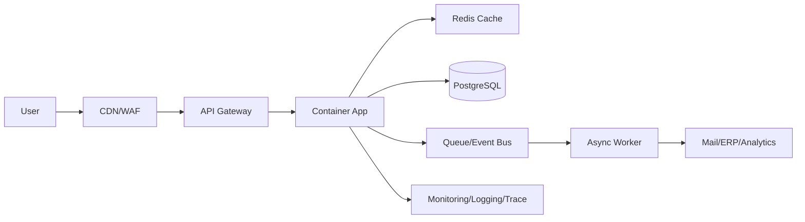

[[Home]]

# Cloud Engineer Magazine（2026-04-06）

## 1) 今日のアプリ
**リアルタイム在庫連動EC（フラッシュセール対応）**  
在庫の急減・注文急増が発生する短時間セールを安全にさばく、API中心のECバックエンド。

---

## 2) 要件整理
### 機能要件
- 商品一覧/詳細、カート、注文、決済連携
- 在庫の即時引当（売り越し防止）
- 管理者向け在庫更新・価格更新
- 注文イベント配信（通知・分析基盤へ）

### 非機能要件
- **可用性**: セール時間帯も注文APIを継続提供（マルチAZ/リージョン設計）
- **性能**: 読み取り高負荷をキャッシュ吸収、注文は低レイテンシで整合性重視
- **セキュリティ**: 最小権限IAM、WAF、暗号化（保存時/転送時）
- **コスト**: 通常時は小さく、セール時だけ水平スケール

---

## 3) 推奨アーキテクチャ（なぜその構成か）
**API Gateway + コンテナ実行基盤 + マネージドRDB + Redis + 非同期イベント**を中核にする。

- 商品参照はキャッシュ優先（DB負荷削減）
- 注文/在庫更新はRDBトランザクションで整合性確保
- 注文後処理（メール/分析/ERP連携）はキュー/イベントで非同期化
- WAF + IAM + Secret管理を標準化し、secure-by-defaultを維持

**トレードオフ**
- サーバレス実行は運用軽いが、長時間処理や細かな接続制御はコンテナが有利
- NoSQLはスケールしやすいが、在庫引当の厳密整合はRDBが実装しやすい

---

## 4) クラウド別実装マップ
### AWS
- エッジ/保護: CloudFront + AWS WAF
- API: Amazon API Gateway
- アプリ: Amazon ECS on Fargate（または EKS）
- DB: Amazon Aurora PostgreSQL
- キャッシュ: Amazon ElastiCache for Redis
- 非同期: Amazon SQS / Amazon EventBridge
- 監視: Amazon CloudWatch + AWS X-Ray
- IAM/Secrets: IAM + AWS Secrets Manager + KMS

### OCI
- エッジ/保護: OCI Load Balancer + OCI WAF
- API: OCI API Gateway
- アプリ: OCI Container Instances（または OKE）
- DB: OCI Autonomous Transaction Processing / Base Database
- キャッシュ: OCI Cache with Redis
- 非同期: OCI Queue + OCI Events + Streaming
- 監視: OCI Monitoring + Logging + Application Performance Monitoring
- IAM/Secrets: OCI IAM + OCI Vault + KMS

### GCP
- エッジ/保護: Cloud Load Balancing + Cloud Armor
- API: API Gateway（または Apigee X）
- アプリ: Cloud Run（または GKE）
- DB: Cloud SQL for PostgreSQL（高可用構成）
- キャッシュ: Memorystore for Redis
- 非同期: Pub/Sub + Cloud Tasks
- 監視: Cloud Monitoring + Cloud Logging + Cloud Trace
- IAM/Secrets: Cloud IAM + Secret Manager + Cloud KMS

---

## 5) システム構成図（Mermaid）

---

## 6) データフロー/認証・認可/監視運用の要点
- **データフロー**: 商品参照は `Cache → miss時DB`。注文は `API → DBトランザクション → イベント発行`
- **認証・認可**: 
  - ユーザー認証はOIDC/JWT
  - サービス間はIAMロール/サービスアカウントで最小権限
  - DB接続情報はSecret Manager/Vaultから取得
- **監視運用**:
  - SLI: 注文API成功率、P95レイテンシ、在庫不整合件数
  - アラート: エラー率急増、キュー滞留、DB接続枯渇
  - 監査ログを有効化し、変更操作を追跡

---

## 7) コスト最適化ポイント（初期・成長期）
### 初期
- コンテナ最小サイズ + オートスケール下限を小さく
- 単一リージョン + マルチAZで開始
- ログ保持期間を短めにし、必要指標を厳選

### 成長期
- 読み取り系をキャッシュ/リードレプリカへオフロード
- Savings Plans/Committed Use（AWS/GCP）やOCIの価格モデル活用
- 非同期ワーカーをバッチ化し、呼び出し回数を削減

---

## 8) 障害時の設計（DR/バックアップ/フェイルオーバー）
- **バックアップ**: RDB日次スナップショット + PITR（ポイントインタイム復元）
- **DR**: 重要データを別リージョンにレプリケーション
- **フェイルオーバー**:
  - DBはマネージドHA機能を利用
  - API/アプリは複数AZに配置
  - DNS/グローバルLBでリージョン切替手順を事前演習
- **目標値例**: RPO 5〜15分、RTO 30〜60分（ビジネス要件に応じて調整）

---

## 9) 学習ポイント（今日覚えるクラウド機能）
- **AWS**: Auroraの可用性機能とElastiCacheのスケール戦略
- **OCI**: API Gateway + Queue + Eventsの疎結合設計
- **GCP**: Cloud Runの自動スケーリング特性とPub/Sub再配信設計

---

## 10) 30〜60分ミニ演習
1. 任意クラウドで「商品参照API」を1本作る（`GET /products/{id}`）
2. Redisキャッシュを前段に置き、TTL=60秒でキャッシュヒット率を観測
3. 注文イベントをキュー/トピックへ発行するダミー処理を追加
4. 監視ダッシュボードに以下3指標を表示:
   - リクエスト数
   - P95レイテンシ
   - エラー率

---

## 11) 公式ドキュメント参照リンク（AWS/OCI/GCP）
### AWS
- Well-Architected Framework: https://docs.aws.amazon.com/wellarchitected/latest/framework/welcome.html
- Amazon API Gateway: https://docs.aws.amazon.com/apigateway/
- Amazon ECS: https://docs.aws.amazon.com/ecs/
- Amazon Aurora: https://docs.aws.amazon.com/AmazonRDS/latest/AuroraUserGuide/CHAP_AuroraOverview.html
- ElastiCache for Redis: https://docs.aws.amazon.com/AmazonElastiCache/latest/red-ug/WhatIs.html
- AWS WAF: https://docs.aws.amazon.com/waf/

### OCI
- OCI Architecture Center: https://docs.oracle.com/en/solutions/
- OCI API Gateway: https://docs.oracle.com/en-us/iaas/Content/APIGateway/home.htm
- OCI Container Instances: https://docs.oracle.com/en-us/iaas/Content/container-instances/home.htm
- OCI Queue: https://docs.oracle.com/en-us/iaas/Content/queue/home.htm
- OCI Cache with Redis: https://docs.oracle.com/en-us/iaas/Content/redis/home.htm
- OCI Vault: https://docs.oracle.com/en-us/iaas/Content/KeyManagement/home.htm

### GCP
- Google Cloud Architecture Framework: https://docs.cloud.google.com/architecture/framework
- API Gateway: https://docs.cloud.google.com/api-gateway/docs
- Cloud Run: https://docs.cloud.google.com/run/docs
- Cloud SQL: https://docs.cloud.google.com/sql/docs
- Memorystore for Redis: https://docs.cloud.google.com/memorystore/docs/redis
- Pub/Sub: https://docs.cloud.google.com/pubsub/docs
