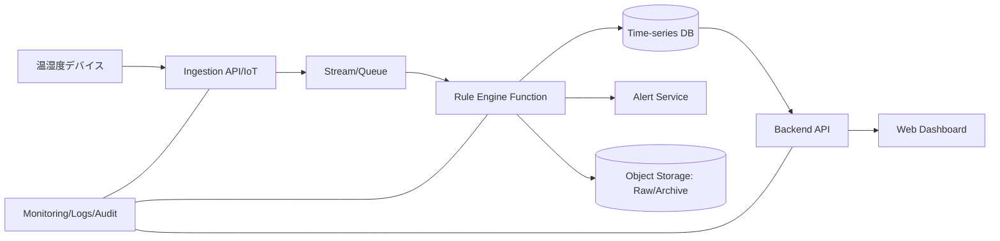

# Cloud Engineer Magazine — 2026-04-08
[[Home]]

## 1) 今日のアプリ
**コールドチェーン監視SaaS（医薬品/食品向け）**  
配送中の温度・湿度センサーを取り込み、閾値逸脱時に即時通知。監査用に改ざん耐性のある履歴を保持。

---
## 2) 要件整理
### 機能要件
- デバイスからのテレメトリ受信（MQTT/HTTPS）
- しきい値判定（例: 2〜8℃逸脱）
- アラート通知（メール/Chat/Webhook）
- 配送単位の時系列可視化
- 監査ログ保持（最低1年）

### 非機能要件
- **可用性**: 99.9%以上（リージョン障害時はRPO≤5分, RTO≤30分目標）
- **性能**: ピーク時 10万 msg/分、遅延は判定まで5秒以内
- **セキュリティ**: デバイスIDごとの認証、最小権限IAM、保存/転送時暗号化
- **コスト**: 初期はサーバレス中心、成長期にストリーム/DBを段階最適化

---
## 3) 推奨アーキテクチャ（なぜその構成か）
**イベント駆動 + マネージド時系列基盤**を採用。  
理由:
- バースト耐性（キュー/ストリームで吸収）
- 閾値判定を関数実行で疎結合化
- 時系列クエリを専用DBで高速化
- 通知・監査を非同期化し、失敗影響を局所化

---
## 4) クラウド別実装マップ
### AWS
- 受信: **AWS IoT Core**
- ルーティング: **IoT Rules → Kinesis Data Streams / SQS**
- 判定: **AWS Lambda**
- 保存: **Amazon Timestream**（時系列）, **Amazon S3**（長期保管）
- API/UI: **API Gateway + Lambda + CloudFront/S3**
- 認可: **IAM + Cognito**
- 監視: **CloudWatch + X-Ray + CloudTrail**

### OCI
- 受信/入口: **API Gateway**（デバイスHTTPS）
- ストリーム: **OCI Streaming**
- 判定: **OCI Functions**
- 保存: **OCI HeatWave(MySQL) または Autonomous DB + Object Storage**
- 認可: **OCI IAM**
- 監視: **OCI Monitoring + Logging + Events**

### GCP
- 受信: **Cloud Run**（HTTPS ingest）
- キュー/ストリーム: **Pub/Sub**
- 判定: **Cloud Functions (2nd gen) / Cloud Run Jobs**
- 保存: **Bigtable(時系列高スループット) または BigQuery**, **Cloud Storage**
- 認可: **IAM + Identity Platform（必要時）**
- 監視: **Cloud Monitoring + Cloud Logging + Cloud Audit Logs**

**トレードオフ（要点）**
- AWS IoT Coreはデバイス接続機能が厚い（証明書運用込みで実装が速い）
- OCIはStreaming+Functionsでシンプル、既存OCI基盤との統合が強み
- GCPはPub/Sub+BigQuery分析連携が速い（分析寄り要件に強い）

---
## 5) システム構成図（Mermaid）

---
## 6) データフロー / 認証・認可 / 監視運用
- **データフロー**: Device → Ingest → Stream → Rule Function → (TSDB + Alert + Archive)
- **認証**: デバイスごとの証明書/署名キー、ローテーション自動化
- **認可**: 送信専用ロール、判定関数は最小権限（DB書込と通知のみ）
- **運用監視**:
  - SLI: 取込成功率、判定遅延P95、アラート配信成功率
  - アラーム: キュー滞留、関数失敗率、DB書込エラー急増
  - 監査: IAM変更、鍵操作、データエクスポート操作を必ず記録

---
## 7) コスト最適化ポイント
### 初期
- サーバレス徹底（関数課金 + マネージドストリーム）
- ログ保持を短期/長期で階層化（Hot 30日、Cold 1年）
- ダッシュボード更新間隔を5〜15秒に制御

### 成長期
- ストリームシャード/パーティションを実測で再配分
- 高頻度クエリは集計済みテーブルを併用
- 予約/コミットメント割引（利用安定後）を適用

---
## 8) 障害時の設計（DR/バックアップ/フェイルオーバー）
- **DR**: マルチAZ標準、重要データはクロスリージョン複製
- **バックアップ**: TSDBスナップショット + Object Storageバージョニング
- **フェイルオーバー**:
  - Ingest DNSフェイルオーバー
  - 判定関数は別リージョンに同一デプロイ
  - RTO/RPOを四半期ごとにゲームデイで検証

---
## 9) 学習ポイント（今日覚えるクラウド機能）
- AWS IoT Core のルールでメッセージを複数宛先へ分岐できる
- OCI Streaming は高スループットのイベント取り込み基盤として使える
- GCP Pub/Sub は疎結合な再試行/デッドレター設計がしやすい

---
## 10) 30〜60分ミニ演習
1. 1分ごとの温度データ（CSV 200行）を疑似生成
2. 閾値判定ロジック（2〜8℃外でalert=true）を関数で実装
3. 3クラウドのどれか1つで「Ingest→Queue→Function→Storage」の最小構成を作成
4. 失敗注入（通知先を無効化）して再試行とアラート挙動を確認
5. 最後にIAMポリシーを見直し、不要権限を1つ削る

---
## 11) 公式ドキュメント参照リンク（AWS/OCI/GCP）
### AWS
- https://docs.aws.amazon.com/iot/latest/developerguide/what-is-aws-iot.html
- https://docs.aws.amazon.com/lambda/latest/dg/welcome.html
- https://docs.aws.amazon.com/timestream/latest/developerguide/what-is-timestream.html
- https://docs.aws.amazon.com/AmazonCloudWatch/latest/monitoring/WhatIsCloudWatch.html

### OCI
- https://docs.oracle.com/en-us/iaas/Content/Streaming/Concepts/streamingoverview.htm
- https://docs.oracle.com/en-us/iaas/Content/Functions/home.htm
- https://docs.oracle.com/en-us/iaas/Content/Identity/home.htm
- https://docs.oracle.com/en-us/iaas/Content/Monitoring/home.htm

### GCP
- https://docs.cloud.google.com/pubsub/docs/overview
- https://docs.cloud.google.com/functions/docs/concepts/overview
- https://docs.cloud.google.com/bigquery/docs/introduction
- https://docs.cloud.google.com/monitoring/docs/monitoring_overview
