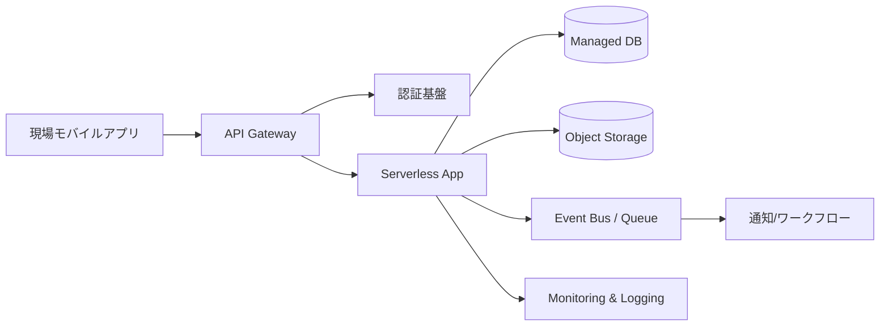

[[Home]]

# Cloud Engineer Magazine — 2026-04-12

## 1) 今日のアプリ
**現場向け「設備点検レポート即時共有アプリ」**
- スマホで写真＋チェックリスト＋音声メモを登録
- オフライン時はローカル保持、オンライン復帰で同期
- 管理者はダッシュボードで異常検知・未対応案件を確認

---
## 2) 要件整理（機能要件 / 非機能要件）
### 機能要件
- 点検記録作成（写真、テキスト、音声）
- 点検ステータス管理（未対応/対応中/完了）
- 設備・拠点・担当者で検索
- 異常時の通知（メール/チャット連携）

### 非機能要件
- **可用性**: 99.9%以上、リージョン障害を考慮したバックアップ
- **性能**: 写真アップロード 3秒以内（平均）、一覧API p95 < 300ms
- **セキュリティ**: 最小権限IAM、保存時暗号化、監査ログ必須
- **コスト**: 初期はサーバレス中心、利用増で一部を予約/コミット化

---
## 3) 推奨アーキテクチャ（なぜその構成か）
**方針: API + サーバレス処理 + マネージドDB + オブジェクトストレージ**
- 変動トラフィックに強く、初期運用コストを抑えやすい
- 画像/音声をオブジェクトストレージに分離し、DB肥大化を回避
- イベント駆動で通知や画像メタ解析を非同期化し、API応答を高速化

**トレードオフ**
- サーバレスは低運用だが、長時間処理や高頻度時はコスト逆転に注意
- RDBは整合性に強いが、超高スループットではNoSQL構成が有利な場面あり

---
## 4) クラウド別実装マップ
### AWS
- API: **Amazon API Gateway**
- 認証: **Amazon Cognito**
- アプリ処理: **AWS Lambda**
- DB: **Amazon Aurora Serverless v2**（または DynamoDB）
- ファイル保存: **Amazon S3**
- 非同期連携: **Amazon EventBridge / SQS**
- 監視: **Amazon CloudWatch / AWS X-Ray / CloudTrail**

### OCI
- API: **OCI API Gateway**
- 認証: **OCI IAM**（必要に応じて Identity Domains）
- アプリ処理: **OCI Functions**
- DB: **Autonomous Database**
- ファイル保存: **OCI Object Storage**
- 非同期連携: **OCI Streaming / Notifications / Queue**
- 監視: **OCI Monitoring / Logging / Audit**

### GCP
- API: **API Gateway**
- 認証: **Identity Platform**（または IAM + IAP 構成）
- アプリ処理: **Cloud Run**（または Cloud Functions）
- DB: **Cloud SQL**（PostgreSQL）
- ファイル保存: **Cloud Storage**
- 非同期連携: **Pub/Sub**
- 監視: **Cloud Monitoring / Cloud Logging / Cloud Audit Logs**

---
## 5) システム構成図（Mermaid）

---
## 6) データフロー / 認証・認可 / 監視運用の要点
- **データフロー**: 画像は署名付きURLで直接アップロード、メタ情報のみAPI経由でDB登録
- **認証**: ユーザー認証はOIDCベース、端末トークン短命化（短TTL）
- **認可**: 拠点単位・設備単位のRBAC（例: inspector/supervisor/admin）
- **監視**: APIエラーレート、キュー滞留、DB接続枯渇、通知失敗率をダッシュボード化
- **監査**: 管理操作・権限変更・データ削除は必ず監査ログに記録

---
## 7) コスト最適化ポイント（初期・成長期）
### 初期
- サーバレス優先（Lambda/Functions/Cloud Run）
- 低頻度アクセスデータは安価ストレージ階層へ（ライフサイクル設定）
- 監視ログは保持期間を短めに設計し、重要ログのみ長期保存

### 成長期
- DBは接続/IO傾向を見てスケール設定最適化
- 定常負荷が高まれば予約/コミット割引を検討
- 重い画像処理はバッチ化し、ピーク時間帯を回避

---
## 8) 障害時の設計（DR / バックアップ / フェイルオーバー）
- DB: 自動バックアップ + PITR、有事の復旧手順をRunbook化
- オブジェクト: バージョニング有効化、必要に応じクロスリージョン複製
- API: マルチAZ前提、依存サービスはタイムアウト/リトライ/サーキットブレーカ実装
- DR訓練: 四半期ごとに「リージョン障害想定」の復旧演習

---
## 9) 学習ポイント（今日覚えるクラウド機能）
- **AWS**: S3署名付きURLで安全な直接アップロード
- **OCI**: Functions + API Gateway のイベント駆動連携
- **GCP**: Cloud Run のスケーリング特性（同時実行設定）

---
## 10) 30〜60分ミニ演習
1. APIエンドポイント `POST /inspections` を1本作る（モック可）
2. 画像アップロードを「API本体経由」→「署名付きURL経由」に変更
3. 変更前後でAPIレイテンシと転送量の差を比較
4. IAMポリシーを見直し、「Object Storage書込のみ許可」の最小権限に修正

---
## 11) 公式ドキュメント参照リンク（AWS / OCI / GCP）
### AWS
- API Gateway: https://docs.aws.amazon.com/apigateway/
- Lambda: https://docs.aws.amazon.com/lambda/
- Amazon S3: https://docs.aws.amazon.com/s3/
- Aurora Serverless v2: https://docs.aws.amazon.com/AmazonRDS/latest/AuroraUserGuide/aurora-serverless-v2.html
- Cognito: https://docs.aws.amazon.com/cognito/
- Well-Architected Framework: https://docs.aws.amazon.com/wellarchitected/

### OCI
- API Gateway: https://docs.oracle.com/en-us/iaas/Content/APIGateway/home.htm
- Functions: https://docs.oracle.com/en-us/iaas/Content/Functions/home.htm
- Object Storage: https://docs.oracle.com/en-us/iaas/Content/Object/home.htm
- Autonomous Database: https://docs.oracle.com/en-us/iaas/autonomous-database/
- IAM: https://docs.oracle.com/en-us/iaas/Content/Identity/home.htm
- Well-Architected Framework: https://docs.oracle.com/en/solutions/oci-well-architected-framework/

### GCP
- API Gateway: https://docs.cloud.google.com/api-gateway/docs
- Cloud Run: https://docs.cloud.google.com/run/docs
- Cloud Storage: https://docs.cloud.google.com/storage/docs
- Cloud SQL: https://docs.cloud.google.com/sql/docs
- Pub/Sub: https://docs.cloud.google.com/pubsub/docs
- Architecture Framework: https://docs.cloud.google.com/architecture/framework
