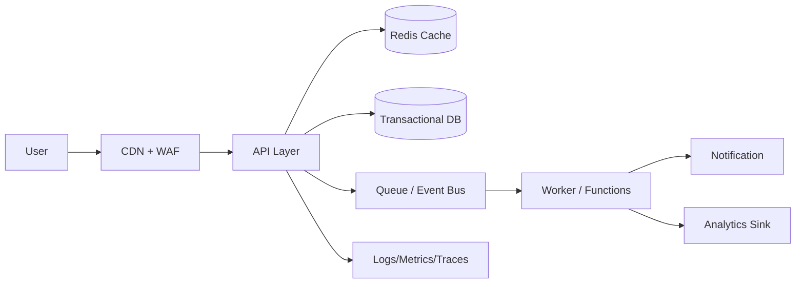

[[Home]]

# Cloud Engineer Magazine — 2026-04-13

## 1) 今日のアプリ
**在庫連動型フラッシュセール基盤（B2C EC向け）**  
「在庫がある間だけ割引価格で販売し、在庫切れ時に即終了する」高トラフィック対応アプリ。

- ユーザー機能: 商品閲覧、カート、決済、注文履歴
- 運用機能: セール作成、在庫同期、価格ルール、リアルタイム指標

> 今日の視点: **マルチクラウド比較（AWS/OCI/GCP）**。実装は単一クラウドでも可能だが、設計観点を3クラウドで共通化する。

---

## 2) 要件整理
### 機能要件
- 秒間数千リクエストのセールページ配信
- 在庫数に応じた販売可否を即時判定
- 決済完了時に在庫を原子的に減算
- 管理画面からセール開始/終了を制御

### 非機能要件
- **可用性**: 目標 99.95% 以上（リージョン内冗長、DBマルチAZ/HA）
- **性能**: p95 応答 300ms 以下（商品閲覧系）
- **セキュリティ**: 最小権限IAM、WAF、KMS暗号化、監査ログ
- **コスト**: 平常時は小さく、セール時のみオートスケール

---

## 3) 推奨アーキテクチャ（なぜその構成か）
**推奨: CDN + API + キャッシュ + トランザクションDB + 非同期イベント**

- CDNで静的配信を吸収し、オリジン負荷を削減
- API層をステートレス化し、オートスケールで急増に追従
- 在庫/価格の読み取りはキャッシュ優先、確定処理のみDB直書き
- 注文確定後はイベント駆動（通知/分析/配送連携）へ分離

**トレードオフ**
- フルサーバレス: 運用軽いが、ピーク時の同時実行制御が難しくなる場合あり
- コンテナ中心: 柔軟性高いが、クラスタ運用負荷が上がる
- 強整合DB: 在庫整合性は高いが、水平分割戦略が必須

---

## 4) クラウド別実装マップ
### AWS
- DNS/CDN/WAF: Route 53 + CloudFront + AWS WAF
- API/実行: API Gateway + AWS Lambda **または** ECS on Fargate
- DB: Amazon Aurora (MySQL/PostgreSQL)
- キャッシュ: ElastiCache for Redis
- 非同期: SQS + EventBridge + SNS
- 監視/監査: CloudWatch + CloudTrail + X-Ray
- IAM/KMS/秘密情報: IAM + KMS + Secrets Manager

### OCI
- DNS/CDN/WAF: OCI DNS + OCI CDN + OCI WAF
- API/実行: OCI API Gateway + OCI Functions **または** OKE
- DB: Autonomous Database **または** MySQL HeatWave
- キャッシュ: OCI Cache (Redis互換)
- 非同期: OCI Queue + Events + Notifications
- 監視/監査: OCI Monitoring + Logging + Audit + APM
- IAM/KMS/秘密情報: OCI IAM + Vault

### GCP
- DNS/CDN/WAF: Cloud DNS + Cloud CDN + Cloud Armor
- API/実行: API Gateway/Cloud Endpoints + Cloud Run **または** GKE
- DB: Cloud SQL **または** AlloyDB
- キャッシュ: Memorystore (Redis)
- 非同期: Pub/Sub + Eventarc + Cloud Tasks
- 監視/監査: Cloud Monitoring + Cloud Logging + Cloud Trace + Cloud Audit Logs
- IAM/KMS/秘密情報: Cloud IAM + Cloud KMS + Secret Manager

---

## 5) システム構成図（Mermaid）

---

## 6) データフロー/認証・認可/監視運用の要点
### データフロー
1. 商品閲覧: CDN → API → Cache（ミス時DB）
2. 注文確定: APIで在庫再確認 → DBトランザクション更新 → イベント発行
3. 後続処理: 非同期ワーカーで通知・分析・外部連携

### 認証・認可
- エンドユーザー認証はOIDC/OAuth2（マネージドIdP活用）
- サービス間はIAMロール/サービスアカウントで短期資格情報
- DB・キュー・秘密情報は「明示許可のみ」の最小権限

### 監視運用
- SLI: エラー率、p95レイテンシ、在庫不整合件数
- アラート: 5xx急増、キュー滞留、DB接続枯渇
- 追跡: 分散トレースで注文ID単位のボトルネック分析

---

## 7) コスト最適化ポイント（初期・成長期）
### 初期
- APIはサーバレス中心（低トラフィック時コスト抑制）
- DBは最小インスタンス + 自動バックアップ
- CDNキャッシュTTLを長めに設定（更新系はパージ運用）

### 成長期
- ホットパスをコンテナ常駐化し、単価を平準化
- DB読取レプリカ/接続プーリング導入
- ログ保持期間を層別化（監査ログ長期、詳細アプリログ短期）

---

## 8) 障害時の設計（DR/バックアップ/フェイルオーバー）
- リージョン内HA: マルチAZ構成 + ヘルスチェック
- バックアップ: DB PITR + 日次スナップショット + 復旧演習
- DR: 重要データを別リージョン複製（RPO/RTOを事前合意）
- フェイルオーバー: DNS/Traffic Managerで段階切替（手動→半自動→自動）

---

## 9) 学習ポイント（今日覚えるクラウド機能）
1. **CDN + WAF連携**でL7防御とオリジン保護を同時に実現
2. **イベント駆動**で注文後処理を疎結合化
3. **最小権限IAM**をサービス単位で分割し、侵害時の影響半径を縮小
4. **トランザクション境界**を「在庫確定」に絞り、スケーラビリティを確保

---

## 10) 30〜60分ミニ演習
**演習テーマ: 「在庫引当API」の最小実装を設計する**

- 15分: API仕様を書く（`POST /reservations`、冪等キー、失敗コード）
- 15分: IAMポリシーを最小権限で作る（API実行ロール、DBアクセス、キュー送信）
- 15分: 監視3点を定義（成功率、遅延、在庫不整合）
- 15分: 障害注入を1つ設計（DB遅延時のリトライ/サーキットブレーカ）

成果物: API仕様1ページ + IAM方針 + アラート条件

---

## 11) 公式ドキュメント参照リンク（AWS/OCI/GCP）
### AWS
- Well-Architected Framework: https://docs.aws.amazon.com/wellarchitected/latest/framework/welcome.html
- Amazon CloudFront: https://docs.aws.amazon.com/AmazonCloudFront/latest/DeveloperGuide/Introduction.html
- AWS WAF: https://docs.aws.amazon.com/waf/latest/developerguide/waf-chapter.html
- Amazon Aurora: https://docs.aws.amazon.com/aurora/
- Amazon ElastiCache: https://docs.aws.amazon.com/AmazonElastiCache/latest/dg/WhatIs.html

### OCI
- OCI Architecture Center: https://docs.oracle.com/en-us/iaas/Content/Architecture/Reference/reference-architectures.htm
- OCI API Gateway: https://docs.oracle.com/en-us/iaas/Content/APIGateway/home.htm
- OCI Functions: https://docs.oracle.com/en-us/iaas/Content/Functions/home.htm
- OCI Queue: https://docs.oracle.com/en-us/iaas/Content/queue/home.htm
- OCI WAF: https://docs.oracle.com/en-us/iaas/Content/WAF/home.htm

### GCP
- Google Cloud Architecture Framework: https://docs.cloud.google.com/architecture/framework
- Cloud Run: https://docs.cloud.google.com/run/docs/overview/what-is-cloud-run
- Cloud CDN: https://docs.cloud.google.com/cdn/docs/overview
- Cloud Armor: https://docs.cloud.google.com/armor/docs/overview
- Pub/Sub: https://docs.cloud.google.com/pubsub/docs/overview
