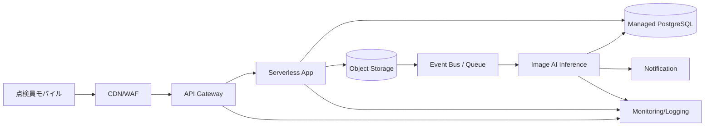

# Cloud Engineer Magazine (2026-04-14)
[[Home]]

## 1) 今日のアプリ
**現場写真付き設備点検レポートSaaS（モバイル対応）**
- 点検員がスマホで写真・チェック結果を登録
- AIで異常候補を自動抽出（ひび割れ/腐食など）
- 管理者はダッシュボードで進捗・異常アラートを確認

> 今日の視点: **マルチクラウド比較（AWS/OCI/GCP）**。同じ要件を3クラウドでどう実装するかを対比。

---

## 2) 要件整理
### 機能要件
- ユーザー認証（点検員/管理者/監査者）
- 点検テンプレート管理
- 写真アップロード、メタデータ保存（場所・設備ID・時刻）
- AI異常判定（非同期）
- 通知（異常時に即時）
- 監査ログ検索

### 非機能要件
- **可用性**: 月間99.9%以上、リージョン障害時はRTO 60分/RPO 15分
- **性能**: 画像アップロードP95 < 2秒（10MB以下）、一覧API P95 < 300ms
- **セキュリティ**: 最小権限IAM、保存時暗号化、監査証跡、WAF
- **コスト**: 初期はサーバレス中心、成長後はワークロードごとに予約/コミット割引を適用

---

## 3) 推奨アーキテクチャ（なぜその構成か）
- フロント/APIは**マネージド実行基盤**（運用負荷を下げる）
- 画像は**オブジェクトストレージ**、業務データは**マネージドRDB**
- AI判定は**イベント駆動の非同期処理**（ピーク吸収）
- 通知は**Pub/Sub系サービス**で疎結合化
- セキュリティは**IdP + IAMロール + KMS鍵管理 + WAF**を標準化

**トレードオフ例**
- サーバレス: 運用が軽いが、長時間処理や高スループットで単価が上がることあり
- コンテナ常駐: 予測負荷ならコスト安定、ただし運用責任は増える

---

## 4) クラウド別実装マップ
### AWS
- 認証: Amazon Cognito
- API: Amazon API Gateway + AWS Lambda
- 画像保存: Amazon S3
- DB: Amazon Aurora PostgreSQL (Serverless v2 も候補)
- 非同期: Amazon SQS / EventBridge
- AI画像分析: Amazon Rekognition Custom Labels（要件次第でSageMaker）
- 通知: Amazon SNS
- 監視: Amazon CloudWatch + AWS X-Ray
- セキュリティ: AWS WAF, AWS KMS, IAM, CloudTrail

### OCI
- 認証: OCI IAM Identity Domains
- API: OCI API Gateway + OCI Functions
- 画像保存: Object Storage
- DB: Autonomous Database（JSON/RDB用途を整理して選択）
- 非同期: OCI Queue / Events
- AI画像分析: OCI Vision
- 通知: Notifications
- 監視: Monitoring / Logging / Application Performance Monitoring
- セキュリティ: OCI WAF, Vault, IAM Policies, Audit

### GCP
- 認証: Identity Platform（またはCloud Identity連携）
- API: API Gateway + Cloud Run（またはCloud Functions）
- 画像保存: Cloud Storage
- DB: Cloud SQL for PostgreSQL
- 非同期: Pub/Sub + Eventarc
- AI画像分析: Vertex AI Vision（またはAutoML/カスタム推論）
- 通知: Pub/Sub + Cloud Functions/Run 経由
- 監視: Cloud Monitoring / Cloud Logging / Cloud Trace
- セキュリティ: Cloud Armor, Cloud KMS, IAM, Cloud Audit Logs

---

## 5) システム構成図（Mermaid）

---

## 6) データフロー/認証・認可/監視運用の要点
- **データフロー**: 画像アップロード時にイベント発火 → 非同期AI判定 → 結果をDBへ反映 → 異常時のみ通知
- **認証・認可**:
  - ユーザー認証はOIDC準拠サービス（Cognito / Identity Domains / Identity Platform）
  - APIはJWT検証 + ロールベース制御（点検員は自分の案件のみ）
  - ワークロード間アクセスは短期資格情報（ロール/サービスアカウント）
- **監視運用**:
  - SLI: API成功率、P95レイテンシ、ジョブ遅延、判定失敗率
  - アラート: エラーバジェット消費率、キュー滞留、DB接続逼迫
  - 監査: すべての管理操作と権限変更を監査ログへ

---

## 7) コスト最適化ポイント（初期・成長期）
### 初期
- API/推論はオンデマンド（Lambda/Functions/Run）中心
- ストレージはライフサイクルで低頻度層へ自動移行
- 開発/検証環境は夜間停止を徹底

### 成長期
- 定常負荷は予約/コミット（Savings Plans, OCI Commit, GCP CUD）を検討
- DBは読み取り分離・接続プールでスケール効率化
- AI推論はバッチ化・モデル最適化で単価を圧縮

---

## 8) 障害時の設計（DR/バックアップ/フェイルオーバー）
- **DB**: 自動バックアップ + PITR、有事は別リージョン復旧
- **オブジェクト**: バージョニング + クロスリージョンレプリケーション
- **アプリ層**: IaCで再構築可能（Terraform等）
- **フェイルオーバー**: DNS/グローバルLBで段階的切替
- **演習**: 四半期ごとに復旧訓練（RTO/RPOの実測）

---

## 9) 学習ポイント（今日覚えるクラウド機能）
1. **イベント駆動設計**でピークを平準化する
2. **最小権限IAM**を人とサービスで分離する
3. **オブザーバビリティ3点セット**（Metrics/Logs/Trace）を最初から入れる
4. **ストレージライフサイクル**は最速で効くコスト改善

---

## 10) 30〜60分ミニ演習
1. いずれか1クラウドで「API + Object Storage + Queue」を作る（IaC推奨）
2. 画像アップロードをトリガーにダミー判定ジョブを実行
3. 判定結果をDBに書き込み、失敗時は通知
4. IAMポリシーを見直し、「不要権限を1つ削る」

**達成条件**
- 非同期処理が通る
- 失敗時通知が届く
- 監視ダッシュボードで成功/失敗件数が見える

---

## 11) 公式ドキュメント参照リンク（AWS/OCI/GCP）
### AWS
- Well-Architected Framework: https://docs.aws.amazon.com/wellarchitected/latest/framework/welcome.html
- Amazon API Gateway: https://docs.aws.amazon.com/apigateway/
- AWS Lambda: https://docs.aws.amazon.com/lambda/
- Amazon S3: https://docs.aws.amazon.com/s3/
- Amazon Aurora: https://docs.aws.amazon.com/aurora/
- AWS WAF: https://docs.aws.amazon.com/waf/
- AWS KMS: https://docs.aws.amazon.com/kms/

### OCI
- OCI Architecture Center: https://docs.oracle.com/en-us/iaas/Content/Architecture/Reference/architecture_reference.htm
- API Gateway: https://docs.oracle.com/en-us/iaas/Content/APIGateway/home.htm
- Functions: https://docs.oracle.com/en-us/iaas/Content/Functions/home.htm
- Object Storage: https://docs.oracle.com/en-us/iaas/Content/Object/home.htm
- Queue: https://docs.oracle.com/en-us/iaas/Content/queue/home.htm
- Vision: https://docs.oracle.com/en-us/iaas/Content/vision/home.htm
- Vault: https://docs.oracle.com/en-us/iaas/Content/KeyManagement/home.htm

### GCP
- Google Cloud Architecture Framework: https://docs.cloud.google.com/architecture/framework
- API Gateway: https://docs.cloud.google.com/api-gateway/docs
- Cloud Run: https://docs.cloud.google.com/run/docs
- Cloud Storage: https://docs.cloud.google.com/storage/docs
- Cloud SQL: https://docs.cloud.google.com/sql/docs
- Pub/Sub: https://docs.cloud.google.com/pubsub/docs
- Cloud Armor: https://docs.cloud.google.com/armor/docs
- Cloud KMS: https://docs.cloud.google.com/kms/docs
