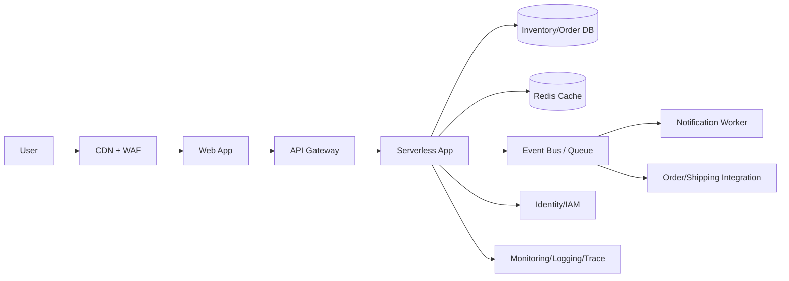

# Cloud Engineer Magazine — 2026-04-15
#cloud #aws #oci #gcp #architecture #daily
[[Home]]

## 1) 今日のアプリ
**ライブコマース向け「リアルタイム在庫連動ストリーミング販売アプリ」**
- 配信視聴中に商品をカート追加
- 在庫をリアルタイム引当（売り越し防止）
- 決済後に受注・出荷システムへ連携

---

## 2) 要件整理（機能/非機能）
### 機能要件
- 視聴者向けライブ配信・チャット・商品表示
- 在庫の即時反映（秒単位）
- 注文作成、決済、注文ステータス通知

### 非機能要件
- **可用性**: 配信中断を避けるためマルチAZ（必要に応じてリージョンDR）
- **性能**: 画面表示P95 < 300ms、在庫引当API P95 < 150ms
- **セキュリティ**: 最小権限IAM、WAF、暗号化（保存/転送）
- **コスト**: 平常時はサーバレス中心、配信イベント時のみオートスケール

---

## 3) 推奨アーキテクチャ（なぜその構成か）
**イベント駆動 + API層 + 分離データストア**を採用。
- 商品閲覧/配信メタデータは読み取り最適化DB
- 在庫引当はトランザクション整合性重視DB
- 注文・通知はPub/Subで疎結合化

**理由**
1. ライブ配信時の急激なトラフィック変動に強い（サーバレス/マネージドで吸収）
2. 在庫・注文の整合性を保ちつつ、UI系は低遅延で拡張しやすい
3. 障害時に機能分離してデグレード運転しやすい（例: チャットのみ一時停止）

---

## 4) クラウド別実装マップ
### AWS での実装サービス
- フロント: **CloudFront + S3 + AWS WAF**
- API: **Amazon API Gateway + AWS Lambda**
- 在庫/注文DB: **Amazon Aurora (PostgreSQL互換)**
- キャッシュ: **Amazon ElastiCache (Redis)**
- イベント: **Amazon EventBridge / Amazon SQS**
- 認証: **Amazon Cognito**
- 監視: **Amazon CloudWatch + AWS X-Ray + AWS CloudTrail**

### OCI での実装サービス
- フロント: **OCI Object Storage + OCI CDN + OCI WAF**
- API: **OCI API Gateway + OCI Functions**
- 在庫/注文DB: **OCI Autonomous Transaction Processing (ATP)**
- キャッシュ: **OCI Cache (Redis互換)**
- イベント: **OCI Streaming + OCI Queue + OCI Events**
- 認証: **OCI IAM (Identity Domains)**
- 監視: **OCI Monitoring + Logging + Audit**

### GCP での実装サービス
- フロント: **Cloud CDN + Cloud Storage + Cloud Armor**
- API: **API Gateway(or Apigee X) + Cloud Run / Cloud Functions**
- 在庫/注文DB: **Cloud SQL (PostgreSQL) または AlloyDB**
- キャッシュ: **Memorystore (Redis)**
- イベント: **Pub/Sub + Cloud Tasks**
- 認証: **Identity Platform / IAM**
- 監視: **Cloud Monitoring + Cloud Logging + Cloud Audit Logs + Cloud Trace**

**トレードオフ（短評）**
- AWS: サービス選択肢が多く細かく最適化可能（設計自由度高いが決定コスト増）
- OCI: Oracle DB系親和性が高く、既存Oracle資産との統合が強い
- GCP: Cloud Run/Pub/Sub中心で実装がシンプル、運用負荷を下げやすい

---

## 5) システム構成図（Mermaid）

---

## 6) データフロー / 認証・認可 / 監視運用
### データフロー
1. ユーザーが配信画面で商品選択
2. APIが在庫引当トランザクション実行（成功時のみカート確定）
3. 注文イベントをキューへ発行
4. 非同期で決済確定・通知・出荷連携

### 認証・認可
- エンドユーザー認証: Cognito / Identity Domains / Identity Platform
- サービス間認可: IAMロール（短期クレデンシャル）
- 原則: **最小権限 + KMS管理鍵 + Secrets Manager系で秘密情報管理**

### 監視運用
- SLI例: 在庫API遅延、注文成功率、キュー滞留
- アラート: エラーレート急増、DB接続枯渇、DLQ件数増加
- ログ方針: PIIマスキング、監査ログ保持、トレース相関ID統一

---

## 7) コスト最適化ポイント（初期・成長期）
### 初期
- サーバレス優先（常時稼働インスタンスを減らす）
- DBは最小構成 + 自動バックアップ
- CDNキャッシュを積極活用しオリジン負荷削減

### 成長期
- 読み取り系をキャッシュ/リードレプリカへ分離
- キュー処理のバッチサイズ最適化
- 予約/コミットメント（Savings Plans, CUD等）を段階導入

---

## 8) 障害時の設計（DR/バックアップ/フェイルオーバー）
- **RPO/RTOを先に定義**（例: RPO 5分, RTO 30分）
- DB: 自動バックアップ + PITR、有事は別リージョンへ復旧
- API層: マルチAZ + ヘルスチェック + 自動再試行
- 非同期系: DLQを必須化し、再処理Runbookを準備
- 配信中断対策: 静的商品表示モードへのフォールバック

---

## 9) 学習ポイント（今日覚えるクラウド機能）
1. **イベント駆動でピーク吸収**（SQS/Streaming/Pub/Sub）
2. **IAM最小権限の実装粒度**（ユーザー権限とサービス権限を分離）
3. **マネージドRedisの使いどころ**（在庫表示の低遅延化）
4. **監査ログの標準化**（CloudTrail / Audit Logs / OCI Audit）

---

## 10) 30〜60分ミニ演習
**演習テーマ: 在庫引当APIの最小構成を1クラウドで作る（擬似でも可）**
- 15分: API Gateway + Serverless関数を作成
- 15分: 在庫テーブル（商品ID, 在庫数, version）を作成
- 10分: 楽観ロックで在庫減算の疑似実装
- 10分: 失敗時をDLQへ送るイベント設計をメモ
- 10分: IAMポリシーを「関数が必要なDB操作のみ許可」に絞る

成果物:
- エンドポイント一覧
- IAMポリシー要約
- 障害時の再処理フロー図（3〜5ステップ）

---

## 11) 公式ドキュメント参照リンク（AWS/OCI/GCP）
### AWS
- Well-Architected: https://docs.aws.amazon.com/wellarchitected/latest/framework/welcome.html
- API Gateway: https://docs.aws.amazon.com/apigateway/
- Lambda: https://docs.aws.amazon.com/lambda/
- Aurora: https://docs.aws.amazon.com/AmazonRDS/latest/AuroraUserGuide/CHAP_AuroraOverview.html
- SQS: https://docs.aws.amazon.com/AWSSimpleQueueService/latest/SQSDeveloperGuide/welcome.html
- Cognito: https://docs.aws.amazon.com/cognito/
- CloudWatch: https://docs.aws.amazon.com/cloudwatch/

### OCI
- OCI Architecture Center: https://docs.oracle.com/en/solutions/
- API Gateway: https://docs.oracle.com/en-us/iaas/Content/APIGateway/home.htm
- Functions: https://docs.oracle.com/en-us/iaas/Content/Functions/home.htm
- Autonomous Transaction Processing: https://docs.oracle.com/en-us/iaas/autonomous-database-serverless/doc/autonomous-transaction-processing.html
- Streaming: https://docs.oracle.com/en-us/iaas/Content/Streaming/home.htm
- OCI IAM: https://docs.oracle.com/en-us/iaas/Content/Identity/home.htm
- Monitoring: https://docs.oracle.com/en-us/iaas/Content/Monitoring/home.htm

### GCP
- Architecture Framework: https://docs.cloud.google.com/architecture/framework
- API Gateway: https://docs.cloud.google.com/api-gateway/docs
- Cloud Run: https://docs.cloud.google.com/run/docs
- Cloud SQL: https://docs.cloud.google.com/sql/docs
- Pub/Sub: https://docs.cloud.google.com/pubsub/docs
- IAM: https://docs.cloud.google.com/iam/docs
- Cloud Monitoring: https://docs.cloud.google.com/monitoring/docs
