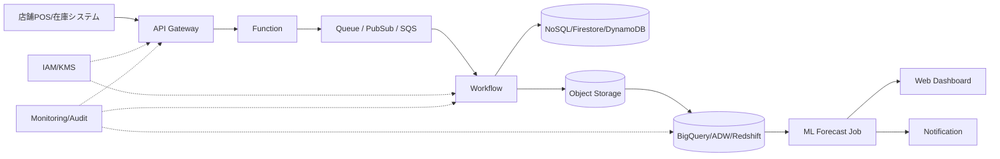

# 2026-04-16 10:15 Cloud Engineer Magazine
Tags: #cloud #aws #oci #gcp #architecture #daily
Links: [[Home]]

## 1) 今日のアプリ
**飲食店向け「在庫ロス最小化アプリ」**
- 目的: 発注・在庫・販売実績を日次で統合し、廃棄ロスを減らす
- コア機能:
  - POS売上取り込み（バッチ/準リアルタイム）
  - 在庫しきい値アラート
  - 需要予測（曜日・天候・イベント要因）
  - 店舗別ダッシュボード

> 今日の視点: **マルチクラウド実装マップ**（アーキテクチャの考え方は共通、実装はAWS/OCI/GCPで置換可能にする）

## 2) 要件整理（機能/非機能）
### 機能要件
- 店舗システムからCSV/APIで売上・在庫データを収集
- 毎日早朝に需要予測を実行
- 在庫不足/過剰見込みを通知
- 管理者向けWeb画面でKPI可視化（廃棄率、欠品率、発注提案）

### 非機能要件
- 可用性: 月99.9%以上（営業時間帯のUI停止を最小化）
- 性能: ダッシュボード初回表示3秒以内、1日数百万レコードの集計
- セキュリティ: 最小権限IAM、保存時暗号化、監査ログ必須
- コスト: 初期はサーバレス中心、成長時に一部を予約/専有へ移行

## 3) 推奨アーキテクチャ（なぜその構成か）
**イベント駆動 + サーバレス + マネージド分析基盤**を採用。
- 理由1: 店舗ごとのデータ到着タイミングが不揃いでも、メッセージングで吸収できる
- 理由2: 日次ピーク（予測実行時間）だけスケールさせられ、常時課金を抑えやすい
- 理由3: DWH/分析サービスを使うことで、運用負荷とチューニング工数を削減
- 理由4: IAMとKMSを中核に置くと、クラウド差異があってもセキュア設計を維持しやすい

## 4) クラウド別実装マップ
### AWS
- 収集/API: Amazon API Gateway + AWS Lambda
- 非同期取り込み: Amazon SQS
- ワークフロー: AWS Step Functions
- トランザクションDB: Amazon DynamoDB（店舗在庫の最新状態）
- データレイク: Amazon S3
- 分析/DWH: Amazon Redshift（またはAthena併用）
- 予測: Amazon Forecast（要件次第でSageMaker）
- 通知: Amazon SNS
- 認証: Amazon Cognito
- 監視: Amazon CloudWatch + AWS CloudTrail

### OCI
- 収集/API: OCI API Gateway + OCI Functions
- 非同期取り込み: OCI Queue
- ワークフロー: OCI Workflows
- トランザクションDB: OCI NoSQL Database
- データレイク: OCI Object Storage
- 分析/DWH: Autonomous Data Warehouse
- 予測: OCI Data Science
- 通知: OCI Notifications
- 認証: OCI IAM
- 監視: OCI Monitoring + Logging + Audit

### GCP
- 収集/API: API Gateway + Cloud Run Functions（またはCloud Functions）
- 非同期取り込み: Pub/Sub
- ワークフロー: Workflows
- トランザクションDB: Firestore（またはCloud SQL）
- データレイク: Cloud Storage
- 分析/DWH: BigQuery
- 予測: Vertex AI
- 通知: Cloud Monitoring Alerting / Pub/Sub push
- 認証: IAM + Identity Platform（アプリ認証要件に応じて）
- 監視: Cloud Monitoring + Cloud Logging + Cloud Audit Logs

## 5) システム構成図（Mermaid）

## 6) データフロー / 認証・認可 / 監視運用の要点
- データフロー:
  1. 店舗データをAPIで受信
  2. 受信直後にキューへ投入し、突発負荷を平滑化
  3. ワークフローで検証・正規化・保存
  4. 日次でDWH集計→予測→発注提案生成
- 認証・認可:
  - サービス間はロールベース（最小権限）
  - 人間ユーザーはSSO/OIDC連携、管理操作はMFA必須
  - 機密データはKMS鍵で暗号化、鍵利用権限を分離
- 監視運用:
  - SLI: API成功率、遅延、キュー滞留、予測ジョブ成功率
  - 監査: すべての管理操作・IAM変更を監査ログ化
  - 運用: アラート閾値は営業時間/夜間で分離

## 7) コスト最適化ポイント（初期・成長期）
- 初期:
  - サーバレス優先（Function/Queue/Managed DWH最小構成）
  - ストレージライフサイクルで古い生データを低頻度層へ
  - ダッシュボード更新頻度を業務に合わせて制御
- 成長期:
  - 分析基盤の予約/コミット割引活用（BigQuery slots, Redshift予約等）
  - 高頻度アクセスデータをキャッシュ層へ分離
  - モデル再学習頻度を最適化（毎日→店舗特性に応じ可変）

## 8) 障害時の設計（DR/バックアップ/フェイルオーバー）
- DR方針:
  - 重要データはクロスリージョン複製（Object Storage + DBバックアップ）
  - RPO: 15分、RTO: 1時間を目標
- バックアップ:
  - DBの定期スナップショット + Point-in-time recovery
  - IaCテンプレートを別リージョンで再現可能に保持
- フェイルオーバー:
  - API層はヘルスチェック付きでリージョン切替
  - キュー再処理（DLQ）を前提に「少なくとも1回」配送で設計

## 9) 学習ポイント（今日覚えるクラウド機能）
- **AWS Step Functions / OCI Workflows / GCP Workflows** の違い
  - 可視化された状態遷移で、再試行・分岐・タイムアウトをコード外に出せる
- **キューサービス**（SQS / OCI Queue / Pub/Sub）
  - 負荷平準化・疎結合化の要
- **監査ログ**（CloudTrail / Audit / Cloud Audit Logs）
  - インシデント調査とコンプライアンスの基盤

## 10) 30〜60分ミニ演習
1. 1クラウド選択（AWS/OCI/GCPどれでも）
2. 「API → Queue → Function/Workflow → DB」の最小パイプラインを作成
3. 失敗系テスト: 不正データを投入してDLQ/失敗ログを確認
4. IAMを見直し、「過剰権限1つ削除」を実施

**完了条件**
- 正常データがDBに保存される
- 異常データが検知され運用者が追跡可能
- 実行ロールが最小権限になっている

## 11) 公式ドキュメント参照リンク（AWS/OCI/GCP）
### AWS
- Well-Architected: https://docs.aws.amazon.com/wellarchitected/latest/framework/welcome.html
- API Gateway: https://docs.aws.amazon.com/apigateway/
- Lambda: https://docs.aws.amazon.com/lambda/
- SQS: https://docs.aws.amazon.com/sqs/
- Step Functions: https://docs.aws.amazon.com/step-functions/
- DynamoDB: https://docs.aws.amazon.com/dynamodb/
- S3: https://docs.aws.amazon.com/s3/
- Redshift: https://docs.aws.amazon.com/redshift/
- CloudWatch: https://docs.aws.amazon.com/cloudwatch/
- CloudTrail: https://docs.aws.amazon.com/awscloudtrail/

### OCI
- OCI Architecture Center / docs home: https://docs.oracle.com/en-us/iaas/Content/home.htm
- API Gateway: https://docs.oracle.com/en-us/iaas/Content/APIGateway/home.htm
- Functions: https://docs.oracle.com/en-us/iaas/Content/Functions/home.htm
- Queue: https://docs.oracle.com/en-us/iaas/Content/queue/home.htm
- Workflows: https://docs.oracle.com/en-us/iaas/Content/workflows/home.htm
- NoSQL: https://docs.oracle.com/en-us/iaas/nosql-database/index.html
- Object Storage: https://docs.oracle.com/en-us/iaas/Content/Object/home.htm
- Autonomous Data Warehouse: https://docs.oracle.com/en/cloud/paas/autonomous-data-warehouse/
- Monitoring: https://docs.oracle.com/en-us/iaas/Content/Monitoring/home.htm
- Logging: https://docs.oracle.com/en-us/iaas/Content/Logging/home.htm
- Audit: https://docs.oracle.com/en-us/iaas/Content/Audit/home.htm

### GCP
- Google Cloud docs home: https://docs.cloud.google.com/docs
- Architecture Framework: https://cloud.google.com/architecture/framework
- API Gateway: https://cloud.google.com/api-gateway/docs
- Pub/Sub: https://cloud.google.com/pubsub/docs
- Workflows: https://cloud.google.com/workflows/docs
- Firestore: https://cloud.google.com/firestore/docs
- Cloud Storage: https://cloud.google.com/storage/docs
- BigQuery: https://cloud.google.com/bigquery/docs
- Vertex AI: https://cloud.google.com/vertex-ai/docs
- Cloud Monitoring: https://cloud.google.com/monitoring/docs
- Cloud Logging: https://cloud.google.com/logging/docs
- Cloud Audit Logs: https://cloud.google.com/logging/docs/audit

---
**ひとことトレードオフ**
- 予測精度を優先するならML運用コストは増える。まずはルールベース補正 + 週次再学習から始め、ROIが見えたら高度化するのが安全。