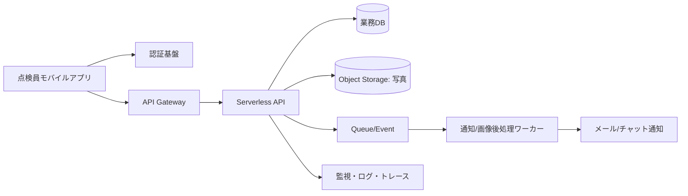

# Cloud Engineer Magazine (2026-04-19 10:15 JST)
[[Home]]

#cloud #aws #oci #gcp #architecture #daily

## 1) 今日のアプリ
**現場向け設備点検アプリ（写真＋チェックリスト＋オフライン対応）**
- 点検員がモバイルでチェック項目入力
- 異常時は写真添付して即時通報
- 電波が弱い拠点でも一時保存し、復帰後同期

> 今日の視点: **AWSを主軸にした単一クラウド実装**を基準にしつつ、OCI/GCPでの等価実装を比較

---

## 2) 要件整理（機能/非機能）
### 機能要件
- ユーザー認証（点検員/管理者）
- 点検レポート作成・更新・検索
- 画像アップロード（圧縮・メタ情報付与）
- 異常検知時の通知（メール/チャット連携）

### 非機能要件
- **可用性**: 業務時間中の停止を極小化（マルチAZ）
- **性能**: 1件の保存API P95 < 300ms（画像転送除く）
- **セキュリティ**: 最小権限IAM、保存/転送時暗号化、監査ログ
- **コスト**: 初期はサーバレス中心、成長後にDB/通知を最適化

---

## 3) 推奨アーキテクチャ（なぜその構成か）
- **API Gateway + Functions(Lambda/Functions/Cloud Run)**: 変動負荷に追随、運用負担小
- **Object Storage(S3/OCI Object Storage/Cloud Storage)**: 写真保存に最適、ライフサイクル管理可
- **Managed NoSQL/Relational DB**: 点検データの検索性を確保
- **Queue + Event駆動**: 通知や画像後処理を非同期化し、API遅延を抑制
- **WAF + IAM + KMS**: secure-by-default

**トレードオフ**
- サーバレスは初期コスト効率◎、ただし高トラフィック常時稼働ならコンテナ常駐の方が単価が下がる場合あり
- NoSQLは柔軟だが、複雑集計はDWH連携が必要

---

## 4) クラウド別実装マップ
### AWS
- 認証: Amazon Cognito
- API: Amazon API Gateway
- 実行: AWS Lambda
- データ: Amazon DynamoDB
- 画像保存: Amazon S3
- 非同期: Amazon SQS + Amazon EventBridge
- 監視: Amazon CloudWatch + AWS X-Ray
- セキュリティ: AWS WAF, AWS KMS, IAM

### OCI
- 認証: OCI IAM Identity Domains
- API: OCI API Gateway
- 実行: OCI Functions
- データ: OCI NoSQL Database（またはAutonomous JSON/ATP）
- 画像保存: OCI Object Storage
- 非同期: OCI Queue + OCI Events
- 監視: OCI Monitoring / Logging / APM
- セキュリティ: OCI WAF, Vault, IAM Policy

### GCP
- 認証: Identity Platform（またはCloud IAM + IAP設計）
- API: API Gateway
- 実行: Cloud Run（またはCloud Functions）
- データ: Firestore
- 画像保存: Cloud Storage
- 非同期: Pub/Sub + Eventarc
- 監視: Cloud Monitoring / Cloud Logging / Trace
- セキュリティ: Cloud Armor, Cloud KMS, IAM

---

## 5) システム構成図（Mermaid）

---

## 6) データフロー / 認証認可 / 監視運用の要点
- **データフロー**: クライアントは署名付きURLで画像を直接Object Storageへアップロード（APIサーバ負荷軽減）
- **認証認可**: JWT検証 + ロール分離（点検員は自拠点データのみ更新可）
- **監視運用**: API遅延・エラー率・キュー滞留をSLO化、閾値超過で自動通知

---

## 7) コスト最適化ポイント（初期・成長期）
### 初期
- サーバレス徹底（従量課金）
- ストレージライフサイクルで古い画像を低コスト層へ移行
- ログ保持期間を用途別に短縮

### 成長期
- DBのアクセスパターン見直し（ホットパーティション回避）
- 通知/バッチをまとめて実行しAPI呼び出し回数を削減
- 予約/コミット割引（各クラウドの長期利用割引）を検討

---

## 8) 障害時の設計（DR/バックアップ/フェイルオーバー）
- **DB**: 自動バックアップ + PITR（Point-in-Time Recovery）
- **オブジェクト**: バージョニング + クロスリージョン複製
- **API層**: マルチAZ、IaCで迅速再構築
- **DR訓練**: 四半期ごとに復旧演習（RTO/RPOを実測）

---

## 9) 学習ポイント（今日覚えるクラウド機能）
- **AWS**: S3署名付きURLで安全アップロード
- **OCI**: Events + Functionsでイベント駆動処理
- **GCP**: Eventarcでイベントルーティングを統一

---

## 10) 30〜60分ミニ演習
1. APIエンドポイント `/inspections` を1本作る（POST）
2. 画像アップロードを署名付きURL方式に変更
3. 登録完了イベントで通知キューを発火
4. 「失敗時リトライ3回 + DLQ」を追加
5. メトリクス3つ（遅延/エラー率/キュー長）をダッシュボード化

---

## 11) 公式ドキュメント参照リンク（AWS/OCI/GCP）
### AWS
- https://docs.aws.amazon.com/apigateway/
- https://docs.aws.amazon.com/lambda/
- https://docs.aws.amazon.com/amazondynamodb/
- https://docs.aws.amazon.com/AmazonS3/latest/userguide/
- https://docs.aws.amazon.com/waf/

### OCI
- https://docs.oracle.com/en-us/iaas/Content/APIGateway/home.htm
- https://docs.oracle.com/en-us/iaas/Content/Functions/home.htm
- https://docs.oracle.com/en-us/iaas/nosql-database/index.html
- https://docs.oracle.com/en-us/iaas/Content/Object/Concepts/objectstorageoverview.htm
- https://docs.oracle.com/en-us/iaas/Content/Events/home.htm

### GCP
- https://docs.cloud.google.com/api-gateway/docs
- https://docs.cloud.google.com/run/docs
- https://docs.cloud.google.com/firestore/docs
- https://docs.cloud.google.com/storage/docs
- https://docs.cloud.google.com/eventarc/docs
