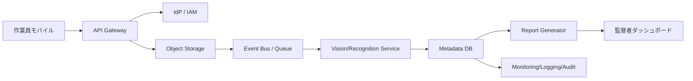

[[Home]]

# Cloud Engineer Magazine (2026-04-20)

## 1) 今日のアプリ
**建設現場の写真報告アプリ（モバイル）**
- 現場作業員がスマホで写真＋コメントを投稿
- AIで「ひび割れ」「漏水」「安全装備未着用」などを自動タグ付け
- 日次レポートを自動生成し、監督者に通知

---

## 2) 要件整理（機能要件 / 非機能要件）
### 機能要件
- 写真アップロード（オフライン時は端末キュー）
- 画像解析（物体検出・ラベル付け）
- 案件/現場/日付で検索
- PDF/HTMLの日次報告書生成
- 監督者承認ワークフロー

### 非機能要件
- **可用性**: 営業時間内SLA 99.9%以上、マルチAZ構成
- **性能**: 写真アップロード応答 < 2秒（非同期解析）
- **セキュリティ**: 最小権限IAM、保存時暗号化、監査ログ
- **コスト**: 初期はサーバレス中心、利用増加時に推論基盤を最適化

---

## 3) 推奨アーキテクチャ（なぜその構成か）
**イベント駆動サーバレス + マネージドAI**を採用。

理由:
1. 写真処理はバーストしやすく、サーバレスで自動スケールしやすい
2. AI推論はまずマネージドAPIで短期立ち上げ（MVP高速化）
3. メタデータDB + オブジェクトストレージ分離で検索性能とコストを両立

---

## 4) クラウド別実装マップ
### AWS での実装サービス
- フロント/API: **Amazon API Gateway** + **AWS Lambda**
- 認証: **Amazon Cognito**
- 画像保存: **Amazon S3**
- メタデータ: **Amazon DynamoDB**
- 画像解析: **Amazon Rekognition**
- 非同期連携: **Amazon EventBridge** / **Amazon SQS**
- 監視: **Amazon CloudWatch** + **AWS CloudTrail**

**トレードオフ**: Rekognitionは導入が速い一方、独自モデル要件が強い場合はSageMaker検討。

### OCI での実装サービス
- フロント/API: **OCI API Gateway** + **OCI Functions**
- 認証: **OCI IAM**（Identity Domains）
- 画像保存: **Object Storage**
- メタデータ: **Autonomous JSON Database**（または ATP/ADW）
- 画像解析: **OCI Vision**
- 非同期連携: **OCI Queue** + **Events**
- 監視: **OCI Monitoring** + **Logging** + **Audit**

**トレードオフ**: OCI Visionは統合しやすい。高度カスタムMLはData Scienceサービスとの組み合わせが必要。

### GCP での実装サービス
- フロント/API: **API Gateway** + **Cloud Run Functions / Cloud Run**
- 認証: **Identity Platform**（または Firebase Auth）
- 画像保存: **Cloud Storage**
- メタデータ: **Firestore**
- 画像解析: **Cloud Vision API**
- 非同期連携: **Pub/Sub**
- 監視: **Cloud Monitoring** + **Cloud Logging** + **Cloud Audit Logs**

**トレードオフ**: Vision APIは実装容易。厳密なRDBトランザクション要件が高いならCloud SQLを検討。

---

## 5) システム構成図（Mermaid）

---

## 6) データフロー / 認証・認可 / 監視運用の要点
### データフロー
1. モバイルが事前署名URLまたはAPI経由で画像アップロード
2. 保存イベントで非同期ジョブ起動
3. AI解析結果をメタデータDBへ保存
4. 日次バッチ/イベントで報告書生成

### 認証・認可
- ユーザー認証はマネージドIdP（Cognito / Identity Domains / Identity Platform）
- APIはJWT検証
- ストレージアクセスは短期トークン/署名URL
- IAMは「現場単位・役割単位」で最小権限

### 監視運用
- SLI: アップロード成功率、解析遅延、通知遅延
- アラート: キュー滞留、関数エラー率、AI API失敗率
- 監査: 管理操作はAudit/CloudTrail/Cloud Audit Logsで追跡

---

## 7) コスト最適化ポイント（初期・成長期）
### 初期
- サーバレス優先（アイドル課金回避）
- 画像ライフサイクル管理で低頻度ストレージへ自動移行
- AI推論は必要フィールドのみ抽出（過剰推論を避ける）

### 成長期
- 解析頻度に応じてバッチ化/優先度キュー導入
- 高頻度検索キーを最適化（ホットパーティション回避）
- 予約/コミットメント割引（Savings Plans / CUD系）を段階導入

---

## 8) 障害時の設計（DR / バックアップ / フェイルオーバー）
- **DR方針**: マルチAZを標準、リージョン障害は重要業務のみクロスリージョン
- **バックアップ**:
  - オブジェクトストレージのバージョニング
  - DBの定期スナップショット + PITR（対応サービス）
- **フェイルオーバー**:
  - APIはヘルスチェック付きで切替可能なDNS設計
  - キュー駆動で再処理可能（冪等キー必須）

---

## 9) 学習ポイント（今日覚えるクラウド機能）
- **イベント駆動設計**: アップロード完了をトリガーに非同期処理へ分離
- **最小権限IAM**: アプリ・運用者・監査の権限を分離
- **監査ログ**: セキュリティ事故時の追跡可能性を先に設計

---

## 10) 30〜60分ミニ演習
**演習テーマ: 「画像アップロード→自動タグ保存」最小構成を1クラウドで作る**
1. バケット/ストレージを作成し、暗号化とライフサイクル設定
2. API + 関数を作成（アップロードイベント受信）
3. Vision系APIを呼び、ラベル結果をDBへ保存
4. ログに trace_id を出力し、失敗時アラートを1本設定

成果物:
- APIエンドポイント
- 1件の画像解析結果レコード
- 失敗通知スクリーンショット（またはログURL）

---

## 11) 公式ドキュメント参照リンク（AWS / OCI / GCP）
### AWS
- API Gateway: https://docs.aws.amazon.com/apigateway/
- Lambda: https://docs.aws.amazon.com/lambda/
- S3: https://docs.aws.amazon.com/s3/
- DynamoDB: https://docs.aws.amazon.com/dynamodb/
- Rekognition: https://docs.aws.amazon.com/rekognition/
- EventBridge: https://docs.aws.amazon.com/eventbridge/
- CloudWatch: https://docs.aws.amazon.com/cloudwatch/
- CloudTrail: https://docs.aws.amazon.com/cloudtrail/

### OCI
- API Gateway: https://docs.oracle.com/en-us/iaas/Content/APIGateway/home.htm
- Functions: https://docs.oracle.com/en-us/iaas/Content/Functions/home.htm
- Object Storage: https://docs.oracle.com/en-us/iaas/Content/Object/home.htm
- Vision: https://docs.oracle.com/en-us/iaas/Content/vision/home.htm
- Queue: https://docs.oracle.com/en-us/iaas/Content/queue/home.htm
- Events: https://docs.oracle.com/en-us/iaas/Content/Events/home.htm
- Monitoring: https://docs.oracle.com/en-us/iaas/Content/Monitoring/home.htm
- Logging: https://docs.oracle.com/en-us/iaas/Content/Logging/home.htm
- Audit: https://docs.oracle.com/en-us/iaas/Content/Audit/home.htm

### GCP
- API Gateway: https://docs.cloud.google.com/api-gateway/docs
- Cloud Run: https://docs.cloud.google.com/run/docs
- Cloud Storage: https://docs.cloud.google.com/storage/docs
- Firestore: https://docs.cloud.google.com/firestore/docs
- Cloud Vision API: https://docs.cloud.google.com/vision/docs
- Pub/Sub: https://docs.cloud.google.com/pubsub/docs
- Cloud Monitoring: https://docs.cloud.google.com/monitoring/docs
- Cloud Logging: https://docs.cloud.google.com/logging/docs
- Cloud Audit Logs: https://docs.cloud.google.com/logging/docs/audit
