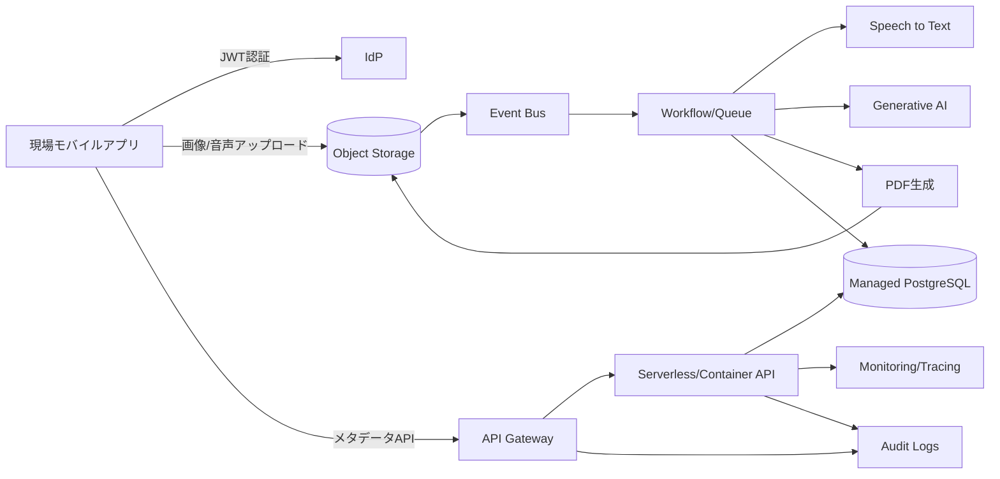

# 2026-04-21 Cloud Engineer Magazine
[[Home]]

## 1) 今日のアプリ
**フィールド保守向け「写真付き点検レポート即時作成アプリ」**
- 現場作業員がモバイルで写真・音声メモを送信
- AIで要約して点検レポートを自動生成
- 承認後にPDF化し、顧客へ共有

> 今日の視点: **マルチクラウド比較（AWS/OCI/GCP）**。アーキテクチャは共通パターンをベースに、各クラウドで同等実装する。

---

## 2) 要件整理（機能要件/非機能要件）
### 機能要件
- モバイルから画像アップロード（オフライン後同期）
- 音声→テキスト化、要約、定型レポート生成
- 承認ワークフロー（担当者→管理者）
- PDF出力・保管・検索

### 非機能要件
- **可用性**: 営業時間中SLA 99.9%以上、リージョン障害時はRTO 1時間以内
- **性能**: 画像アップロードはP95 2秒以内（メタデータAPI）、レポート生成は60秒以内
- **セキュリティ**: 最小権限IAM、保存時暗号化、監査ログ、短期トークン
- **コスト**: 初期はサーバーレス中心、利用増加時にコンテナ常駐へ段階移行

---

## 3) 推奨アーキテクチャ（なぜその構成か）
**イベント駆動 + マネージドAI + オブジェクトストレージ中心**
- 画像/音声はオブジェクトストレージへ直接保存（アプリサーバーの帯域負荷を回避）
- アップロードイベントで非同期処理（文字起こし、要約、PDF生成）
- メタデータはマネージドRDBに保存し、承認状態を厳密管理
- APIはID連携済みのAPI Gateway + Functions/Runで最小運用

**採用理由**
- ピーク時の変動負荷に強い（非同期処理で吸収）
- 監査・暗号化・IAMをクラウド標準機能で実装しやすい
- 初期費用を抑えつつ、将来はコンテナ基盤へ移行しやすい

---

## 4) クラウド別実装マップ
### AWS での実装サービス
- フロント/API: Amazon API Gateway + AWS Lambda
- 認証: Amazon Cognito
- 画像/音声保存: Amazon S3
- イベント連携: Amazon EventBridge
- 非同期処理: AWS Step Functions + Lambda
- 音声認識: Amazon Transcribe
- 生成AI要約: Amazon Bedrock
- DB: Amazon Aurora Serverless v2 (PostgreSQL)
- 監視: Amazon CloudWatch / AWS X-Ray / AWS CloudTrail

### OCI での実装サービス
- フロント/API: OCI API Gateway + OCI Functions
- 認証: OCI IAM Identity Domains
- 画像/音声保存: OCI Object Storage
- イベント連携: OCI Events + OCI Streaming（必要時）
- 非同期処理: OCI Functions + OCI Queue
- 音声/AI: OCI AI Speech / OCI Generative AI
- DB: OCI Autonomous Database (Transaction Processing)
- 監視: OCI Monitoring / Logging / Audit

### GCP での実装サービス
- フロント/API: API Gateway + Cloud Run
- 認証: Identity Platform（または Cloud Identity + IAP）
- 画像/音声保存: Cloud Storage
- イベント連携: Eventarc + Pub/Sub
- 非同期処理: Cloud Run Jobs / Cloud Functions
- 音声認識: Speech-to-Text
- 生成AI要約: Vertex AI (Gemini)
- DB: Cloud SQL for PostgreSQL
- 監視: Cloud Monitoring / Cloud Logging / Cloud Audit Logs

---

## 5) システム構成図（Mermaid）

---

## 6) データフロー/認証・認可/監視運用の要点
- **データフロー**: クライアントは事前署名URLで直接オブジェクト保存 → イベント発火 → 非同期でAI処理 → 結果をDB反映
- **認証・認可**:
  - OIDC/OAuth2ベースで短命トークン
  - APIはスコープ/ロールで最小権限
  - ストレージはバケットポリシー + KMS鍵で暗号化
- **監視運用**:
  - SLI: APIレイテンシ、非同期処理時間、失敗率
  - アラート: キュー滞留、AI呼び出し失敗、DB接続飽和
  - 監査: 管理操作とデータイベントのログ保持期間を明確化

---

## 7) コスト最適化ポイント（初期・成長期）
### 初期
- サーバーレス中心でアイドルコスト最小化
- ストレージはライフサイクルで低頻度層へ自動移行
- AI推論はバッチ化して呼び出し回数を削減

### 成長期
- 予測可能な高負荷処理はコンテナ常駐化（単価最適化）
- DBは接続プーリング/読み取り分離を導入
- 予約/コミットメント割引（Savings Plans / OCI commitments / GCP CUD）を検討

---

## 8) 障害時の設計（DR/バックアップ/フェイルオーバー）
- DB: 自動バックアップ + PITR、有事は別リージョンへ復旧
- オブジェクト: クロスリージョンレプリケーション
- API層: IaCで別リージョン再展開可能に
- 非同期キュー: 冪等キーで重複実行耐性
- DR訓練: 月次で「リージョン障害想定」の復旧演習を実施

---

## 9) 学習ポイント（今日覚えるクラウド機能）
1. **事前署名URL**で安全に大容量アップロード
2. **イベント駆動**で同期APIを細く保つ設計
3. **最小権限IAM**（実行ロール分離）の運用
4. **監査ログ + メトリクス + トレース**の三点セット
5. AI処理は**オンライン/バッチの使い分け**がコスト鍵

---

## 10) 30〜60分ミニ演習
**演習: 画像アップロード→イベント起動→ダミー要約保存までを1クラウドで実装**
- 目標:
  - バケット作成
  - APIで事前署名URL発行
  - アップロードイベントで関数起動
  - DB（または一時的にNoSQL）へ処理結果を書き込む
- 完了条件:
  - 1件アップロードで「受信→処理→保存」ログが追跡できる
  - IAMポリシーがワイルドカード最小化されている

---

## 11) 公式ドキュメント参照リンク（AWS/OCI/GCP）
### AWS
- Well-Architected Framework: https://docs.aws.amazon.com/wellarchitected/latest/framework/welcome.html
- Amazon S3: https://docs.aws.amazon.com/AmazonS3/latest/userguide/Welcome.html
- AWS Lambda: https://docs.aws.amazon.com/lambda/latest/dg/welcome.html
- Amazon API Gateway: https://docs.aws.amazon.com/apigateway/latest/developerguide/welcome.html
- Amazon Cognito: https://docs.aws.amazon.com/cognito/latest/developerguide/what-is-amazon-cognito.html
- AWS Step Functions: https://docs.aws.amazon.com/step-functions/latest/dg/welcome.html
- Amazon EventBridge: https://docs.aws.amazon.com/eventbridge/latest/userguide/eb-what-is.html
- Amazon Bedrock: https://docs.aws.amazon.com/bedrock/latest/userguide/what-is-bedrock.html

### OCI
- OCI Architecture Center: https://docs.oracle.com/en-us/iaas/Content/Architecture/Concepts/architecturecenter.htm
- OCI Object Storage: https://docs.oracle.com/en-us/iaas/Content/Object/Concepts/objectstorageoverview.htm
- OCI Functions: https://docs.oracle.com/en-us/iaas/Content/Functions/home.htm
- OCI API Gateway: https://docs.oracle.com/en-us/iaas/Content/APIGateway/home.htm
- OCI IAM Identity Domains: https://docs.oracle.com/en-us/iaas/Content/Identity/home.htm
- OCI Generative AI: https://docs.oracle.com/en-us/iaas/Content/generative-ai/home.htm
- OCI AI Speech: https://docs.oracle.com/en-us/iaas/Content/ai-speech/home.htm
- OCI Monitoring: https://docs.oracle.com/en-us/iaas/Content/Monitoring/home.htm

### GCP
- Google Cloud Architecture Framework: https://docs.cloud.google.com/architecture/framework
- Cloud Storage: https://docs.cloud.google.com/storage/docs
- Cloud Run: https://docs.cloud.google.com/run/docs
- API Gateway: https://docs.cloud.google.com/api-gateway/docs
- Pub/Sub: https://docs.cloud.google.com/pubsub/docs
- Eventarc: https://docs.cloud.google.com/eventarc/docs
- Speech-to-Text: https://docs.cloud.google.com/speech-to-text/docs
- Vertex AI: https://docs.cloud.google.com/vertex-ai/docs
- Cloud Monitoring: https://docs.cloud.google.com/monitoring/docs

---
実装メモ: まずは単一クラウドでMVPを1本作り、同一境界（認証、ストレージ、イベント、DB）で他クラウドへマッピングすると比較学習が最短です。
