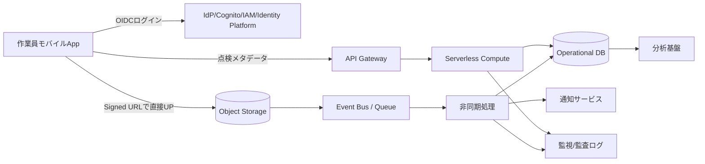

# 2026-04-22 10-15 Cloud Engineer Magazine

#cloud #aws #oci #gcp #architecture #daily
[[Home]]

## 1) 今日のアプリ
**写真付きフィールド点検アプリ（オフライン対応）**

現場作業員がスマホで設備点検を実施し、写真・チェック項目・位置情報を送信。管理者はダッシュボードで進捗/異常を確認。地下・山間部でも使えるようにオフライン入力を前提にする。

---

## 2) 要件整理（機能要件/非機能要件）
### 機能要件
- 点検テンプレート配布（設備種別ごと）
- 点検結果入力（テキスト、数値、写真、GPS）
- オフライン保存→オンライン時に自動同期
- 異常値検知時の通知
- 管理者向け検索・集計ダッシュボード

### 非機能要件
- **可用性**: 99.9%以上（業務時間中の停止最小化）
- **性能**: 写真アップロード後5秒以内で記録反映（通常時）
- **セキュリティ**: 最小権限IAM、暗号化（保存時/転送時）、監査ログ
- **コスト**: 初期はサーバレス中心、利用増で段階的に最適化

---

## 3) 推奨アーキテクチャ（なぜその構成か）
**方針: API + オブジェクトストレージ + 非同期処理 + マネージドDB**

- モバイルクライアントは認証後にAPIへメタデータ送信
- 写真は署名付きURLで直接オブジェクトストレージへ保存（APIサーバの帯域負荷を回避）
- アップロードイベントを契機に非同期処理（サムネ生成/AI検査/通知）
- 点検結果はトランザクションDB、分析は別系（BQ/ADW等）へ集約

**理由**
- オフライン再送や写真大容量に強い
- スパイク時もキュー/イベントで吸収しやすい
- 初期は低運用、成長後に分析基盤を拡張しやすい

---

## 4) クラウド別実装マップ
### AWS での実装サービス
- 認証: **Amazon Cognito**
- API: **Amazon API Gateway + AWS Lambda**
- 写真保存: **Amazon S3**（Pre-signed URL）
- DB: **Amazon DynamoDB**（点検レコード）
- 非同期: **Amazon EventBridge / Amazon SQS**
- 通知: **Amazon SNS**
- 監視: **Amazon CloudWatch + AWS CloudTrail**
- 鍵管理: **AWS KMS**

### OCI での実装サービス
- 認証: **OCI IAM**（Identity Domains）
- API: **OCI API Gateway + OCI Functions**
- 写真保存: **OCI Object Storage**（Pre-Authenticated Request/署名URL運用）
- DB: **Autonomous JSON Database** または **OCI NoSQL Database**
- 非同期: **OCI Streaming** / **OCI Queue**
- 通知: **OCI Notifications**
- 監視: **OCI Monitoring + Logging + Audit**
- 鍵管理: **OCI Vault**

### GCP での実装サービス
- 認証: **Identity Platform**（または Firebase Authentication）
- API: **API Gateway + Cloud Run/Cloud Functions**
- 写真保存: **Cloud Storage**（Signed URL）
- DB: **Firestore**（点検レコード）
- 非同期: **Pub/Sub + Eventarc**
- 通知: **Firebase Cloud Messaging / Pub/Sub連携**
- 監視: **Cloud Monitoring + Cloud Logging + Cloud Audit Logs**
- 鍵管理: **Cloud KMS**

**トレードオフ（短評）**
- DynamoDB/Firestoreは運用軽量で初速◎、複雑JOINは苦手
- OCIはコスト競争力と統合運用が強み、チーム習熟が鍵
- Cloud Runはコンテナ資産流用に強く、Lambdaはイベント連携の密度が高い

---

## 5) システム構成図（Mermaid）

---

## 6) データフロー/認証・認可/監視運用の要点
- **データフロー**: 
  1. ユーザー認証
  2. APIで点検ID発行
  3. Signed URL取得
  4. 画像をObject Storageへ直送
  5. イベント発火→非同期処理→DB更新→通知
- **認証・認可**:
  - モバイルはOIDC/OAuth2トークン利用
  - APIはJWT検証 + ロールベースアクセス制御
  - ストレージは短命URL（数分） + バケットポリシー最小化
- **監視運用**:
  - SLI: API成功率、P95遅延、同期失敗率、キュー滞留
  - アラート: しきい値 + 異常検知（エラー急増/再試行増大）
  - 監査: 管理操作は全てAudit/Trailへ

---

## 7) コスト最適化ポイント（初期・成長期）
### 初期
- サーバレス中心（Lambda/Functions/Cloud Run）でアイドル課金を回避
- 画像はライフサイクルで低頻度層へ自動移行
- ログ保持期間を業務要件に合わせて短縮

### 成長期
- 高トラフィックAPIは予約/コミットメント（Savings Plans/CUD等）を検討
- DBアクセスパターンを見直し、ホットパーティションを回避
- 画像変換ワークロードをバッチ化して単価最適化

---

## 8) 障害時の設計（DR/バックアップ/フェイルオーバー）
- **DR方針**: 重要度に応じてRTO/RPOを明確化（例: RTO 1時間, RPO 15分）
- **バックアップ**:
  - DBは定期スナップショット + PITR
  - Object Storageはバージョニング + クロスリージョン複製
- **フェイルオーバー**:
  - API/ComputeはマルチAZ前提
  - 必要に応じてリージョン待機系（Warm Standby）
- **実運用**:
  - 四半期ごとに復旧演習（Runbook更新）

---

## 9) 学習ポイント（今日覚えるクラウド機能）
1. **Signed URL / Pre-signed URL** で大容量アップロードを安全に直送
2. **イベント駆動設計**（EventBridge/Pub/Sub/Streaming）で疎結合化
3. **監査ログの常時有効化**（CloudTrail/Audit Logs/OCI Audit）
4. **KMS/Vault連携**で暗号鍵管理を分離

---

## 10) 30〜60分ミニ演習
**お題: 「画像アップロードをAPI経由からSigned URL方式に置き換える設計メモを作る」**

- 15分: 現行フロー図（API経由）を描く
- 15分: Signed URL方式に置換した新フロー図を描く
- 15分: IAMポリシー（最小権限）を3つ定義
- 15分: 失敗時再送（指数バックオフ）と監視項目を列挙

**達成条件**
- API帯域削減理由を説明できる
- URL有効期限・権限スコープ・監査ログの設計を説明できる

---

## 11) 公式ドキュメント参照リンク（AWS/OCI/GCP）
### AWS
- Well-Architected Framework: https://docs.aws.amazon.com/wellarchitected/latest/framework/welcome.html
- Amazon S3 presigned URL: https://docs.aws.amazon.com/AmazonS3/latest/userguide/using-presigned-url.html
- Amazon API Gateway: https://docs.aws.amazon.com/apigateway/latest/developerguide/welcome.html
- AWS Lambda: https://docs.aws.amazon.com/lambda/latest/dg/welcome.html
- Amazon DynamoDB: https://docs.aws.amazon.com/amazondynamodb/latest/developerguide/Introduction.html
- AWS CloudTrail: https://docs.aws.amazon.com/awscloudtrail/latest/userguide/cloudtrail-user-guide.html

### OCI
- OCI Architecture Center: https://docs.oracle.com/en-us/iaas/Content/Architecture/home.htm
- OCI Object Storage: https://docs.oracle.com/en-us/iaas/Content/Object/home.htm
- OCI API Gateway: https://docs.oracle.com/en-us/iaas/Content/APIGateway/home.htm
- OCI Functions: https://docs.oracle.com/en-us/iaas/Content/Functions/home.htm
- OCI Monitoring: https://docs.oracle.com/en-us/iaas/Content/Monitoring/home.htm
- OCI Vault: https://docs.oracle.com/en-us/iaas/Content/KeyManagement/home.htm

### GCP
- Google Cloud Architecture Framework: https://docs.cloud.google.com/architecture/framework
- Cloud Storage Signed URLs: https://docs.cloud.google.com/storage/docs/access-control/signed-urls
- API Gateway: https://docs.cloud.google.com/api-gateway/docs
- Cloud Run: https://docs.cloud.google.com/run/docs
- Firestore: https://docs.cloud.google.com/firestore/docs
- Cloud Audit Logs: https://docs.cloud.google.com/logging/docs/audit
