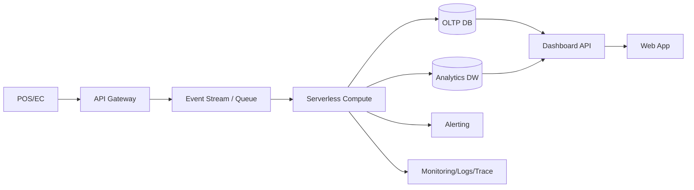

# 2026-04-23 10:15 Cloud Engineer Magazine
Tags: #cloud #aws #oci #gcp #architecture #daily  
Links: [[Home]]

## 1) 今日のアプリ
**店舗向けリアルタイム在庫アラートSaaS**  
複数店舗のPOS/EC在庫を数秒〜1分単位で集約し、欠品予兆・過剰在庫を通知する。

---

## 2) 要件整理（機能要件/非機能要件）
### 機能要件
- POS/ECイベントをリアルタイム取り込み
- SKUごとの在庫閾値アラート（メール/チャット/Webhook）
- 店舗・カテゴリ別ダッシュボード
- 在庫補充提案（ルールベース）

### 非機能要件
- **可用性**: 99.9%以上（取り込みとAPIを冗長化）
- **性能**: イベント反映遅延 < 60秒、API p95 < 300ms
- **セキュリティ**: 最小権限IAM、暗号化（保存時/転送時）、監査ログ
- **コスト**: 初期はサーバレス中心、成長時に高頻度処理のみ常時稼働へ最適化

---

## 3) 推奨アーキテクチャ（なぜその構成か）
**方針: イベント駆動 + マネージドDB + マネージド監視**
- イベントバス/キューでバースト吸収し、POSピークに耐える
- サーバレス関数で集計・アラート判定し、運用負荷を下げる
- OLTP向けマネージドRDB（在庫最新値）+ 分析基盤（履歴分析）を分離
- IAMロール分離（ingest / compute / read-only dashboard）で被害範囲を局所化

**トレードオフ（例）**
- サーバレス関数: 運用は軽いが高頻度・長時間処理は割高になり得る
- マネージドRDB: 一貫性が取りやすいが、超高スループット時はパーティショニング設計が重要

---

## 4) クラウド別実装マップ
### AWS での実装サービス
- 取り込み: **Amazon API Gateway** + **Amazon EventBridge**（またはSQS）
- 処理: **AWS Lambda**
- トランザクションDB: **Amazon Aurora PostgreSQL**
- 分析: **Amazon Redshift Serverless**
- 認証: **Amazon Cognito** + **IAM**
- 監視: **Amazon CloudWatch** + **AWS X-Ray**
- 秘密情報: **AWS Secrets Manager**

### OCI での実装サービス
- 取り込み: **OCI API Gateway** + **OCI Streaming**
- 処理: **OCI Functions**
- トランザクションDB: **Autonomous Transaction Processing**
- 分析: **Autonomous Data Warehouse**
- 認証: **OCI Identity and Access Management (IAM)**
- 監視: **OCI Monitoring** + **Logging** + **Application Performance Monitoring**
- 秘密情報: **OCI Vault**

### GCP での実装サービス
- 取り込み: **API Gateway** + **Pub/Sub**
- 処理: **Cloud Run**（または Cloud Functions）
- トランザクションDB: **Cloud SQL for PostgreSQL**
- 分析: **BigQuery**
- 認証: **Identity and Access Management (IAM)** / **Identity Platform**
- 監視: **Cloud Monitoring** + **Cloud Logging** + **Cloud Trace**
- 秘密情報: **Secret Manager**

---

## 5) システム構成図（Mermaid）

---

## 6) データフロー/認証・認可/監視運用の要点
- **データフロー**: 受信イベントに idempotency key（event_id）を付与し重複排除
- **認証・認可**:
  - クライアントはOIDC/OAuth2で認証
  - サービス間は短期クレデンシャル（ロール/サービスアカウント）
  - DB接続情報はSecrets Manager/Vault/Secret Managerで集中管理
- **監視運用**:
  - SLI: 取り込み成功率、反映遅延、アラート送信成功率
  - SLO逸脱で自動通知
  - 構造化ログ + 分散トレースで遅延箇所を可視化

---

## 7) コスト最適化ポイント（初期・成長期）
### 初期
- サーバレス中心（Lambda/Functions/Cloud Run）でアイドルコストを抑制
- 分析はサーバレスDWH（Redshift Serverless / ADW / BigQuery）で最小スタート

### 成長期
- 高頻度バッチを常時稼働コンピュートへ移管（単価最適化）
- ストレージのライフサイクル管理で履歴データを低コスト層へ
- クエリ最適化（パーティション/クラスタリング/マテビュー）で分析課金を削減

---

## 8) 障害時の設計（DR/バックアップ/フェイルオーバー）
- **DR方針**: RPO 5〜15分、RTO 30〜60分を目標
- DBは自動バックアップ + PITR有効化
- リージョン障害に備え、イベントを永続キューに保持して再処理可能にする
- IaC（Terraform等）で別リージョンへ再展開可能にしておく
- 定期的に復旧訓練（Runbookベース）を実施

---

## 9) 学習ポイント（今日覚えるクラウド機能）
- **AWS EventBridge**: イベントルーティングと疎結合化
- **OCI Streaming**: 高スループットのイベントストリーミング基盤
- **GCP Pub/Sub**: 非同期メッセージングによるバースト吸収

---

## 10) 30〜60分ミニ演習
1. 1つのSKUイベントJSON（入荷/販売）を定義
2. API Gateway → Queue/Stream → Function/Run の最小パイプラインを1クラウドで作る
3. 在庫閾値ロジック（例: 在庫 < 5）で通知を出す
4. 同じ処理を別クラウドでサービス対応表に置き換える
5. 比較メモを3行で書く（実装速度/運用性/課金感）

---

## 11) 公式ドキュメント参照リンク（AWS/OCI/GCP）
### AWS
- Well-Architected Framework: https://docs.aws.amazon.com/wellarchitected/latest/framework/welcome.html
- Amazon EventBridge: https://docs.aws.amazon.com/eventbridge/
- AWS Lambda: https://docs.aws.amazon.com/lambda/
- Amazon Aurora: https://docs.aws.amazon.com/aurora/
- Amazon Cognito: https://docs.aws.amazon.com/cognito/
- Amazon CloudWatch: https://docs.aws.amazon.com/cloudwatch/

### OCI
- OCI Architecture Center: https://docs.oracle.com/en-us/iaas/Content/Architecture/home.htm
- OCI Streaming: https://docs.oracle.com/en-us/iaas/Content/Streaming/home.htm
- OCI Functions: https://docs.oracle.com/en-us/iaas/Content/Functions/home.htm
- Autonomous Database: https://docs.oracle.com/en-us/iaas/autonomous-database/index.html
- OCI IAM: https://docs.oracle.com/en-us/iaas/Content/Identity/home.htm
- OCI Monitoring: https://docs.oracle.com/en-us/iaas/Content/Monitoring/home.htm

### GCP
- Google Cloud Architecture Framework: https://docs.cloud.google.com/architecture/framework
- Pub/Sub: https://docs.cloud.google.com/pubsub/docs
- Cloud Run: https://docs.cloud.google.com/run/docs
- Cloud SQL: https://docs.cloud.google.com/sql/docs
- BigQuery: https://docs.cloud.google.com/bigquery/docs
- IAM: https://docs.cloud.google.com/iam/docs
