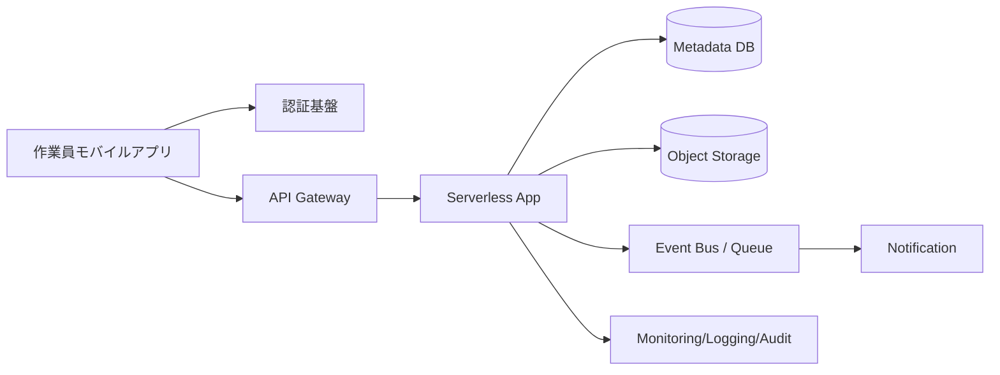

[[Home]]

# Cloud Engineer Magazine (2026-04-24)
**Perspective:** マルチクラウド比較（同一要件を AWS / OCI / GCP で実装）

## 1) 今日のアプリ
**写真付き現場点検レポートアプリ**（モバイル）
- 作業員が写真＋チェック項目＋位置情報を送信
- 管理者がダッシュボードで進捗確認
- 異常検知時に即時通知

## 2) 要件整理
### 機能要件
- 点検レポートの登録（画像アップロード、コメント、GPS）
- レポート一覧・検索（現場/担当者/日付）
- 異常フラグ時の通知（メール/チャット）

### 非機能要件
- **可用性:** 業務時間中の停止最小化（マルチAZ/リージョン設計余地）
- **性能:** 画像アップロードの低遅延、一覧API p95 < 300ms 目標
- **セキュリティ:** 最小権限IAM、保存時暗号化、監査ログ
- **コスト:** 初期はサーバレス中心、成長時はアクセス頻度で階層化

## 3) 推奨アーキテクチャ（なぜその構成か）
- **API + 認証 + オブジェクトストレージ + マネージドDB** の定番構成
- 写真はオブジェクトストレージに分離し、DBにはメタデータのみ保存
- 非同期通知（キュー/イベント）でAPI応答を軽くする
- 監視・監査を標準サービスで統一し運用負荷を下げる

## 4) クラウド別実装マップ
### AWS
- 認証: **Amazon Cognito**
- API: **Amazon API Gateway + AWS Lambda**
- 画像保存: **Amazon S3**
- メタデータDB: **Amazon DynamoDB**
- 通知/非同期: **Amazon EventBridge + Amazon SNS**
- 監視: **Amazon CloudWatch + AWS CloudTrail**

### OCI
- 認証: **OCI Identity and Access Management (IAM)**（アプリ認証はIDCS/OIDC連携）
- API: **OCI API Gateway + OCI Functions**
- 画像保存: **OCI Object Storage**
- メタデータDB: **OCI NoSQL Database**（または ATP）
- 通知/非同期: **OCI Events + OCI Notifications**
- 監視: **OCI Monitoring + Logging + Audit**

### GCP
- 認証: **Identity Platform**（または Firebase Authentication）
- API: **API Gateway + Cloud Run**（または Cloud Functions）
- 画像保存: **Cloud Storage**
- メタデータDB: **Firestore (Native mode)**
- 通知/非同期: **Eventarc + Pub/Sub**
- 監視: **Cloud Monitoring + Cloud Logging + Cloud Audit Logs**

## 5) システム構成図（Mermaid）

## 6) データフロー/認証・認可/監視運用の要点
- **データフロー:** 画像は事前署名URLで直接ストレージへ、APIはメタデータ登録のみ
- **認証・認可:** OIDC/JWT検証 + API単位のRBAC、バックエンドは最小権限ロール
- **監視運用:**
  - SLI: API成功率、p95レイテンシ、アップロード失敗率
  - アラート: 異常率急増、関数エラー、通知配信失敗
  - 監査: 認証イベント・権限変更・データイベントを監査ログへ

## 7) コスト最適化ポイント（初期・成長期）
- **初期:** サーバレス徹底（Lambda/Functions/Cloud Run最小構成）、ストレージ標準クラス
- **成長期:**
  - 画像ライフサイクルで低頻度階層へ自動移行
  - 読み取り多発時はキャッシュ層導入
  - APIのコールドスタート/同時実行を計測し、常時起動最小限化

## 8) 障害時の設計（DR/バックアップ/フェイルオーバー）
- ストレージはバージョニング + クロスリージョン複製（要件次第）
- DBは PITR / バックアップ有効化、復旧手順をRunbook化
- API層はIaCで再構築可能にし、リージョン切替手順を定期演習
- **トレードオフ:** 多リージョン常時アクティブは高コスト、まずはバックアップ + 手動昇格から開始

## 9) 学習ポイント（今日覚えるクラウド機能）
- **AWS:** S3 事前署名URLで安全な直接アップロード
- **OCI:** Events → Notifications のイベント駆動連携
- **GCP:** Eventarc を使った疎結合なイベントルーティング

## 10) 30〜60分ミニ演習
1. 1クラウドを選び、API + Storage + DB の最小構成を作成
2. 画像アップロードを「アプリ→API経由」から「事前署名URL直送」に変更
3. 異常フラグで通知を飛ばすイベントルールを追加
4. ダッシュボードに以下3指標を表示: APIエラー率 / p95 / 通知失敗数

## 11) 公式ドキュメント参照リンク（AWS/OCI/GCP）
### AWS
- API Gateway: https://docs.aws.amazon.com/apigateway/
- Lambda: https://docs.aws.amazon.com/lambda/
- S3: https://docs.aws.amazon.com/s3/
- DynamoDB: https://docs.aws.amazon.com/dynamodb/
- Cognito: https://docs.aws.amazon.com/cognito/
- EventBridge: https://docs.aws.amazon.com/eventbridge/
- SNS: https://docs.aws.amazon.com/sns/
- CloudWatch: https://docs.aws.amazon.com/cloudwatch/
- CloudTrail: https://docs.aws.amazon.com/cloudtrail/

### OCI
- API Gateway: https://docs.oracle.com/en-us/iaas/Content/APIGateway/home.htm
- Functions: https://docs.oracle.com/en-us/iaas/Content/Functions/home.htm
- Object Storage: https://docs.oracle.com/en-us/iaas/Content/Object/home.htm
- NoSQL Database: https://docs.oracle.com/en-us/iaas/nosql-database/index.html
- Events: https://docs.oracle.com/en-us/iaas/Content/Events/home.htm
- Notifications: https://docs.oracle.com/en-us/iaas/Content/Notification/home.htm
- Monitoring: https://docs.oracle.com/en-us/iaas/Content/Monitoring/home.htm
- Logging: https://docs.oracle.com/en-us/iaas/Content/Logging/home.htm
- Audit: https://docs.oracle.com/en-us/iaas/Content/Audit/home.htm

### GCP
- API Gateway: https://docs.cloud.google.com/api-gateway/docs
- Cloud Run: https://docs.cloud.google.com/run/docs
- Cloud Storage: https://docs.cloud.google.com/storage/docs
- Firestore: https://docs.cloud.google.com/firestore/docs
- Pub/Sub: https://docs.cloud.google.com/pubsub/docs
- Eventarc: https://docs.cloud.google.com/eventarc/docs
- Cloud Monitoring: https://docs.cloud.google.com/monitoring/docs
- Cloud Logging: https://docs.cloud.google.com/logging/docs
- Cloud Audit Logs: https://docs.cloud.google.com/logging/docs/audit

---
**ひとことトレードオフ:**
- 開発速度重視なら AWS/GCP のサーバレス統合が速い。
- 既存Oracle資産が強い組織なら OCI は運用整合性が高い。
- マルチクラウドは可搬性向上の反面、運用標準化コストが増える。