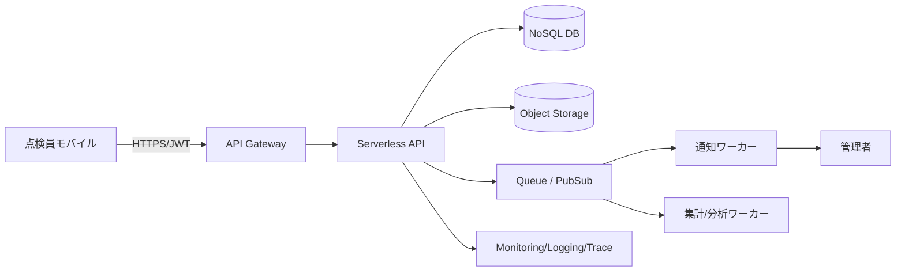

# 2026-04-25 10-15 Cloud Engineer Magazine
#cloud #aws #oci #gcp #architecture #daily
[[Home]]

## 1) 今日のアプリ
**オフライン対応の現場設備点検アプリ（写真付き報告 + 異常検知）**
- 点検員がモバイルでチェックリスト入力、写真添付、異常フラグを送信
- 電波が弱い現場でも一時保存し、オンライン復帰時に同期
- 管理者はダッシュボードで進捗・異常件数を即時確認

## 2) 要件整理（機能/非機能）
**機能要件**
- 点検結果 CRUD、写真アップロード、コメント
- オフラインキューと再送
- 異常時の通知（メール/チャット）
- 日次/週次レポート

**非機能要件**
- 可用性: 業務時間帯 99.9% 以上
- 性能: API p95 < 300ms、画像アップロードは非同期
- セキュリティ: 最小権限 IAM、保存時暗号化、監査ログ
- コスト: 初期はサーバレス中心、成長時にホットパス最適化

## 3) 推奨アーキテクチャ（なぜその構成か）
**方針: API はサーバレス、画像はオブジェクトストレージ、集計はイベント駆動**
- モバイル→API Gateway→Functions/Lambda/Cloud Run で運用負荷を削減
- 写真は Object Storage/S3/Cloud Storage に分離し、DB 負荷を回避
- 点検イベントをメッセージング層に流し、通知・分析を疎結合化
- 認証は IDaaS（Cognito / OCI IAM Identity Domains / Firebase Auth + IAM）で統一

## 4) クラウド別実装マップ
### AWS
- 認証: Amazon Cognito
- API: Amazon API Gateway + AWS Lambda
- データ: Amazon DynamoDB（点検メタデータ）
- 画像: Amazon S3（必要なら S3 Lifecycle）
- 非同期: Amazon SQS + EventBridge
- 監視: Amazon CloudWatch + AWS X-Ray

### OCI
- 認証: OCI IAM Identity Domains
- API: OCI API Gateway + OCI Functions
- データ: OCI NoSQL Database
- 画像: OCI Object Storage（Lifecycle/Archive）
- 非同期: OCI Queue + OCI Events
- 監視: OCI Monitoring + Logging + APM

### GCP
- 認証: Firebase Authentication + IAM
- API: API Gateway + Cloud Run
- データ: Firestore（Native mode）
- 画像: Cloud Storage
- 非同期: Pub/Sub + Eventarc
- 監視: Cloud Monitoring + Cloud Logging + Cloud Trace

## 5) システム構成図（Mermaid）

## 6) データフロー/認証・認可/監視運用の要点
- データフロー: モバイルは**署名付きURL**で画像を直接保存し、APIはメタデータのみ処理
- 認証: OIDC/JWT、短命トークン、端末紛失時の即時失効
- 認可: ロール分離（点検員/管理者/監査者）、環境別 IAM 分離
- 監視: SLI（成功率/レイテンシ/キュー滞留）、アラートは業務時間の優先度を分離

## 7) コスト最適化ポイント（初期・成長期）
**初期**
- サーバレス徹底（常時稼働 VM を避ける）
- ストレージ Lifecycle で古い写真を低コスト層へ
- ログ保持期間を要件準拠で短縮

**成長期**
- 高頻度 API はキャッシュ導入（API Gateway/Cloud CDN 相当）
- DB のアクセスパターン見直し（ホットキー分散、二次索引最適化）
- 非同期ワーカーをバッチ化し呼び出し回数を削減

## 8) 障害時の設計（DR/バックアップ/フェイルオーバー）
- DB: 定期バックアップ + PITR（可能なサービスで有効化）
- オブジェクト: バージョニング + クロスリージョン複製（重要写真のみ）
- API: IaC で別リージョン再構築可能にする
- フェイルオーバー: DNS/ルーティングで段階切替、キュー再処理で整合性回復

## 9) 学習ポイント（今日覚えるクラウド機能）
- **AWS**: S3 Presigned URL でアプリ経由の大容量転送を回避
- **OCI**: API Gateway + Functions + Queue のイベント分離
- **GCP**: Cloud Run + Pub/Sub + Eventarc で疎結合イベント処理

## 10) 30〜60分ミニ演習
1. API に「点検結果登録」エンドポイントを 1 つ作る
2. 画像アップロードを署名付き URL 方式に変更する
3. 異常フラグ true のイベントだけキューへ publish
4. 監視に `API p95` と `Queue oldest age` のアラートを追加
5. 最後に「最小権限 IAM になっているか」を自己レビュー

## 11) 公式ドキュメント参照リンク（AWS/OCI/GCP）
**AWS**
- API Gateway: https://docs.aws.amazon.com/apigateway/
- Lambda: https://docs.aws.amazon.com/lambda/
- DynamoDB: https://docs.aws.amazon.com/dynamodb/
- S3: https://docs.aws.amazon.com/s3/
- SQS: https://docs.aws.amazon.com/sqs/
- CloudWatch: https://docs.aws.amazon.com/cloudwatch/

**OCI**
- API Gateway: https://docs.oracle.com/en-us/iaas/Content/APIGateway/home.htm
- Functions: https://docs.oracle.com/en-us/iaas/Content/Functions/home.htm
- NoSQL: https://docs.oracle.com/en-us/iaas/nosql-database/index.html
- Object Storage: https://docs.oracle.com/en-us/iaas/Content/Object/home.htm
- Queue: https://docs.oracle.com/en-us/iaas/Content/queue/home.htm
- Monitoring: https://docs.oracle.com/en-us/iaas/Content/Monitoring/home.htm

**GCP**
- API Gateway: https://docs.cloud.google.com/api-gateway/docs
- Cloud Run: https://docs.cloud.google.com/run/docs
- Firestore: https://docs.cloud.google.com/firestore/docs
- Cloud Storage: https://docs.cloud.google.com/storage/docs
- Pub/Sub: https://docs.cloud.google.com/pubsub/docs
- Cloud Monitoring: https://docs.cloud.google.com/monitoring/docs

---
### ひとことトレードオフ
- AWS は選択肢が広く細かい最適化が得意（設計自由度高い分、決めることが多い）
- OCI はシンプルな構成でコスト見通しを立てやすい（採用事例/情報量は AWS・GCP より少なめ）
- GCP は Cloud Run / PubSub の開発体験が軽快（組織 IAM 設計を先に固めると運用が楽）
