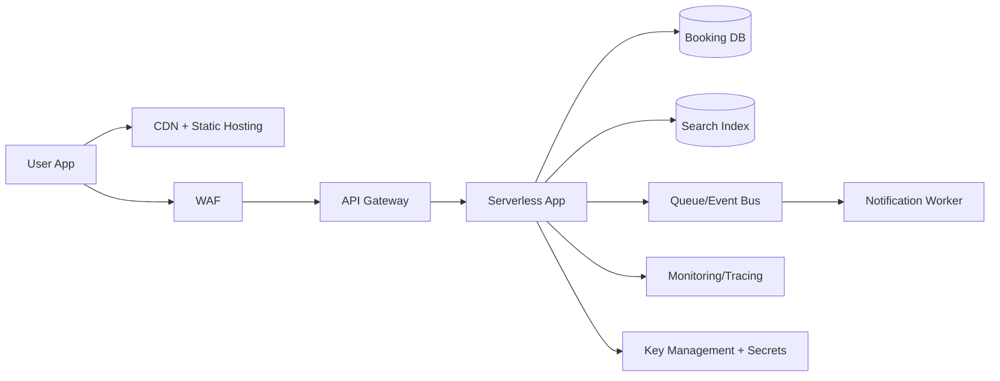

# Daily Cloud Engineer Magazine - 2026-04-26
Tags: #cloud #aws #oci #gcp #architecture #daily
Link: [[Home]]

## 1) 今日のアプリ
**地域イベント予約プラットフォーム（Web + モバイルAPI）**
- ユーザーはイベント検索・予約・キャンセル
- 主催者は在庫（席数）管理、当日チェックインQR発行
- 決済は外部PSP連携（本稿では決済基盤は境界外）

---

## 2) 要件整理（機能/非機能）
### 機能要件
- イベント検索（日時・場所・カテゴリ）
- 予約/キャンセル（在庫の同時更新、二重予約防止）
- ユーザープロファイル管理
- 通知（予約確定、リマインド）

### 非機能要件
- **可用性**: 月間稼働率 99.9%以上、リージョン障害時はRTO 60分以内
- **性能**: 検索API p95 < 300ms、予約API p95 < 500ms
- **セキュリティ**: OIDCベース認証、最小権限IAM、保存/通信の暗号化
- **コスト**: 初期はサーバレス中心で固定費最小化、成長時に段階的に最適化

---

## 3) 推奨アーキテクチャ（なぜその構成か）
**視点: マルチクラウド比較（実装は各クラウド単独でも成立）**
- エッジ配信 + APIゲートウェイ + サーバレス実行 + マネージドDB
- 予約処理は**トランザクション整合性優先**（在庫更新を単一書き込みパスに限定）
- 検索は読み取り最適化（全文検索/二次インデックス）を分離
- 非同期通知はキュー/イベントで疎結合化

**理由**
1. 初期はアクセス変動が大きく、サーバレスが過不足なく追従
2. 予約の整合性と検索のスケーラビリティを分離できる
3. WAF + IAM + KMSで secure-by-default を実装しやすい

---

## 4) クラウド別実装マップ
### AWS
- フロント: CloudFront + S3
- API: Amazon API Gateway
- アプリ: AWS Lambda
- 予約DB: Amazon DynamoDB（条件付き書き込みで二重予約防止）
- 検索: Amazon OpenSearch Service
- 非同期: Amazon SQS / Amazon EventBridge
- 認証: Amazon Cognito
- 監視: Amazon CloudWatch + AWS X-Ray
- 秘密情報: AWS Secrets Manager

### OCI
- フロント: OCI Object Storage + OCI CDN
- API: OCI API Gateway
- アプリ: OCI Functions
- 予約DB: Autonomous Database（Transaction Processing）
- 検索: OCI Search with OpenSearch
- 非同期: OCI Queue + OCI Events
- 認証: OCI IAM（必要に応じて外部IdP連携）
- 監視: OCI Monitoring + Logging + Application Performance Monitoring
- 秘密情報: OCI Vault

### GCP
- フロント: Cloud CDN + Cloud Storage
- API: API Gateway（またはApigee X）
- アプリ: Cloud Run
- 予約DB: Cloud SQL（PostgreSQL）または Firestore（要件次第）
- 検索: Vertex AI Search / OpenSearch互換構成（要件次第）
- 非同期: Pub/Sub + Cloud Tasks
- 認証: Identity Platform / IAM
- 監視: Cloud Monitoring + Cloud Logging + Cloud Trace
- 秘密情報: Secret Manager

**トレードオフ（短評）**
- DynamoDB/Firestore: 運用負荷低いがクエリ設計先行が必須
- Cloud SQL/Autonomous DB: SQL柔軟性高いがスケール設計が必要
- API Gateway系: 迅速導入向き、高度ポリシーはApigee等が有利

---

## 5) システム構成図（Mermaid）

---

## 6) データフロー / 認証認可 / 監視運用
- **データフロー**: 検索は検索インデックス参照、予約はDBトランザクションで在庫更新後にイベント発行
- **認証・認可**: OIDCログイン + JWT検証、APIごとにRBAC、実行ロールは最小権限
- **監視運用**:
  - SLI: API成功率、p95レイテンシ、予約失敗率
  - アラート: 5xx急増、キュー滞留、DB接続枯渇
  - 監査: すべての管理操作を監査ログ化

---

## 7) コスト最適化ポイント（初期・成長期）
### 初期
- サーバレス徹底（Lambda/Functions/Cloud Run）
- 低トラフィック時は最小プロビジョニング
- ログ保持期間を短めに定義（法令範囲内）

### 成長期
- キャッシュ比率向上（CDN/APIレスポンスキャッシュ）
- DBのホットパス最適化（インデックス見直し）
- 予約処理だけを常時稼働サービス化し、検索/通知はサーバレス維持

---

## 8) 障害時の設計（DR/バックアップ/フェイルオーバー）
- **バックアップ**: DB日次フル + PITR、有効性を定期リストア試験
- **DR**: 別リージョンへIaCで待機系を最小構成展開
- **フェイルオーバー**: DNS/グローバルLBで段階切替、書き込み系は片系アクティブを維持
- **運用演習**: 四半期ごとにゲームデイ（DB障害、キュー遅延、認証障害）

---

## 9) 学習ポイント（今日覚える機能）
1. **条件付き書き込み/楽観ロック**で二重予約を防ぐ
2. **非同期イベント駆動**で通知を本線処理から分離
3. **最小権限IAM + Secrets管理**を最初から組み込む

---

## 10) 30〜60分ミニ演習
**演習:「二重予約防止API」を1本作る**
- 目標: `POST /bookings` で同一座席の重複確保を防止
- 手順:
  1. API Gateway + サーバレス関数を1本作成
  2. DBに `event_id + seat_id` の一意制約（または条件付き書き込み）
  3. 成功時のみイベント発行（Queue/PubSub）
  4. 競合時は409を返す
  5. 監視に成功率・競合率を出す

---

## 11) 公式ドキュメント参照リンク（AWS/OCI/GCP）
### AWS
- Well-Architected Framework: https://docs.aws.amazon.com/wellarchitected/latest/framework/welcome.html
- Amazon API Gateway: https://docs.aws.amazon.com/apigateway/
- AWS Lambda: https://docs.aws.amazon.com/lambda/
- Amazon DynamoDB: https://docs.aws.amazon.com/dynamodb/
- Amazon Cognito: https://docs.aws.amazon.com/cognito/
- AWS WAF: https://docs.aws.amazon.com/waf/

### OCI
- OCI Architecture Center: https://docs.oracle.com/en-us/iaas/Content/Architecture/Concepts/architecturecenter.htm
- OCI API Gateway: https://docs.oracle.com/en-us/iaas/Content/APIGateway/home.htm
- OCI Functions: https://docs.oracle.com/en-us/iaas/Content/Functions/home.htm
- Autonomous Database: https://docs.oracle.com/en-us/iaas/autonomous-database/
- OCI Search with OpenSearch: https://docs.oracle.com/en-us/iaas/Content/search-opensearch/home.htm
- OCI Vault: https://docs.oracle.com/en-us/iaas/Content/KeyManagement/home.htm

### GCP
- Google Cloud Architecture Framework: https://docs.cloud.google.com/architecture/framework
- Cloud Run: https://docs.cloud.google.com/run/docs
- API Gateway: https://docs.cloud.google.com/api-gateway/docs
- Cloud SQL: https://docs.cloud.google.com/sql/docs
- Pub/Sub: https://docs.cloud.google.com/pubsub/docs
- IAM: https://docs.cloud.google.com/iam/docs
