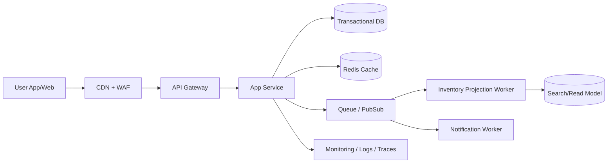

# Cloud Engineer Magazine — 2026-04-30
#cloud #aws #oci #gcp #architecture #daily
[[Home]]

## 1) 今日のアプリ
**リアルタイム在庫連動フラッシュセール基盤**（EC向け）

- 期間限定セールで、在庫数を秒単位で反映
- 在庫切れ時は自動で販売停止
- モバイル通知・Web表示を同時更新

---

## 2) 要件整理（機能要件/非機能要件）

### 機能要件
- 商品一覧/詳細表示
- 注文受付、決済連携（外部決済API想定）
- 在庫予約（カート投入時の短時間ホールド）
- 在庫減算の整合性担保（重複販売防止）
- セール開始/終了のスケジューリング

### 非機能要件
- **可用性**: セール中のSLA 99.9%以上
- **性能**: 商品閲覧P95 < 300ms、注文API P95 < 500ms
- **セキュリティ**: 最小権限IAM、WAF、KMS暗号化、監査ログ
- **コスト**: 平常時は低コスト、セール時のみ自動スケール

---

## 3) 推奨アーキテクチャ（なぜその構成か）

**イベント駆動 + キャッシュ前段 + 在庫DBの強整合トランザクション**を採用。

- 読み取りはCDN/キャッシュで高速化
- 書き込み（注文・在庫更新）はトランザクション系DBへ集約
- 在庫更新イベントをメッセージングで配信し、検索/通知へ非同期反映

**理由**
- ピーク時の読み取り負荷をオフロードできる
- 在庫の整合性を犠牲にせずスケールしやすい
- 非同期化で失敗分離（通知遅延 ≠ 注文停止）

---

## 4) クラウド別実装マップ

### AWS
- Edge: **CloudFront** + **AWS WAF**
- App/API: **API Gateway** + **AWS Lambda**（またはECS Fargate）
- トランザクションDB: **Amazon Aurora (MySQL/PostgreSQL)**
- キャッシュ: **ElastiCache for Redis**
- 非同期: **Amazon SQS / SNS / EventBridge**
- 監視: **CloudWatch**, **X-Ray**, **CloudTrail**
- 秘密情報: **AWS Secrets Manager**, **KMS**

### OCI
- Edge: **OCI WAF** + **Load Balancer**
- App/API: **API Gateway** + **OCI Functions**（またはOKE）
- トランザクションDB: **Autonomous Transaction Processing**（またはMySQL HeatWave）
- キャッシュ: **OCI Cache with Redis**
- 非同期: **OCI Queue** + **Events** + **Notifications**
- 監視: **Monitoring**, **Logging**, **Application Performance Monitoring**
- 秘密情報: **Vault**, **Key Management**

### GCP
- Edge: **Cloud Load Balancing** + **Cloud Armor**
- App/API: **API Gateway** + **Cloud Run**
- トランザクションDB: **Cloud SQL**（高可用構成）
- キャッシュ: **Memorystore for Redis**
- 非同期: **Pub/Sub** + **Eventarc**
- 監視: **Cloud Monitoring**, **Cloud Logging**, **Cloud Trace**, **Cloud Audit Logs**
- 秘密情報: **Secret Manager**, **Cloud KMS**

---

## 5) システム構成図（Mermaid）

---

## 6) データフロー/認証・認可/監視運用の要点

### データフロー
1. 商品表示: CDN → API → Redisヒット、ミス時DB
2. 注文: APIで在庫ホールド → 決済成功後に在庫確定減算
3. 在庫イベントを配信し、表示系Read Modelと通知を更新

### 認証・認可
- 一般ユーザー: OIDC/OAuth 2.0ベース
- サービス間: IAMロール/サービスアカウント（静的鍵を避ける）
- 管理系API: RBAC + MFA + IP制限
- すべての機密情報はマネージドSecretsで保管

### 監視運用
- SLI: 注文成功率、在庫不整合率、P95レイテンシ
- アラート: 在庫更新遅延、キュー滞留、DB接続逼迫
- 監査: すべての管理操作を監査ログへ

---

## 7) コスト最適化ポイント（初期・成長期）

### 初期
- サーバレス中心（Lambda/Functions/Cloud Run）
- 小規模DB + オートスケール最小値を低く設定
- CDNキャッシュTTL最適化でオリジン負荷削減

### 成長期
- 高頻度クエリをRedisへオフロード
- DBリードレプリカ/接続プーリング導入
- キューコンシューマを負荷連動スケール
- Savings Plans/Committed Use などを段階導入

---

## 8) 障害時の設計（DR/バックアップ/フェイルオーバー）

- DBはマルチAZ（または同等HA）
- PITRバックアップを有効化
- キューは再試行・DLQ設計
- リージョン障害に備え、
  - クリティカルデータはクロスリージョン複製
  - DNS/トラフィックマネージャでフェイルオーバー
- DR訓練を四半期ごとに実施（手順をRunbook化）

---

## 9) 学習ポイント（今日覚えるクラウド機能）

- **AWS**: Aurora の高可用性 + EventBridge のイベントルーティング
- **OCI**: Queue + Events での疎結合アーキテクチャ
- **GCP**: Cloud Run + Pub/Sub によるスケールアウト設計

**トレードオフ例**
- API Gateway + サーバレス: 運用軽いが、超低遅延要件では常時起動コンテナが有利
- Redis導入: 高速化できるが、失効/整合性設計が必要

---

## 10) 30〜60分ミニ演習

1. 任意クラウドで「商品取得API + Redisキャッシュ」を作る
2. キャッシュミス時のみDB参照する実装にする
3. 在庫更新イベントを1つ発行し、非同期ワーカーでログ出力
4. 失敗時にDLQ（または同等機能）へ退避する設定を確認

**完了条件**
- P95応答時間がキャッシュ有無で改善
- キュー失敗メッセージを再処理できる

---

## 11) 公式ドキュメント参照リンク（AWS/OCI/GCP）

### AWS
- Well-Architected: https://docs.aws.amazon.com/wellarchitected/latest/framework/welcome.html
- API Gateway: https://docs.aws.amazon.com/apigateway/
- Lambda: https://docs.aws.amazon.com/lambda/
- Aurora: https://docs.aws.amazon.com/AmazonRDS/latest/AuroraUserGuide/CHAP_AuroraOverview.html
- ElastiCache for Redis: https://docs.aws.amazon.com/AmazonElastiCache/latest/red-ug/WhatIs.html
- EventBridge: https://docs.aws.amazon.com/eventbridge/
- SQS: https://docs.aws.amazon.com/sqs/

### OCI
- OCI Documentation Home: https://docs.oracle.com/en-us/iaas/Content/home.htm
- API Gateway: https://docs.oracle.com/en-us/iaas/Content/APIGateway/home.htm
- Functions: https://docs.oracle.com/en-us/iaas/Content/Functions/home.htm
- Queue: https://docs.oracle.com/en-us/iaas/Content/queue/home.htm
- Events: https://docs.oracle.com/en-us/iaas/Content/Events/home.htm
- Autonomous Database: https://docs.oracle.com/en-us/iaas/autonomous-database/index.html
- OCI Cache with Redis: https://docs.oracle.com/en-us/iaas/Content/redis/home.htm

### GCP
- Google Cloud Documentation Home: https://docs.cloud.google.com/docs
- API Gateway: https://docs.cloud.google.com/api-gateway/docs
- Cloud Run: https://docs.cloud.google.com/run/docs
- Cloud SQL: https://docs.cloud.google.com/sql/docs
- Memorystore for Redis: https://docs.cloud.google.com/memorystore/docs/redis
- Pub/Sub: https://docs.cloud.google.com/pubsub/docs
- Eventarc: https://docs.cloud.google.com/eventarc/docs
- Cloud Architecture Framework: https://docs.cloud.google.com/architecture/framework
