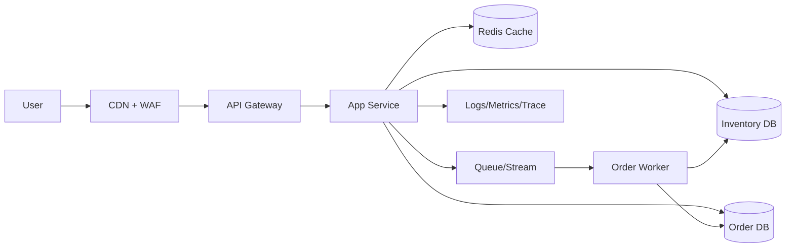

# Cloud Engineer Magazine (2026-05-01)
[[Home]]

## 1) 今日のアプリ
**リアルタイム在庫連動フラッシュセール基盤**（EC向け）
- セール開始直後の急激なアクセス増に耐える
- 在庫を秒単位で反映し、売り越しを防止
- 決済前に「在庫確保（短時間ロック）」を実施

---

## 2) 要件整理
### 機能要件
- 商品一覧/詳細表示、検索
- セール開始・終了の時間制御
- 注文時の在庫引当（TTL付き）
- 支払い確定で在庫減算、失敗時ロック解放
- 管理者向けセール設定

### 非機能要件
- **可用性:** マルチAZ、RTO 60分 / RPO 5分
- **性能:** ピーク 5,000 req/s、P95 < 300ms
- **セキュリティ:** 最小権限IAM、WAF、KMS暗号化、監査ログ
- **コスト:** 平常時は小さく、セール時のみ自動スケール

---

## 3) 推奨アーキテクチャ（なぜその構成か）
- **API層 + マネージドDB + キャッシュ + 非同期イベント**を基本形にする
- 在庫更新は同期処理だけに寄せず、注文イベントをキュー/ストリームへ発行し整合性を担保
- ホットデータ（在庫数）は低レイテンシKV/キャッシュで参照、確定更新はトランザクション可能なDBへ
- セール時のバーストはCDN/WAF + オートスケールで吸収

**トレードオフ例**
- RDB中心: 整合性は強いがピーク時にボトルネック化しやすい
- KV/NoSQL中心: スケールしやすいが複雑な集計や厳密トランザクション設計が難化

---

## 4) クラウド別実装マップ
### AWS
- フロント: CloudFront + S3
- API: API Gateway + Lambda（または ECS Fargate）
- 在庫DB: DynamoDB（条件付き書き込み）
- 注文DB: Aurora PostgreSQL
- キャッシュ: ElastiCache for Redis
- 非同期: SQS / EventBridge
- セキュリティ: IAM, KMS, WAF, Secrets Manager
- 監視: CloudWatch, X-Ray, CloudTrail

### OCI
- フロント: OCI Object Storage + CDN
- API: API Gateway + Functions（または OKE）
- 在庫DB: NoSQL Database
- 注文DB: Autonomous Transaction Processing
- キャッシュ: OCI Cache（Redis）
- 非同期: OCI Streaming / Queue
- セキュリティ: IAM, Vault, WAF, Cloud Guard
- 監視: Monitoring, Logging, Events, Audit

### GCP
- フロント: Cloud Storage + Cloud CDN
- API: API Gateway + Cloud Run（または GKE）
- 在庫DB: Firestore（または Bigtable, 要件次第）
- 注文DB: Cloud SQL for PostgreSQL
- キャッシュ: Memorystore for Redis
- 非同期: Pub/Sub
- セキュリティ: IAM, Cloud KMS, Secret Manager, Cloud Armor
- 監視: Cloud Monitoring, Cloud Logging, Cloud Trace, Cloud Audit Logs

---

## 5) システム構成図（Mermaid）

---

## 6) データフロー / 認証・認可 / 監視運用の要点
- **データフロー:**
  1. 商品表示はキャッシュ優先
  2. 注文要求で在庫を条件付き更新（残数>0）
  3. 注文イベントを非同期発行し、確定処理をワーカーで実施
- **認証・認可:**
  - 管理APIはOIDC連携 + RBAC
  - サービス間は短命トークン/ロールベース
  - DB接続情報はSecret Manager/Vaultで集中管理
- **監視運用:**
  - SLI: 成功率、P95遅延、在庫不整合件数
  - アラート: エラー率閾値、キュー滞留、DB接続枯渇
  - 監査: API呼び出し・権限変更をAuditログで追跡

---

## 7) コスト最適化ポイント（初期・成長期）
### 初期
- サーバレス中心（Lambda/Functions/Cloud Run）でアイドルコスト削減
- 小さめDB + 自動バックアップ
- CDNキャッシュTTLを適切化してAPI負荷低減

### 成長期
- コンテナ常駐化で高トラフィック時の単価最適化
- リードレプリカやシャーディングでDBスケール
- ログ保持期間とサンプリング率を見直し

---

## 8) 障害時の設計（DR/バックアップ/フェイルオーバー）
- マルチAZ必須、リージョンDRは重要度に応じて段階導入
- DB: 日次フル + 継続バックアップ、PITR有効化
- キュー再処理（DLQ）と冪等キーで二重処理防止
- フェイルオーバー演習を月次実施（ランブック更新）

---

## 9) 学習ポイント（今日覚えるクラウド機能）
- **AWS:** DynamoDB 条件付き書き込みで在庫競合を抑制
- **OCI:** Cloud Guard + IAMポリシーでセキュア運用を標準化
- **GCP:** Pub/Sub + Cloud Run のイベント駆動処理パターン

---

## 10) 30〜60分ミニ演習
1. 在庫APIの擬似設計（`reserve`, `confirm`, `release`）を作る（10分）
2. 3クラウドで同等サービスを表にマッピング（15分）
3. 「売り越し防止」のための条件更新ロジックを書き出す（15分）
4. 監視アラート3本（遅延/エラー/滞留）を定義（10分）

---

## 11) 公式ドキュメント参照リンク（AWS/OCI/GCP）
### AWS
- Well-Architected: https://docs.aws.amazon.com/wellarchitected/latest/framework/welcome.html
- DynamoDB（条件式/書き込み）: https://docs.aws.amazon.com/amazondynamodb/latest/developerguide/Expressions.ConditionExpressions.html
- API Gateway: https://docs.aws.amazon.com/apigateway/latest/developerguide/welcome.html
- SQS: https://docs.aws.amazon.com/AWSSimpleQueueService/latest/SQSDeveloperGuide/welcome.html
- CloudWatch: https://docs.aws.amazon.com/AmazonCloudWatch/latest/monitoring/WhatIsCloudWatch.html

### OCI
- IAM: https://docs.oracle.com/en-us/iaas/Content/Identity/home.htm
- API Gateway: https://docs.oracle.com/en-us/iaas/Content/APIGateway/home.htm
- Functions: https://docs.oracle.com/en-us/iaas/Content/Functions/home.htm
- NoSQL: https://docs.oracle.com/en-us/iaas/nosql-database/index.html
- Cloud Guard: https://docs.oracle.com/en-us/iaas/cloud-guard/home.htm

### GCP
- Architecture Framework: https://docs.cloud.google.com/architecture/framework
- API Gateway: https://docs.cloud.google.com/api-gateway/docs
- Cloud Run: https://docs.cloud.google.com/run/docs
- Pub/Sub: https://docs.cloud.google.com/pubsub/docs
- Cloud SQL: https://docs.cloud.google.com/sql/docs
- Cloud Monitoring: https://docs.cloud.google.com/monitoring/docs
