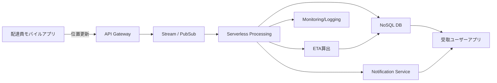

[[Home]]

# Cloud Engineer Magazine (2026-05-02)

## 1) 今日のアプリ
**リアルタイム配送追跡 + 到着予測（ETA）アプリ**  
荷物・配達員の位置を数秒〜数十秒間隔で収集し、利用者に地図上で現在地と到着予測を表示する。

---
## 2) 要件整理
### 機能要件
- 配達員アプリから位置情報を継続送信
- 受取ユーザー向けに現在地/ETA表示
- 配送ステータス通知（集荷/配達中/完了）
- 運用者向けダッシュボード（遅延・稼働状況）

### 非機能要件
- **可用性**: 24/7、単一AZ障害で継続
- **性能**: 位置更新の反映を数秒以内
- **セキュリティ**: 端末認証、最小権限IAM、通信暗号化
- **コスト**: 初期はサーバレス中心、成長時にストリーム処理最適化

---
## 3) 推奨アーキテクチャ（なぜその構成か）
- **API + ストリーミング + NoSQL + Pub/Sub通知**の定番構成を採用。  
- 位置更新は高頻度・スパイク性があるため、まずはマネージドなイベント基盤に受ける。  
- ETA計算は軽量ならサーバレス関数、負荷増大時はコンテナ/ストリーム分析へ段階移行。
- 認証はID基盤（OIDC/OAuth2）と短命トークンを前提にし、バックエンドは常にIAMで最小権限。

---
## 4) クラウド別実装マップ
### AWS
- API: **Amazon API Gateway**
- 認証: **Amazon Cognito**
- 位置イベント受信: **Amazon Kinesis Data Streams**
- ルーティング処理: **AWS Lambda**
- 現在位置/配送状態: **Amazon DynamoDB**
- 通知: **Amazon SNS**
- 監視: **Amazon CloudWatch / AWS X-Ray**

### OCI
- API: **OCI API Gateway**
- 認証: **OCI IAM**（Identity Domains）
- イベント処理: **OCI Streaming**
- サーバレス処理: **OCI Functions**
- データ保存: **Autonomous JSON Database**（またはNoSQL）
- 通知: **OCI Notifications**
- 監視: **OCI Monitoring / Logging / APM**

### GCP
- API: **API Gateway**（またはCloud Endpoints）
- 認証: **Identity Platform**（またはIAM + IAP構成）
- イベント受信: **Pub/Sub**
- 処理: **Cloud Functions**（2nd gen）
- データ保存: **Firestore**（リアルタイム用途）
- 通知: **Firebase Cloud Messaging**（モバイル通知）
- 監視: **Cloud Monitoring / Cloud Logging / Cloud Trace**

---
## 5) システム構成図（Mermaid）

---
## 6) データフロー/認証・認可/監視運用の要点
- **データフロー**: 位置情報は「受信API→イベント基盤→処理→DB反映→配信」を非同期化し、ピーク耐性を確保。
- **認証・認可**:
  - モバイルはOIDC/OAuth2でトークン取得
  - APIはJWT検証、バックエンド間はIAMロールで機械認証
  - IAMポリシーは配送ドメイン単位で最小権限
- **監視運用**:
  - SLI例: 更新遅延、APIエラー率、ETA誤差
  - アラート: P95レイテンシ、DLQ増加、失敗リトライ閾値
  - 監査ログを有効化し、認証失敗・権限拒否を可視化

---
## 7) コスト最適化ポイント（初期・成長期）
### 初期
- サーバレス（関数・マネージドAPI・マネージドDB）で固定費を抑える
- ログ保持期間を短めに設定し、重要メトリクス中心で収集

### 成長期
- 高頻度処理をバッチ/マイクロバッチ化して実行回数を削減
- ホットパーティション回避（キー設計見直し）でNoSQL効率改善
- 予約/コミットメント割引（各クラウドのSavings/Commit）を段階適用

---
## 8) 障害時の設計（DR/バックアップ/フェイルオーバー）
- **マルチAZ**を基本、RTO/RPOを先に定義
- イベントは再処理可能に（順序キー・重複排除キー）
- DBバックアップ + Point-in-time recovery有効化
- 通知失敗時はDLQへ退避し再送ワークフローを実装
- リージョン障害対策は、読取系を先に冗長化し、書込系は業務要件に応じて段階的にマルチリージョン化

---
## 9) 学習ポイント（今日覚えるクラウド機能）
- **AWS**: Kinesis + Lambda でのイベント駆動処理パターン
- **OCI**: Streaming + Functions + API Gateway のサーバレス連携
- **GCP**: Pub/Sub + Cloud Functions + Firestore のリアルタイム構成
- 共通: IAM最小権限、非同期化、可観測性（メトリクス/ログ/トレース）

---
## 10) 30〜60分ミニ演習
1. APIエンドポイントを1つ作成（`POST /location`）
2. ダミー位置データを5件送信
3. イベント基盤経由で関数を起動し、NoSQLへ保存
4. 監視画面で処理件数・エラー率を確認
5. IAMを見直し「不要権限を1つ削る」

**達成条件**: 「位置更新→DB反映→監視で確認」までを一連で再現できること。

---
## 11) 公式ドキュメント参照リンク（AWS/OCI/GCP）
### AWS
- https://docs.aws.amazon.com/apigateway/
- https://docs.aws.amazon.com/cognito/
- https://docs.aws.amazon.com/streams/latest/dev/introduction.html
- https://docs.aws.amazon.com/lambda/
- https://docs.aws.amazon.com/dynamodb/
- https://docs.aws.amazon.com/AmazonCloudWatch/

### OCI
- https://docs.oracle.com/en-us/iaas/Content/APIGateway/home.htm
- https://docs.oracle.com/en-us/iaas/Content/Identity/home.htm
- https://docs.oracle.com/en-us/iaas/Content/Streaming/home.htm
- https://docs.oracle.com/en-us/iaas/Content/Functions/home.htm
- https://docs.oracle.com/en-us/iaas/autonomous-database-serverless/doc/json.html
- https://docs.oracle.com/en-us/iaas/Content/Monitoring/home.htm

### GCP
- https://docs.cloud.google.com/api-gateway/docs
- https://docs.cloud.google.com/pubsub/docs
- https://docs.cloud.google.com/functions/docs
- https://docs.cloud.google.com/firestore/docs
- https://docs.cloud.google.com/monitoring/docs
- https://docs.cloud.google.com/logging/docs

---
**明日の予告**: 次回は別アプリとして「画像付き設備点検レポートアプリ」を題材に、オブジェクトストレージと検索基盤の設計比較を扱います。
