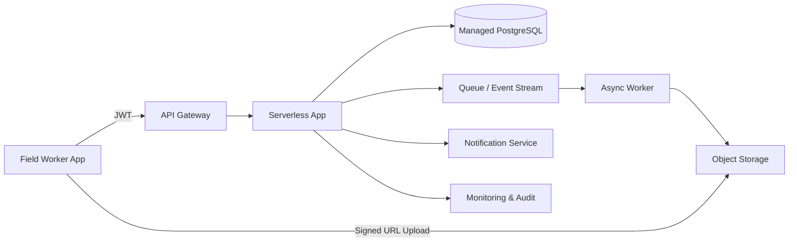

# Cloud Engineer Magazine (2026-05-03)
[[Home]]

## 1) 今日のアプリ
**現場点検レポートアプリ（オフライン対応）**  
保守員がスマホで写真・点検結果を入力し、帰社前に同期。管理者はダッシュボードで異常件数・対応状況を確認。

---

## 2) 要件整理
### 機能要件
- 点検フォーム入力（チェックリスト/自由記述）
- 写真アップロード（圧縮 + メタデータ）
- オフライン保存と再送
- 管理画面で検索・集計・ステータス更新
- 通知（重大異常時）

### 非機能要件
- **可用性**: API 99.9%以上、データ損失最小化
- **性能**: 写真付き送信 p95 < 2s（オンライン時）
- **セキュリティ**: 最小権限IAM、暗号化（保存時/転送時）、監査ログ
- **コスト**: 初期はサーバレス中心、利用増で段階的最適化

---

## 3) 推奨アーキテクチャ（なぜその構成か）
**API + オブジェクトストレージ + マネージドDB + 非同期処理**を基本にする。  
理由:
- 写真アップロードはオブジェクトストレージ直送（署名付きURL）でAPI負荷を回避
- 点検データはトランザクション整合性が要るためRDBを採用
- 通知・画像後処理はキュー/イベントで分離しスパイク耐性を確保
- 運用初期はサーバレスで固定費を抑え、成長後に一部を常時稼働へ移行可能

---

## 4) クラウド別実装マップ
### AWS
- フロント/API: Amazon API Gateway + AWS Lambda
- 認証: Amazon Cognito
- 画像保存: Amazon S3（Presigned URL）
- DB: Amazon Aurora Serverless v2 (PostgreSQL互換)
- 非同期: Amazon SQS + AWS Lambda
- 監視: Amazon CloudWatch + AWS CloudTrail
- 秘密情報: AWS Secrets Manager

### OCI
- フロント/API: OCI API Gateway + OCI Functions
- 認証: OCI IAM Identity Domains
- 画像保存: OCI Object Storage（Pre-Authenticated Request）
- DB: OCI Autonomous Transaction Processing
- 非同期: OCI Streaming + OCI Functions
- 監視: OCI Monitoring / Logging / Audit
- 秘密情報: OCI Vault

### GCP
- フロント/API: API Gateway + Cloud Run（または Cloud Functions）
- 認証: Identity Platform（または IAMベースのサービス間認証）
- 画像保存: Cloud Storage（Signed URL）
- DB: Cloud SQL for PostgreSQL
- 非同期: Pub/Sub + Cloud Run
- 監視: Cloud Monitoring + Cloud Logging + Cloud Audit Logs
- 秘密情報: Secret Manager

---

## 5) システム構成図（Mermaid）

---

## 6) データフロー/認証・認可/監視運用の要点
- **データフロー**:  
  1) ログインしてJWT取得  
  2) APIで点検メタデータ登録  
  3) 署名付きURLで画像直送  
  4) 完了イベントで後処理（サムネイル/AI判定任意）
- **認証・認可**:  
  - 人: Cognito / Identity Domains / Identity Platform  
  - サービス間: IAMロール + 短期認証情報  
  - テナント/拠点単位の行レベルアクセス制御をアプリ層で実装
- **監視運用**:  
  - SLI: API成功率、同期遅延、キュー滞留、DB接続枯渇  
  - 監査: API呼び出し・権限変更・秘密情報アクセスをAuditログで追跡

---

## 7) コスト最適化ポイント（初期・成長期）
- **初期**: サーバレス優先、ストレージライフサイクルで古い画像を低頻度層へ
- **成長期**:  
  - DBは接続プーリング/リードレプリカ検討  
  - 画像配信はCDN導入  
  - イベント処理はバッチ化して実行回数を削減

---

## 8) 障害時の設計（DR/バックアップ/フェイルオーバー）
- DB自動バックアップ + Point-in-Time Recovery
- オブジェクトストレージのバージョニング有効化
- 重要データはクロスリージョン複製（RPO要件に応じて）
- API障害時はオフラインキュー継続、復旧後に再送
- ランブック: 「認証障害」「DB高負荷」「キュー滞留」の3系統を事前作成

---

## 9) 学習ポイント（今日覚えるクラウド機能）
- **AWS**: S3 Presigned URL で安全にクライアントアップロード
- **OCI**: Pre-Authenticated Request と Object Storage連携
- **GCP**: Cloud Storage Signed URL + Pub/Subで非同期分離

**トレードオフ（短く）**
- API直アップロードは実装簡単だが帯域/タイムアウトで不利
- 署名付きURL方式は安全かつスケールしやすいが、URL有効期限管理が必要

---

## 10) 30〜60分ミニ演習
1. APIで「点検レコード作成」エンドポイントを1本作る
2. 画像アップロード用署名付きURLを発行する
3. クライアントから画像を直接アップロードする
4. 完了イベントをキューに積み、ワーカーでログ出力
5. 失敗時リトライ回数とDLQ/再処理手順をメモ

---

## 11) 公式ドキュメント参照リンク（AWS/OCI/GCP）
### AWS
- API Gateway: https://docs.aws.amazon.com/apigateway/
- Lambda: https://docs.aws.amazon.com/lambda/
- S3 Presigned URL: https://docs.aws.amazon.com/AmazonS3/latest/userguide/ShareObjectPreSignedURL.html
- Aurora Serverless v2: https://docs.aws.amazon.com/AmazonRDS/latest/AuroraUserGuide/aurora-serverless-v2.html
- CloudWatch: https://docs.aws.amazon.com/cloudwatch/

### OCI
- API Gateway: https://docs.oracle.com/en-us/iaas/Content/APIGateway/home.htm
- Functions: https://docs.oracle.com/en-us/iaas/Content/Functions/home.htm
- Object Storage (PAR): https://docs.oracle.com/en-us/iaas/Content/Object/Tasks/usingpreauthenticatedrequests.htm
- Autonomous Database: https://docs.oracle.com/en-us/iaas/autonomous-database-serverless/doc/
- Monitoring/Logging/Audit: https://docs.oracle.com/en-us/iaas/Content/Monitoring/home.htm

### GCP
- API Gateway: https://docs.cloud.google.com/api-gateway/docs
- Cloud Run: https://docs.cloud.google.com/run/docs
- Cloud Storage Signed URLs: https://docs.cloud.google.com/storage/docs/access-control/signed-urls
- Cloud SQL: https://docs.cloud.google.com/sql/docs
- Pub/Sub: https://docs.cloud.google.com/pubsub/docs
- Cloud Monitoring: https://docs.cloud.google.com/monitoring/docs
