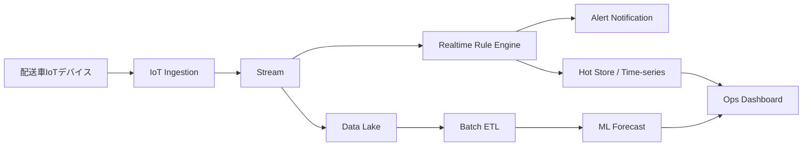

---
tags:
  - cloud
  - aws
  - oci
  - gcp
  - architecture
  - daily
---
[[Home]]

# Cloud Engineer Magazine（2026-05-04）

## 1) 今日のアプリ
**リアルタイム在庫・需要予測付き「冷蔵チェーン向け配送温度監視アプリ」**
- IoTセンサー（温度/湿度/GPS）を配送車から収集
- 閾値逸脱を即時通知
- 過去データで需要/劣化リスク予測

## 2) 要件整理
### 機能要件
- 1分間隔でテレメトリ収集
- 温度逸脱時に30秒以内の通知
- 配送ルート別ダッシュボード
- 日次で予測バッチ（翌日廃棄リスク）

### 非機能要件
- **可用性**: 24/7、リージョン障害時も監視継続
- **性能**: ピーク 20,000 デバイス同時接続
- **セキュリティ**: デバイス証明書認証、最小権限IAM、保存時/転送時暗号化
- **コスト**: 初期はサーバレス中心、成長時にストリーム最適化

## 3) 推奨アーキテクチャ（なぜその構成か）
- **イベント駆動 + ストリーミング + 時系列保存**を基本形にする。
- 理由:
  1. センサーデータはスパイク型で、サーバレス/マネージドが運用負荷を下げる
  2. 通知は低遅延処理が必要で、ストリーム処理が適合
  3. 監査・分析・予測でホット/コールドデータを分離するとコスト効率が高い

## 4) クラウド別実装マップ
### AWS での実装サービス
- 受信: **AWS IoT Core**
- ストリーム: **Amazon Kinesis Data Streams**
- リアルタイム処理: **AWS Lambda**
- 時系列保存: **Amazon Timestream**
- 通知: **Amazon SNS**
- バッチ分析/予測: **Amazon S3 + AWS Glue + Amazon SageMaker**
- IAM/鍵: **IAM, AWS KMS**
- 監視: **Amazon CloudWatch, AWS CloudTrail**

### OCI での実装サービス
- 受信: **OCI IoT/Streaming連携（実装は OCI Streaming を入口に統一）**
- ストリーム: **OCI Streaming**
- リアルタイム処理: **OCI Functions**
- 保存: **Autonomous Database (JSON/時系列用途) + Object Storage**
- 通知: **OCI Notifications**
- 分析/予測: **OCI Data Flow (Spark) + OCI Data Science**
- IAM/鍵: **OCI IAM, OCI Vault**
- 監視: **OCI Monitoring, Logging, Events, Audit**

### GCP での実装サービス
- 受信: **Cloud IoT パターン代替として Pub/Sub 入口 + デバイス認証基盤**
- ストリーム: **Pub/Sub**
- リアルタイム処理: **Dataflow (Streaming) / Cloud Functions**
- 時系列/分析保存: **BigQuery + Cloud Storage**
- 通知: **Cloud Monitoring Alerting + Pub/Sub push/Cloud Run**
- 予測: **Vertex AI**
- IAM/鍵: **Cloud IAM, Cloud KMS**
- 監視: **Cloud Monitoring, Cloud Logging, Cloud Audit Logs**

**トレードオフ（要点）**
- AWS: IoT機能の統合度が高く、デバイス管理がしやすい
- OCI: コスト効率とシンプルな運用導線（Streaming + Functions）が強み
- GCP: 分析/ML（BigQuery + Vertex AI）への接続が最短

## 5) システム構成図（Mermaid）

## 6) データフロー/認証・認可/監視運用の要点
- **データフロー**: デバイス→受信→ストリーム→(リアルタイム判定/通知) + (レイク蓄積→学習)
- **認証・認可**:
  - デバイスごとの証明書/鍵を発行・ローテーション
  - IAMロールは機能単位（ingest, process, read-only dashboard）
  - 人手アクセスはSSO連携 + 監査ログ必須
- **監視運用**:
  - SLO: 通知遅延30秒以内、データ欠損率 <0.1%
  - 主要アラート: 受信停止、遅延増加、DLQ増加、関数失敗率

## 7) コスト最適化ポイント（初期・成長期）
- **初期**:
  - サーバレス優先（Lambda/Functions/Cloud Functions）
  - 保存はライフサイクルで自動階層化（Hot→Archive）
- **成長期**:
  - ストリームのシャード/パーティション再設計
  - 集計済みテーブルを作りダッシュボードクエリを削減
  - 学習ジョブをスポット/プリエンプティブル系に寄せる

## 8) 障害時の設計（DR/バックアップ/フェイルオーバー）
- マルチAZ（または同等）を標準
- 日次バックアップ + ポイントインタイム復旧
- 受信経路は再送キュー/DLQを必須化
- リージョン障害時は
  1) 受信先DNS/エンドポイント切替
  2) 重要通知のみ縮退運転
  3) 復旧後にレイク再同期

## 9) 学習ポイント（今日覚えるクラウド機能）
- **AWS IoT Core ルール**でメッセージを複数先に分岐できる
- **OCI Streaming**はKafka互換APIを使った移行設計がしやすい
- **GCP Pub/Sub + Dataflow**でスケール自動追従のストリーム処理を組みやすい

## 10) 30〜60分ミニ演習
1. 1つの温度イベントJSONを定義（deviceId, temp, ts, geo）
2. 3クラウドそれぞれで「受信→ログ保存」最小構成を図にする
3. 閾値逸脱ルール（例: temp > 8℃を5分継続）を疑似コード化
4. IAMポリシーを3ロールに分解（ingest, processor, viewer）
5. 月間コストの主要ドライバを3つ挙げる（受信数、保持期間、クエリ量）

## 11) 公式ドキュメント参照リンク（AWS/OCI/GCP）
### AWS
- https://docs.aws.amazon.com/iot/latest/developerguide/what-is-aws-iot.html
- https://docs.aws.amazon.com/streams/latest/dev/introduction.html
- https://docs.aws.amazon.com/lambda/latest/dg/welcome.html
- https://docs.aws.amazon.com/timestream/latest/developerguide/what-is-timestream.html
- https://docs.aws.amazon.com/IAM/latest/UserGuide/introduction.html

### OCI
- https://docs.oracle.com/en-us/iaas/Content/Streaming/Concepts/streamingoverview.htm
- https://docs.oracle.com/en-us/iaas/Content/Functions/Concepts/functionsoverview.htm
- https://docs.oracle.com/en-us/iaas/Content/Object/Concepts/objectstorageoverview.htm
- https://docs.oracle.com/en-us/iaas/Content/Identity/Concepts/overview.htm
- https://docs.oracle.com/en-us/iaas/Content/Monitoring/Concepts/monitoringoverview.htm

### GCP
- https://docs.cloud.google.com/pubsub/docs/overview
- https://docs.cloud.google.com/dataflow/docs/concepts/beam-programming-model
- https://docs.cloud.google.com/bigquery/docs/introduction
- https://docs.cloud.google.com/vertex-ai/docs/start/introduction-unified-platform
- https://docs.cloud.google.com/iam/docs/overview
