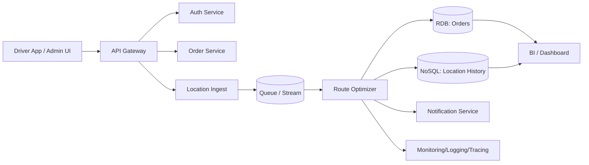

# Cloud Engineer Magazine — 2026-05-05
#cloud #aws #oci #gcp #architecture #daily
[[Home]]

## 1) 今日のアプリ
**リアルタイム配送ルート最適化アプリ（配車・遅延予測付き）**
- 配送ドライバーの現在地、注文状況、交通データを使って最短ルートを再計算
- 遅延が見込まれる配送を自動通知
- 管理者ダッシュボードでKPI（遅延率、配送単価、稼働率）を可視化

## 2) 要件整理（機能/非機能）
### 機能要件
- 注文登録・配送ステータス更新
- 位置情報の定期アップロード（例: 10〜30秒）
- ルート再計算API（イベント駆動）
- 配送先への通知（遅延/到着予定）

### 非機能要件
- **可用性**: RTO 1時間以内、RPO 5分以内
- **性能**: ルート再計算API P95 < 300ms、ダッシュボード更新遅延 < 60秒
- **セキュリティ**: 最小権限IAM、保存時暗号化、通信経路TLS、監査ログ
- **コスト**: 初期はサーバレス中心、成長後に常時稼働基盤へ段階移行

## 3) 推奨アーキテクチャ（なぜその構成か）
**本日の視点: マルチクラウド比較（実装は単一クラウドでも可）**
- 取り込みは **API Gateway + ストリーミング/キュー** でバースト耐性を確保
- 最適化ロジックは **コンテナ or Functions** でスケール
- トランザクションは **マネージドRDB**、位置ログは **NoSQL/時系列向けストア**
- 可観測性は **メトリクス + ログ + トレース** を統合

理由:
1. リアルタイム更新はピーク偏在が強く、キューで平滑化すると安定
2. ルート最適化は計算負荷が変動し、オートスケール向き
3. 注文の整合性（RDB）と大量時系列データ（NoSQL）を分離すると運用しやすい

## 4) クラウド別実装マップ
### AWS
- 入口/API: **Amazon API Gateway**
- 非同期処理: **Amazon SQS** / **Amazon Kinesis Data Streams**
- 計算: **AWS Lambda**（初期） or **Amazon ECS on Fargate**（成長期）
- DB: **Amazon Aurora (PostgreSQL互換)** + **Amazon DynamoDB**
- 通知: **Amazon SNS**
- 監視: **Amazon CloudWatch**, **AWS X-Ray**, **AWS CloudTrail**
- 秘匿情報: **AWS Secrets Manager**, 暗号鍵 **AWS KMS**

### OCI
- 入口/API: **API Gateway**
- 非同期処理: **OCI Queue** / **OCI Streaming**
- 計算: **OCI Functions**（初期） or **Container Instances / OKE**（成長期）
- DB: **Autonomous Transaction Processing** + **Oracle NoSQL Database Cloud Service**
- 通知: **Notifications**
- 監視: **Monitoring**, **Logging**, **Application Performance Monitoring**, **Audit**
- 秘匿情報: **Vault**

### GCP
- 入口/API: **API Gateway**
- 非同期処理: **Pub/Sub**
- 計算: **Cloud Functions / Cloud Run**（初期）→ **GKE**（成長期）
- DB: **Cloud SQL (PostgreSQL)** + **Firestore**（またはBigtable）
- 通知: **Firebase Cloud Messaging**（モバイル）/ 外部連携
- 監視: **Cloud Monitoring**, **Cloud Logging**, **Cloud Trace**, **Cloud Audit Logs**
- 秘匿情報: **Secret Manager**, 鍵管理 **Cloud KMS**

## 5) システム構成図（Mermaid）

## 6) データフロー / 認証認可 / 監視運用
- **データフロー**: 位置情報→キュー→最適化→注文DB更新→通知
- **認証・認可**:
  - エンドユーザー認証は OIDC/OAuth2
  - サービス間は IAM ロール（短期認証情報）
  - DB資格情報は Secret Manager/Vault 管理、ローテーション
- **監視運用**:
  - SLI: API遅延、再計算成功率、キュー滞留時間
  - アラート: P95遅延超過、DLQ増加、エラー率閾値超過
  - 監査: すべての管理APIを監査ログへ

## 7) コスト最適化ポイント（初期・成長期）
- **初期**: サーバレス優先（Lambda/Functions/Cloud Run）でアイドルコスト最小化
- **成長期**:
  - 高トラフィックAPIはコンテナ常駐化で単価最適化
  - ストレージはライフサイクルで低頻度層へ自動移行
  - ログ保持期間を用途別に分離（監査長期、デバッグ短期）

## 8) 障害時の設計（DR/バックアップ/フェイルオーバー）
- マルチAZ構成を標準
- RDB自動バックアップ + PITR
- キュー再処理（DLQ）で一時障害を吸収
- リージョン障害時:
  - 重要データを別リージョン複製
  - DNS/Traffic Managerでフェイルオーバー
  - 復旧訓練（ゲームデー）を月次実施

## 9) 学習ポイント（今日覚えるクラウド機能）
1. **キューでバースト吸収**するとAPI安定性が上がる
2. **RDB + NoSQLの責務分離**が運用性とコストを改善
3. **最小権限IAM + Secrets管理 + 監査ログ**で secure-by-default

## 10) 30〜60分ミニ演習
1. 1クラウドを選び、API→Queue→Worker→DB の最小構成を設計
2. 「遅延率 > 5%」のとき通知するアラート条件を3つ定義
3. 初期（月間1万配送）と成長期（月間100万配送）で
   - どのサービスを切り替えるか
   - どこがボトルネックになるか
   を箇条書きで比較

## 11) 公式ドキュメント参照リンク（AWS/OCI/GCP）
### AWS
- Well-Architected Framework: https://docs.aws.amazon.com/wellarchitected/latest/framework/welcome.html
- API Gateway: https://docs.aws.amazon.com/apigateway/
- Lambda: https://docs.aws.amazon.com/lambda/
- ECS/Fargate: https://docs.aws.amazon.com/AmazonECS/latest/developerguide/Welcome.html
- DynamoDB: https://docs.aws.amazon.com/amazondynamodb/
- Aurora: https://docs.aws.amazon.com/AmazonRDS/latest/AuroraUserGuide/CHAP_AuroraOverview.html
- CloudWatch: https://docs.aws.amazon.com/cloudwatch/

### OCI
- OCI Architecture Center: https://docs.oracle.com/en-us/iaas/Content/Architecture/Concepts/architecturecenter.htm
- API Gateway: https://docs.oracle.com/en-us/iaas/Content/APIGateway/home.htm
- Queue: https://docs.oracle.com/en-us/iaas/Content/queue/home.htm
- Streaming: https://docs.oracle.com/en-us/iaas/Content/Streaming/home.htm
- Functions: https://docs.oracle.com/en-us/iaas/Content/Functions/home.htm
- Monitoring: https://docs.oracle.com/en-us/iaas/Content/Monitoring/home.htm
- Vault: https://docs.oracle.com/en-us/iaas/Content/KeyManagement/home.htm

### GCP
- Architecture Framework: https://docs.cloud.google.com/architecture/framework
- API Gateway: https://docs.cloud.google.com/api-gateway/docs
- Pub/Sub: https://docs.cloud.google.com/pubsub/docs
- Cloud Run: https://docs.cloud.google.com/run/docs
- Cloud Functions: https://docs.cloud.google.com/functions/docs
- Cloud SQL: https://docs.cloud.google.com/sql/docs
- Firestore: https://docs.cloud.google.com/firestore/docs
- Cloud Monitoring: https://docs.cloud.google.com/monitoring/docs
