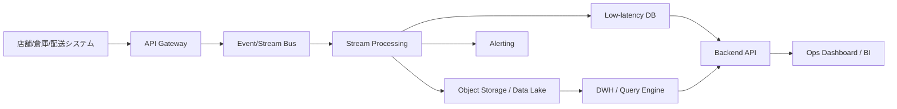

# Cloud Engineer Magazine (2026-05-06)
[[Home]]

## 1) 今日のアプリ
**「リアルタイム在庫＆配送可視化ダッシュボード（EC/小売向け）」**
- 店舗・倉庫・配送ステータスを1画面で可視化
- 在庫切れ予測、遅延アラート、発注自動化のトリガーを提供

---

## 2) 要件整理
### 機能要件
- 在庫更新イベントをリアルタイム取り込み（秒〜数十秒以内）
- 注文・出荷・配送イベントの時系列追跡
- ダッシュボード表示（拠点別在庫、配送遅延、欠品予測）
- 閾値超過時の通知（Slack/メール/Webhook）

### 非機能要件
- **可用性:** 99.9%+、単一AZ障害で継続
- **性能:** 書き込み高頻度（イベント駆動）、読み取りは集計中心
- **セキュリティ:** 最小権限IAM、暗号化（保存時/転送時）、監査ログ
- **コスト:** 初期はサーバレス中心、成長後にストリーム/分析基盤を最適化

---

## 3) 推奨アーキテクチャ（なぜその構成か）
**イベント駆動 + OLTP/OLAP分離**
1. 業務システムから在庫/注文イベントをメッセージング層へ投入
2. ストリーム処理で正規化・重複排除・ルーティング
3. 
   - 即時参照用: 低レイテンシDBへ
   - 分析用: DWH/レイクへ
4. API + BIダッシュボードで可視化

**理由**
- 書き込みスパイクをバッファ吸収しやすい
- 分析系クエリが業務DBを圧迫しない
- クラウドごとのマネージド分析サービスを活かせる

---

## 4) クラウド別実装マップ
### AWS での実装サービス
- 取り込み: **Amazon API Gateway** / **Amazon EventBridge** / **Amazon Kinesis Data Streams**
- 処理: **AWS Lambda** / **Amazon Managed Service for Apache Flink**
- 即時DB: **Amazon DynamoDB**
- 分析: **Amazon S3** + **AWS Glue** + **Amazon Athena**（or **Amazon Redshift**）
- 可視化: **Amazon QuickSight**
- 認証認可: **AWS IAM**, **Amazon Cognito**（ユーザー向け）
- 監視: **Amazon CloudWatch**, **AWS CloudTrail**

### OCI での実装サービス
- 取り込み: **OCI API Gateway** / **OCI Streaming**
- 処理: **OCI Functions**（軽量処理）
- 即時DB: **Autonomous JSON Database** or **OCI NoSQL Database**
- 分析: **Object Storage** + **Data Integration** + **Autonomous Data Warehouse**
- 可視化: **OCI Analytics Cloud**
- 認証認可: **OCI IAM**
- 監視: **OCI Monitoring**, **Logging**, **Audit**

### GCP での実装サービス
- 取り込み: **API Gateway** / **Pub/Sub**
- 処理: **Cloud Run** or **Dataflow**
- 即時DB: **Firestore** or **Bigtable**（アクセス特性次第）
- 分析: **Cloud Storage** + **BigQuery**
- 可視化: **Looker Studio**（または Looker）
- 認証認可: **Cloud IAM**
- 監視: **Cloud Monitoring**, **Cloud Logging**, **Cloud Audit Logs**

**トレードオフ例**
- AWS Kinesis vs GCP Pub/Sub: Kinesisはシャード制御できめ細かい調整、Pub/Subは運用簡素性が高い
- OCI ADW vs BigQuery: ADWはOracleエコシステム親和性、BigQueryはサーバレス分析の拡張性

---

## 5) システム構成図（Mermaid）

---

## 6) データフロー/認証・認可/監視運用の要点
- **データフロー:** イベントIDで冪等処理、遅延到着イベントを許容する設計（event-time基準）
- **認証・認可:** サービス間はIAMロール/サービスアカウントで短期認証情報を利用、秘密情報はSecrets管理
- **監視運用:** 
  - SLI: イベント遅延、処理失敗率、ダッシュボード応答時間
  - アラート: 遅延閾値超過、DLQ蓄積、分析ジョブ失敗
  - 監査: 管理操作はAuditログで追跡

---

## 7) コスト最適化ポイント（初期・成長期）
### 初期
- サーバレス優先（Lambda/Functions/Cloud Run）
- ストレージライフサイクルで古いデータを低コスト層へ
- BI更新頻度を必要最小限に

### 成長期
- ストリームのパーティション/シャード再設計
- 集計テーブル（マテビュー）でクエリ単価削減
- リザーブド/コミットメント割引（各クラウドの割引モデル）を適用

---

## 8) 障害時の設計（DR/バックアップ/フェイルオーバー）
- **DR方針:** RPO/RTOを明文化（例: RPO 5分, RTO 30分）
- **バックアップ:** DB定期スナップショット + オブジェクトストレージのバージョニング
- **フェイルオーバー:** マルチAZを基本、リージョン障害時は読み取り中心機能を先に復旧
- **再処理:** DLQイベント再投入手順をRunbook化

---

## 9) 学習ポイント（今日覚えるクラウド機能）
1. **AWS:** EventBridge + Kinesis の使い分け（イベント連携 vs 高スループットストリーム）
2. **OCI:** Streaming と Functions の連携パターン
3. **GCP:** Pub/Sub → Dataflow → BigQuery の定番分析パイプライン

---

## 10) 30〜60分ミニ演習
**課題:** 「在庫更新イベント」を1種類定義し、3クラウド分の最小構成を設計する
- 10分: イベントスキーマ作成（product_id, warehouse_id, delta, ts）
- 15分: AWS/OCI/GCPで ingest→process→store を1サービスずつマッピング
- 15分: IAM最小権限ポリシー方針を箇条書き
- 10分: 障害時に再処理する手順（DLQ起点）を文章化

---

## 11) 公式ドキュメント参照リンク（AWS/OCI/GCP）
### AWS
- https://docs.aws.amazon.com/eventbridge/
- https://docs.aws.amazon.com/streams/latest/dev/introduction.html
- https://docs.aws.amazon.com/lambda/
- https://docs.aws.amazon.com/amazondynamodb/
- https://docs.aws.amazon.com/athena/
- https://docs.aws.amazon.com/cloudwatch/
- https://docs.aws.amazon.com/awscloudtrail/latest/userguide/cloudtrail-user-guide.html

### OCI
- https://docs.oracle.com/en-us/iaas/Content/APIConcepts/usingapi.htm
- https://docs.oracle.com/en-us/iaas/Content/Streaming/home.htm
- https://docs.oracle.com/en-us/iaas/Content/Functions/home.htm
- https://docs.oracle.com/en-us/iaas/autonomous-database-serverless/doc/
- https://docs.oracle.com/en-us/iaas/Content/Identity/home.htm
- https://docs.oracle.com/en-us/iaas/Content/Monitoring/home.htm
- https://docs.oracle.com/en-us/iaas/Content/Audit/Concepts/auditoverview.htm

### GCP
- https://docs.cloud.google.com/pubsub/docs/overview
- https://docs.cloud.google.com/dataflow/docs
- https://docs.cloud.google.com/bigquery/docs
- https://docs.cloud.google.com/iam/docs
- https://docs.cloud.google.com/monitoring/docs
- https://docs.cloud.google.com/logging/docs
- https://docs.cloud.google.com/storage/docs
