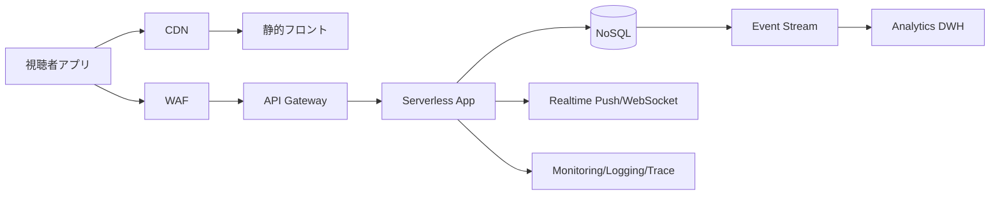

[[Home]]

# Cloud Engineer Magazine — 2026-05-07

## 1) 今日のアプリ
**ライブ配信向け「リアルタイム投票・Q&A」プラットフォーム**
- 視聴者が数秒以内に投票
- 配信者が結果を即時表示
- 不正投票防止（認証・レート制御）

> 今日の視点: **マルチクラウド比較（AWS / OCI / GCP）**

---

## 2) 要件整理
### 機能要件
- リアルタイム投票（低遅延）
- Q&A投稿・モデレーション
- 集計結果の即時反映
- 配信イベント終了後の分析（時系列・ユーザー属性）

### 非機能要件
- **可用性:** 配信ピーク時でも継続利用（マルチAZ/リージョン設計）
- **性能:** 投票API p95 < 200ms、同時接続急増に追従
- **セキュリティ:** 最小権限IAM、WAF、暗号化（保存/転送）
- **コスト:** 平常時は安価、イベント時のみオートスケール

---

## 3) 推奨アーキテクチャ（なぜその構成か）
**方針:**
1. フロントはCDN配信で低遅延化
2. 投票書き込みはマネージドNoSQLへ集約（高スループット）
3. リアルタイム通知はWebSocket/Push基盤
4. 分析はOLTPと分離してDWHへ

**理由:**
- 配信系は「急激なバースト」が本質。サーバレス＋オートスケールで過不足を抑える。  
- 書き込み頻度が高いので、RDB単体よりNoSQLカウンタ/イベント蓄積が有利。  
- 分析系を分離しないと、集計クエリが本番API性能を劣化させる。

---

## 4) クラウド別実装マップ
### AWS での実装サービス
- フロント配信: **CloudFront + S3**
- API: **API Gateway + Lambda**
- リアルタイム: **API Gateway WebSocket**
- データ: **DynamoDB**（投票イベント/集計）
- 認証: **Amazon Cognito**
- 保護: **AWS WAF + Shield Standard**
- 監視: **CloudWatch + X-Ray**
- 分析: **Kinesis (任意) + S3 + Athena**

### OCI での実装サービス
- フロント配信: **OCI Object Storage + OCI CDN**
- API: **API Gateway + Functions**
- リアルタイム: **API Gateway(WS相当設計) + Streaming連携**
- データ: **NoSQL Database**
- 認証: **OCI IAM / Identity Domains**
- 保護: **OCI WAF + Cloud Guard**
- 監視: **Monitoring + Logging + Application Performance Monitoring**
- 分析: **OCI Streaming + Data Flow/Autonomous Database(用途別)**

### GCP での実装サービス
- フロント配信: **Cloud CDN + Cloud Storage**
- API: **API Gateway(or Cloud Endpoints) + Cloud Run/Functions**
- リアルタイム: **Firebase Realtime Database / Firestore listeners（用途次第）**
- データ: **Firestore（リアルタイム同期）or Bigtable（高スループット）**
- 認証: **Identity Platform / Firebase Authentication**
- 保護: **Cloud Armor**
- 監視: **Cloud Monitoring + Cloud Logging + Trace**
- 分析: **Pub/Sub + BigQuery**

**トレードオフ（短評）**
- AWS: 選択肢が広く細かく最適化しやすいが、設計自由度が高く複雑化しやすい。  
- OCI: コスト性能比が良い構成を作りやすい一方、実装パターン情報はAWS/GCPより少なめ。  
- GCP: リアルタイム同期と分析連携が強い。Firestore設計を誤るとクエリ/課金が跳ねる。

---

## 5) システム構成図（Mermaid）

---

## 6) データフロー/認証・認可/監視運用の要点
- **データフロー:**
  1. ユーザー認証後に投票API呼び出し
  2. アプリ層で重複投票・期限・レート制御
  3. NoSQLへイベント保存、集計値更新
  4. WebSocket/Pushで最新結果を配信
  5. イベントをストリーム経由でDWHへ
- **認証・認可:**
  - OIDC/OAuth2ベース、短命トークン
  - IAMロールはAPI実行・DB書込などを分離（最小権限）
  - 管理APIはMFA必須
- **監視運用:**
  - SLI: API遅延、投票成功率、接続維持率
  - アラート: エラー率急増、WAFブロック急増、DBスロットリング
  - 構成変更はIaCで管理（差分レビュー）

---

## 7) コスト最適化ポイント（初期・成長期）
### 初期
- サーバレス中心（常時起動コストを回避）
- CDNキャッシュTTL最適化でオリジン負荷減
- ログ保持期間を短め開始（要件に応じ延長）

### 成長期
- ホットパーティション対策（キー設計見直し）
- 分析クエリを定期集計化しスキャン量削減
- 予約/コミットメント系割引（利用安定後）を検討

---

## 8) 障害時の設計（DR/バックアップ/フェイルオーバー）
- マルチAZを標準化
- NoSQLのバックアップ/ポイントインタイムリカバリ有効化
- リージョン障害時はDNS/Traffic Manager系でフェイルオーバー
- RTO/RPOを先に定義（例: RTO 30分、RPO 5分）
- 定期的にゲームデーで切替訓練

---

## 9) 学習ポイント（今日覚えるクラウド機能）
- **AWS:** DynamoDB のパーティション設計とスロットリング回避
- **OCI:** API Gateway + Functions + NoSQL の最小構成パターン
- **GCP:** Firestore リアルタイム同期と課金影響の関係

---

## 10) 30〜60分ミニ演習
1. 任意クラウド1つで「投票API」最小構成をIaCで作る（Terraform/各社ネイティブ）
2. 1ユーザー1回投票制限を実装（ID + pollIdの一意制御）
3. 負荷テストを軽く実施し、p95遅延とエラー率を確認
4. 監視アラートを1つ設定（エラー率閾値）

---

## 11) 公式ドキュメント参照リンク（AWS/OCI/GCP）
### AWS
- Well-Architected Framework: https://docs.aws.amazon.com/wellarchitected/latest/framework/welcome.html
- Amazon API Gateway: https://docs.aws.amazon.com/apigateway/
- AWS Lambda: https://docs.aws.amazon.com/lambda/
- Amazon DynamoDB: https://docs.aws.amazon.com/dynamodb/
- Amazon Cognito: https://docs.aws.amazon.com/cognito/
- AWS WAF: https://docs.aws.amazon.com/waf/

### OCI
- OCI Documentation Home: https://docs.oracle.com/en-us/iaas/Content/home.htm
- API Gateway: https://docs.oracle.com/en-us/iaas/Content/APIGateway/home.htm
- Functions: https://docs.oracle.com/en-us/iaas/Content/Functions/home.htm
- NoSQL Database: https://docs.oracle.com/en-us/iaas/nosql-database/index.html
- WAF: https://docs.oracle.com/en-us/iaas/Content/WAF/home.htm
- Cloud Guard: https://docs.oracle.com/en-us/iaas/cloud-guard/home.htm

### GCP
- Google Cloud Architecture Framework: https://docs.cloud.google.com/architecture/framework
- API Gateway: https://docs.cloud.google.com/api-gateway/docs
- Cloud Run: https://docs.cloud.google.com/run/docs
- Firestore: https://docs.cloud.google.com/firestore/docs
- Cloud Armor: https://docs.cloud.google.com/armor/docs
- BigQuery: https://docs.cloud.google.com/bigquery/docs
