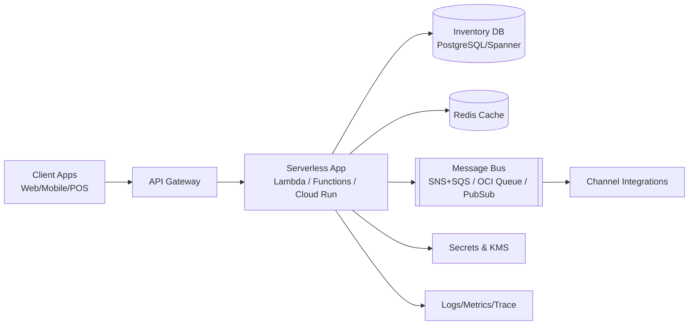

# Daily Cloud Engineer Magazine
#cloud #aws #oci #gcp #architecture #daily
[[Home]]

日付: 2026-05-08 10:15 (JST)

## 1) 今日のアプリ
**リアルタイム在庫同期付き D2C コマースAPI**

複数販売チャネル（自社EC/モバイル/店舗POS）からの注文を受け、在庫引当をリアルタイムで行うバックエンド。今日は**マルチクラウド比較視点**（AWS/OCI/GCPで同等実装）で設計する。

---

## 2) 要件整理（機能要件 / 非機能要件）
### 機能要件
- 注文受付 API（REST）
- 在庫引当（楽観ロック + 冪等キー）
- 支払い結果イベント受信で確定/取消
- 在庫変更イベントを各チャネルへ配信
- 管理者向け在庫照会ダッシュボード

### 非機能要件
- 可用性: 月間稼働率 99.95% 目標
- 性能: p95 API 応答 200ms 以下（読取）、400ms 以下（在庫更新）
- セキュリティ: 最小権限IAM、KMS管理鍵、WAF、監査ログ
- コスト: 初期はサーバレス中心、成長時はホットパスをマネージドK8s/高性能DBへ段階移行

---

## 3) 推奨アーキテクチャ（なぜその構成か）
- API層はマネージド API Gateway + サーバレス実行で運用負荷を最小化
- 在庫更新は**トランザクション対応DB**で整合性確保
- 非同期連携はメッセージング（Pub/Sub系）で疎結合化
- キャッシュで参照負荷を吸収し、DB書き込み競合を削減
- 監視はメトリクス/ログ/トレースを統合し、SLO運用しやすくする

**トレードオフ:**
- 完全同期（単純） vs 非同期（拡張性） → 注文確定前は同期最小、周辺通知は非同期化
- 単一リージョン（低コスト） vs 複数リージョン（高可用） → 初期は単一AZ冗長、成長後にリージョン冗長へ

---

## 4) クラウド別実装マップ
### AWS
- API: Amazon API Gateway
- 実行: AWS Lambda
- 在庫DB: Amazon Aurora PostgreSQL（または DynamoDB + 条件付き更新）
- キャッシュ: Amazon ElastiCache for Redis
- 非同期: Amazon SNS + Amazon SQS
- 認証: Amazon Cognito / IAM
- 監視: Amazon CloudWatch + AWS X-Ray
- セキュリティ: AWS WAF, AWS KMS, AWS Secrets Manager

### OCI
- API: OCI API Gateway
- 実行: OCI Functions
- 在庫DB: OCI Base Database Service (PostgreSQL) または Autonomous Database
- キャッシュ: OCI Cache with Redis
- 非同期: OCI Queue
- 認証: OCI IAM
- 監視: OCI Monitoring + Logging + Application Performance Monitoring
- セキュリティ: OCI WAF, OCI Vault

### GCP
- API: API Gateway
- 実行: Cloud Run（または Cloud Functions）
- 在庫DB: Cloud SQL for PostgreSQL（または Spanner for global scale）
- キャッシュ: Memorystore for Redis
- 非同期: Pub/Sub
- 認証: IAM, Identity Platform（必要時）
- 監視: Cloud Monitoring + Cloud Logging + Cloud Trace
- セキュリティ: Cloud Armor, Cloud KMS, Secret Manager

---

## 5) システム構成図（Mermaid）

---

## 6) データフロー / 認証・認可 / 監視運用の要点
### データフロー
1. クライアントが注文API呼び出し（Idempotency-Key付与）
2. アプリが在庫をトランザクション更新（不足時は即409）
3. 成功時に注文イベントをメッセージ基盤へ発行
4. 下流（通知/分析/ERP連携）が非同期処理

### 認証・認可
- APIはJWT/OAuth2 + サービス間はIAMロール
- DB接続情報はSecrets Manager/Vault/Secret Managerで管理
- 監査ログ（APIアクセス・管理操作）を必ず有効化
- 最小権限: 実行ロールは必要なキュー/DB/シークレットに限定

### 監視運用
- SLI: 成功率、p95遅延、在庫更新失敗率、キュー滞留
- アラート: エラーレート急増、DLQ増加、DB接続飽和
- 分散トレースで注文ID単位の追跡を可能に

---

## 7) コスト最適化ポイント（初期・成長期）
### 初期
- サーバレス従量課金を優先
- 小さめDBインスタンス + 自動停止/スケジュール停止（非本番）
- ログ保持期間を短めに設定（例: 14〜30日）

### 成長期
- リード多いAPIはキャッシュヒット率改善
- 予約/コミットメント割引（Savings Plans / CUD など）検討
- 重いバッチをスポット/プリエンプティブル活用へ分離

---

## 8) 障害時の設計（DR/バックアップ/フェイルオーバー）
- DB: 自動バックアップ + PITR、有効化
- 非同期: DLQ設置、再処理手順をRunbook化
- リージョン障害: RTO/RPOを定義し、パイロットライト構成から開始
- API: WAFルール誤検知時の即時ロールバック手順

---

## 9) 学習ポイント（今日覚えるクラウド機能）
- **冪等性**: API再送でも二重引当しない設計
- **条件付き更新/トランザクション**: 在庫競合を制御
- **DLQ**: 失敗メッセージの隔離と再処理
- **最小権限IAM**: 実行主体ごとの厳密スコープ

---

## 10) 30〜60分ミニ演習
1. どれか1クラウドを選び、注文APIの最小構成を作図
2. Idempotency-Key を使うAPI仕様（HTTPヘッダ/レスポンスコード）を定義
3. 在庫更新失敗時のDLQ再処理フローを3ステップで書く
4. IAMポリシーを「キュー送信のみ許可」に絞る案を作る

---

## 11) 公式ドキュメント参照リンク（AWS/OCI/GCP）
### AWS
- Well-Architected Framework: https://docs.aws.amazon.com/wellarchitected/latest/framework/welcome.html
- Amazon API Gateway: https://docs.aws.amazon.com/apigateway/
- AWS Lambda: https://docs.aws.amazon.com/lambda/
- Amazon Aurora: https://docs.aws.amazon.com/aurora/
- Amazon SQS: https://docs.aws.amazon.com/sqs/
- AWS IAM: https://docs.aws.amazon.com/iam/

### OCI
- OCI Architecture Center: https://docs.oracle.com/en-us/iaas/Content/Architecture/home.htm
- OCI API Gateway: https://docs.oracle.com/en-us/iaas/Content/APIGateway/home.htm
- OCI Functions: https://docs.oracle.com/en-us/iaas/Content/Functions/home.htm
- OCI Queue: https://docs.oracle.com/en-us/iaas/Content/queue/home.htm
- OCI IAM: https://docs.oracle.com/en-us/iaas/Content/Identity/home.htm
- OCI Vault: https://docs.oracle.com/en-us/iaas/Content/KeyManagement/home.htm

### GCP
- Google Cloud Architecture Framework: https://docs.cloud.google.com/architecture/framework
- API Gateway: https://docs.cloud.google.com/api-gateway/docs
- Cloud Run: https://docs.cloud.google.com/run/docs
- Cloud SQL: https://docs.cloud.google.com/sql/docs
- Pub/Sub: https://docs.cloud.google.com/pubsub/docs
- IAM: https://docs.cloud.google.com/iam/docs
