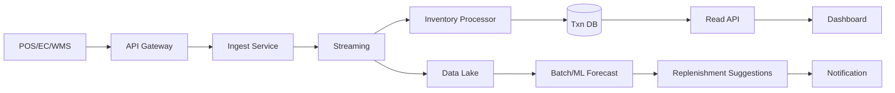

---
tags:
  - cloud
  - aws
  - oci
  - gcp
  - architecture
  - daily
---
[[Home]]

# Cloud Engineer Magazine (2026-05-12)

## 1) 今日のアプリ
**リアルタイム在庫最適化アプリ（小売向け）**  
店舗・EC・倉庫の在庫イベントを集約し、欠品予測・自動補充提案・アラートを行う。

---

## 2) 要件整理（機能要件/非機能要件）
### 機能要件
- POS/EC/倉庫システムから在庫増減イベントを秒〜分単位で取り込み
- SKUごとの現在在庫、引当在庫、安全在庫を可視化
- しきい値割れ時に通知（Slack/メール/Webhook）
- 日次で需要予測バッチを実行し、補充提案を生成

### 非機能要件
- **可用性**: 主要API 99.9%以上、リージョン障害時はRTO 60分以内
- **性能**: 在庫更新反映 5秒以内、ダッシュボードP95 < 300ms
- **セキュリティ**: 最小権限IAM、KMS暗号化、監査ログ保持
- **コスト**: 初期はサーバレス中心、成長期は処理量に応じて常時稼働基盤へ段階移行

---

## 3) 推奨アーキテクチャ（なぜその構成か）
**イベント駆動 + CQRS寄り構成**を採用。  
- 書き込み系（在庫イベント取り込み）と読み取り系（ダッシュボード）を分離し、負荷特性を最適化
- ストリーミング基盤でスパイク耐性を確保
- 予測処理はバッチ/MLジョブとして分離してコスト効率を上げる

**採用理由（要点）**
- 在庫イベントは突発的に増えるため、キュー/ストリームで平滑化
- APIはオートスケールで低運用化
- 分析はDWH/レイクに集約して将来分析に再利用可能

---

## 4) クラウド別実装マップ
### AWS での実装サービス
- API: **Amazon API Gateway** + **AWS Lambda**
- イベント取り込み: **Amazon Kinesis Data Streams**（または SQS）
- トランザクションDB: **Amazon DynamoDB**
- 分析基盤: **Amazon S3** + **AWS Glue** + **Amazon Athena**
- 通知: **Amazon EventBridge** + **Amazon SNS**
- 認証: **Amazon Cognito** / IAMロール
- 監視: **Amazon CloudWatch** + **AWS X-Ray** + **AWS CloudTrail**

### OCI での実装サービス
- API: **OCI API Gateway** + **OCI Functions**
- イベント取り込み: **OCI Streaming**
- トランザクションDB: **Autonomous Database (JSON/Transaction Processing)** または **NoSQL Database**
- 分析基盤: **Object Storage** + **Data Integration** + **OCI Data Flow (Spark)**
- 通知: **OCI Events** + **OCI Notifications**
- 認証: **OCI IAM**
- 監視: **OCI Monitoring** + **Logging** + **Audit**

### GCP での実装サービス
- API: **API Gateway** + **Cloud Run**（または Cloud Functions）
- イベント取り込み: **Pub/Sub**
- トランザクションDB: **Firestore** または **Cloud SQL**
- 分析基盤: **Cloud Storage** + **Dataflow** + **BigQuery**
- 通知: **Eventarc** + **Cloud Tasks / Pub/Sub push**
- 認証: **IAM** + **Identity Platform**（必要時）
- 監視: **Cloud Monitoring** + **Cloud Logging** + **Cloud Audit Logs**

**トレードオフ（短評）**
- DynamoDB / Firestore / OCI NoSQL は運用が軽い反面、クエリ柔軟性でRDBに劣る
- Cloud Run はコンテナ自由度が高いが、超低遅延常時処理では常駐基盤が有利な場合あり
- ストリーミングは Kinesis/PubSub/OCI Streaming いずれも有効。既存運用スキルで選定すると導入が速い

---

## 5) システム構成図（Mermaid）

---

## 6) データフロー/認証・認可/監視運用の要点
- **データフロー**: イベントは必ずストリーム経由。重複イベントは idempotency key で排除
- **認証・認可**: 
  - サービス間は短期クレデンシャル（IAMロール/Workload Identity）
  - 人ユーザーはRBAC（閲覧者/在庫管理者/運用者）
  - 機密データはKMSで暗号化（保存時 + 可能なら転送時TLS強制）
- **監視運用**:
  - SLI: 取り込み遅延、失敗率、在庫反映遅延
  - アラート: エラーレート閾値 + ストリームラグ閾値
  - 監査: 管理操作はAuditログを長期保管

---

## 7) コスト最適化ポイント（初期・成長期）
### 初期
- サーバレス優先（Lambda/Functions/Cloud Run）で固定費を削減
- 分析はクエリ従量（Athena/BigQuery）で開始
- ログ保持期間を業務要件に合わせ短めに設定

### 成長期
- 高頻度ワークロードを予約/コミットメントへ移行（Savings Plans/CUD等）
- ストリームシャード/パーティション最適化
- ホットデータとコールドデータを分離（標準ストレージ→アーカイブ階層）

---

## 8) 障害時の設計（DR/バックアップ/フェイルオーバー）
- **DR方針**: マルチAZ標準、必要に応じてマルチリージョン待機
- **バックアップ**:
  - Txn DB: 定期スナップショット + PITR
  - Data Lake: バージョニング + クロスリージョン複製
- **フェイルオーバー**:
  - DNS/グローバルLBでセカンダリへ切替
  - 非同期複製のためRPO要件（例: 5〜15分）を事前合意
- **演習**: 四半期ごとに復旧訓練（Runbook検証）

---

## 9) 学習ポイント（今日覚えるクラウド機能）
- **AWS**: Kinesis のシャード設計と Lambda イベントソースマッピング
- **OCI**: Streaming + Functions + Events の連携パターン
- **GCP**: Pub/Sub と Dataflow の責務分離（取り込み vs 変換）

---

## 10) 30〜60分ミニ演習
1. 任意クラウド1つで「在庫更新API → ストリーム → DB反映」の最小構成を作る
2. 重複イベントを想定し、idempotency key チェックを実装
3. 監視メトリクスを3つ設定（処理件数、失敗率、遅延）
4. しきい値アラート1件を作成し、通知到達を確認

---

## 11) 公式ドキュメント参照リンク（AWS/OCI/GCP）
### AWS
- Well-Architected Framework: https://docs.aws.amazon.com/wellarchitected/latest/framework/welcome.html
- Amazon API Gateway: https://docs.aws.amazon.com/apigateway/
- AWS Lambda: https://docs.aws.amazon.com/lambda/
- Amazon Kinesis Data Streams: https://docs.aws.amazon.com/streams/latest/dev/introduction.html
- Amazon DynamoDB: https://docs.aws.amazon.com/amazondynamodb/latest/developerguide/Introduction.html
- Amazon S3: https://docs.aws.amazon.com/AmazonS3/latest/userguide/Welcome.html
- AWS Glue: https://docs.aws.amazon.com/glue/
- Amazon Athena: https://docs.aws.amazon.com/athena/
- AWS CloudWatch: https://docs.aws.amazon.com/cloudwatch/

### OCI
- OCI Architecture Center: https://docs.oracle.com/en-us/iaas/Content/Architecture/Concepts/architecture.htm
- OCI API Gateway: https://docs.oracle.com/en-us/iaas/Content/APIGateway/home.htm
- OCI Functions: https://docs.oracle.com/en-us/iaas/Content/Functions/home.htm
- OCI Streaming: https://docs.oracle.com/en-us/iaas/Content/Streaming/home.htm
- OCI NoSQL Database: https://docs.oracle.com/en-us/iaas/nosql-database/index.html
- OCI Object Storage: https://docs.oracle.com/en-us/iaas/Content/Object/home.htm
- OCI Monitoring: https://docs.oracle.com/en-us/iaas/Content/Monitoring/home.htm

### GCP
- Google Cloud Architecture Framework: https://docs.cloud.google.com/architecture/framework
- API Gateway: https://docs.cloud.google.com/api-gateway/docs
- Cloud Run: https://docs.cloud.google.com/run/docs
- Pub/Sub: https://docs.cloud.google.com/pubsub/docs
- Firestore: https://docs.cloud.google.com/firestore/docs
- BigQuery: https://docs.cloud.google.com/bigquery/docs
- Dataflow: https://docs.cloud.google.com/dataflow/docs
- Cloud Monitoring: https://docs.cloud.google.com/monitoring/docs
