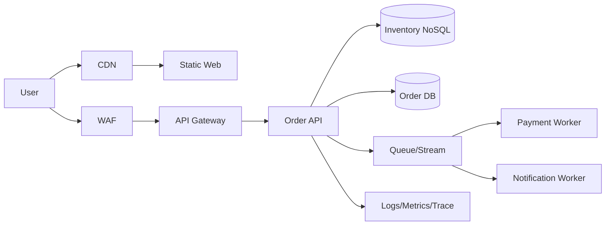

[[Home]]

# Cloud Engineer Magazine — 2026-05-14

## 1) 今日のアプリ
**在庫連動フラッシュセール基盤（EC向け）**  
短時間にアクセスが急増するセールを安全にさばき、在庫の二重販売を防ぐ。

---

## 2) 要件整理
### 機能要件
- 商品一覧・詳細表示
- 在庫表示（ほぼリアルタイム）
- 注文作成（在庫引当の原子性）
- 決済連携（外部PSP想定）

### 非機能要件
- **可用性:** セール中も継続提供（マルチAZ/リージョンDR）
- **性能:** 読み取り高負荷、注文APIは低遅延
- **セキュリティ:** 最小権限IAM、WAF、暗号化、秘密情報管理
- **コスト:** 平常時は低コスト、ピーク時だけ自動スケール

---

## 3) 推奨アーキテクチャ（なぜその構成か）
- フロントは **CDN + オブジェクトストレージ** で配信し、読み取りトラフィックを安価に吸収。
- API は **マネージドAPIゲートウェイ + コンテナ/サーバレス** で急増に追従。
- 在庫は **低遅延NoSQL + 条件付き更新(楽観ロック/条件式)** で二重販売を抑止。
- 注文イベントは **メッセージング/ストリーム** に非同期化して、決済・通知を疎結合化。
- 観測は **ログ/メトリクス/トレース統合**、運用はSLOベースでアラート。

**トレードオフ:**  
RDBは整合性に強いがピーク吸収でシャーディング負担が増える。NoSQL条件付き更新は在庫引当に強いが、複雑な集計は分析基盤へ分離が必要。

---

## 4) クラウド別実装マップ
### AWS
- 配信: CloudFront + S3
- API: API Gateway + AWS Lambda（またはECS Fargate）
- 在庫: DynamoDB（ConditionExpression）
- 非同期: SQS / EventBridge
- 秘密情報: AWS Secrets Manager
- 監視: CloudWatch + X-Ray

### OCI
- 配信: OCI CDN + Object Storage
- API: API Gateway + OCI Functions（またはOKE）
- 在庫: Autonomous JSON Database（JSONドキュメント）またはNoSQL Database
- 非同期: OCI Queue / Streaming
- 秘密情報: OCI Vault
- 監視: OCI Monitoring + Logging + Application Performance Monitoring

### GCP
- 配信: Cloud CDN + Cloud Storage
- API: API Gateway（またはApigee X）+ Cloud Run
- 在庫: Firestore（トランザクション/条件更新）
- 非同期: Pub/Sub
- 秘密情報: Secret Manager
- 監視: Cloud Monitoring + Cloud Logging + Cloud Trace

---

## 5) システム構成図（Mermaid）

---

## 6) データフロー/認証・認可/監視運用の要点
- **データフロー:** 注文APIで在庫を条件付き更新 → 成功時のみ注文確定イベントを発行。
- **認証・認可:**
  - エンドユーザー: OIDC/OAuth2（IDトークン検証）
  - サービス間: IAMロール/サービスアカウントで短期認証情報
  - 原則: 最小権限、キー直書き禁止、Secret Manager/Vault利用
- **監視運用:**
  - SLI例: 注文成功率、P95レイテンシ、在庫競合率
  - アラート: 5xx急増、キュー滞留、在庫更新失敗率増加

---

## 7) コスト最適化ポイント（初期・成長期）
- **初期:** サーバレス中心（Lambda/Functions/Cloud Run）でアイドル課金削減。
- **成長期:**
  - コンピュートは予約/コミットメント割引を検討
  - CDNキャッシュ率改善でオリジン負荷と転送料を抑制
  - NoSQLのTTL/アクセスパターン最適化、ログ保持期間の段階化

---

## 8) 障害時の設計（DR/バックアップ/フェイルオーバー）
- **DR方針:** RPO/RTOを先に定義（例: RPO 5分, RTO 30分）。
- **バックアップ:** DB定期バックアップ + Point-in-time recovery。
- **フェイルオーバー:**
  - 最低でもマルチAZ
  - 重要ワークロードはマルチリージョン待機構成
  - DNS/Global LBで切替、ランブックを定期訓練

---

## 9) 学習ポイント（今日覚えるクラウド機能）
- **AWS DynamoDB ConditionExpression** で在庫の競合更新を防ぐ
- **OCI Queue/Streaming** で注文後処理を非同期化
- **GCP Pub/Sub + Cloud Run** でイベント駆動スケール

---

## 10) 30〜60分ミニ演習
1. 「在庫1の商品」に対し、同時に2件の注文リクエストを送るテストケースを作成。  
2. 条件付き更新（トランザクション）を有効化し、二重販売が起きないことを確認。  
3. キュー経由で通知ワーカーを非同期実行し、API応答時間の改善を計測。  
4. 5xxアラート閾値を設定し、擬似障害で通知されることを確認。

---

## 11) 公式ドキュメント参照リンク（AWS/OCI/GCP）
### AWS
- Well-Architected Framework: https://docs.aws.amazon.com/wellarchitected/latest/framework/welcome.html
- Amazon CloudFront: https://docs.aws.amazon.com/AmazonCloudFront/latest/DeveloperGuide/Introduction.html
- Amazon API Gateway: https://docs.aws.amazon.com/apigateway/latest/developerguide/welcome.html
- AWS Lambda: https://docs.aws.amazon.com/lambda/latest/dg/welcome.html
- Amazon DynamoDB（条件式）: https://docs.aws.amazon.com/amazondynamodb/latest/developerguide/Expressions.ConditionExpressions.html
- AWS WAF: https://docs.aws.amazon.com/waf/latest/developerguide/waf-chapter.html

### OCI
- OCI Architecture Center: https://docs.oracle.com/en-us/iaas/Content/Architecture/Reference/architectures.htm
- API Gateway: https://docs.oracle.com/en-us/iaas/Content/APIGateway/Concepts/apigatewayoverview.htm
- Functions: https://docs.oracle.com/en-us/iaas/Content/Functions/Concepts/functionsoverview.htm
- Queue: https://docs.oracle.com/en-us/iaas/Content/queue/overview.htm
- Streaming: https://docs.oracle.com/en-us/iaas/Content/Streaming/Concepts/streamingoverview.htm
- Vault: https://docs.oracle.com/en-us/iaas/Content/KeyManagement/Concepts/keyoverview.htm

### GCP
- Google Cloud Architecture Framework: https://docs.cloud.google.com/architecture/framework
- Cloud CDN: https://docs.cloud.google.com/cdn/docs/overview
- Cloud Run: https://docs.cloud.google.com/run/docs/overview/what-is-cloud-run
- Firestore transactions: https://docs.cloud.google.com/firestore/docs/manage-data/transactions
- Pub/Sub: https://docs.cloud.google.com/pubsub/docs/overview
- Secret Manager: https://docs.cloud.google.com/secret-manager/docs/overview
