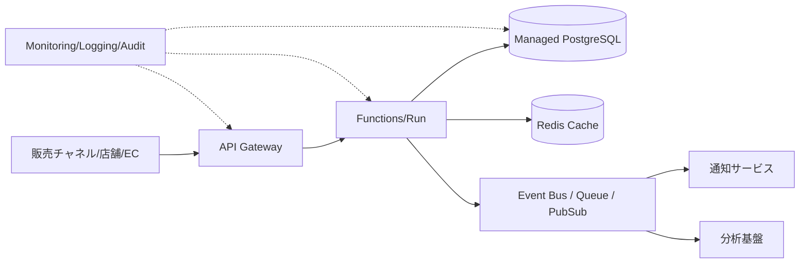

# Cloud Engineer Magazine — 2026-05-15
Tags: #cloud #aws #oci #gcp #architecture #daily
Links: [[Home]]

## 1) 今日のアプリ
**リアルタイム在庫アラート付き D2C EC 在庫同期アプリ**

- 複数販売チャネル（自社EC/モール/店舗）で在庫を統合
- 在庫しきい値割れをリアルタイム通知
- 受注急増時にも過販売を防ぐ

---

## 2) 要件整理
### 機能要件
- 在庫更新API（入庫/出庫/調整）
- 注文イベント連携（Webhook/イベント取り込み）
- 在庫アラート通知（メール/チャット）
- 在庫参照ダッシュボード（商品別・倉庫別）

### 非機能要件
- **可用性**: 24/7運用、RTO 30分、RPO 5分以内
- **性能**: 在庫更新API p95 < 200ms、ピーク時 2,000 req/s
- **セキュリティ**: 最小権限IAM、KMS暗号化、監査ログ保持
- **コスト**: 初期はサーバレス中心、成長後は予約/コミット割引で最適化

---

## 3) 推奨アーキテクチャ（なぜその構成か）
**方針: イベント駆動 + サーバレス + マネージドDB**

- 受注/在庫変動をイベント化し、疎結合で拡張しやすくする
- APIはマネージドゲートウェイ + Functionsで運用負荷を下げる
- 在庫台帳はトランザクション整合性の高いマネージドRDBを中核にする
- 非同期通知・分析はストリーム/キュー分離でピーク吸収

**トレードオフ**
- Functionsは初期コスト有利だが、超高トラフィック常時稼働ではコンテナ常駐の方が安い場合あり
- RDBは整合性に強いが、超高頻度の読み取りはキャッシュ併用が前提

---

## 4) クラウド別実装マップ
### AWS
- API: **Amazon API Gateway**
- アプリ実行: **AWS Lambda**
- 在庫DB: **Amazon Aurora PostgreSQL**
- 非同期連携: **Amazon EventBridge / Amazon SQS**
- キャッシュ: **Amazon ElastiCache for Redis**
- 通知: **Amazon SNS**
- 認証: **Amazon Cognito + IAM**
- 監視: **Amazon CloudWatch + AWS X-Ray + CloudTrail**

### OCI
- API: **OCI API Gateway**
- アプリ実行: **OCI Functions**
- 在庫DB: **Autonomous Database (Transaction Processing)**
- 非同期連携: **OCI Streaming / OCI Queue**
- キャッシュ: **OCI Cache (Redis)**
- 通知: **OCI Notifications**
- 認証: **OCI IAM**
- 監視: **OCI Monitoring / Logging / Audit**

### GCP
- API: **API Gateway**
- アプリ実行: **Cloud Functions (2nd gen) / Cloud Run**
- 在庫DB: **Cloud SQL for PostgreSQL**
- 非同期連携: **Pub/Sub**
- キャッシュ: **Memorystore for Redis**
- 通知: **Pub/Sub + Cloud Run/Functions (通知連携)**
- 認証: **IAM + Identity Platform（必要時）**
- 監視: **Cloud Monitoring / Cloud Logging / Cloud Audit Logs / Trace**

---

## 5) システム構成図（Mermaid）

---

## 6) データフロー/認証・認可/監視運用の要点
- **データフロー**: 注文イベント受信 → 在庫引当更新（DB Tx）→ 更新イベント発行 → 通知/分析へ配信
- **認証・認可**:
  - APIはOIDC/JWT検証
  - サービス間はIAMロール（静的鍵を極力排除）
  - DB接続情報はSecrets管理（KMSで暗号化）
- **監視運用**:
  - SLI: API遅延、5xx率、在庫更新失敗率、キュー滞留時間
  - アラート: しきい値 + 異常検知（急激な在庫減少）
  - 監査: 管理API・IAM変更を監査ログで追跡

---

## 7) コスト最適化ポイント（初期・成長期）
### 初期
- サーバレス中心（Lambda/Functions/Cloud Functions）
- 単一リージョン + 自動バックアップ
- Redisは小さく開始、キャッシュヒット率を測定して増強

### 成長期
- 常時負荷が高い処理をCloud Run/コンテナ常駐へ再配置
- DBはリードレプリカ追加、I/O最適化、接続プーリング
- AWS Savings Plans / GCP CUD / OCIのコミット割引を検討

---

## 8) 障害時の設計（DR/バックアップ/フェイルオーバー）
- **DR**: マルチAZを標準、重要系はクロスリージョンレプリケーション
- **バックアップ**: DB PITR有効化、日次スナップショット、復旧演習を月次実施
- **フェイルオーバー**:
  - APIはヘルスチェックで自動切替
  - 非同期処理はDLQで再処理可能化
  - 在庫更新は冪等キーで重複更新を防止

---

## 9) 学習ポイント（今日覚えるクラウド機能）
1. **イベント駆動の基本**: 同期APIと非同期イベントを分離すると障害分離しやすい
2. **最小権限IAM**: 人/サービス/運用ロールを分離して権限境界を明確化
3. **可観測性3点セット**: メトリクス・ログ・トレースを同時設計する

---

## 10) 30〜60分ミニ演習
**演習: 在庫アラートAPIの最小構成を1クラウドで作る**

- 30分版
  1. API Gatewayで`POST /inventory/events`作成
  2. FunctionでJSON受信し、しきい値判定のみ実装
  3. 通知サービス（SNS/Notifications/PubSub経由）へ送信

- 60分版
  1. 上記に加えてRDBへ在庫更新（トランザクション）
  2. 監視アラート（エラー率/遅延）を2つ設定
  3. IAMポリシーを最小権限で見直し

---

## 11) 公式ドキュメント参照リンク（AWS/OCI/GCP）
### AWS
- API Gateway: https://docs.aws.amazon.com/apigateway/
- AWS Lambda: https://docs.aws.amazon.com/lambda/
- Aurora: https://docs.aws.amazon.com/aurora/
- EventBridge: https://docs.aws.amazon.com/eventbridge/
- SQS: https://docs.aws.amazon.com/sqs/
- ElastiCache: https://docs.aws.amazon.com/elasticache/
- SNS: https://docs.aws.amazon.com/sns/
- Cognito: https://docs.aws.amazon.com/cognito/
- CloudWatch: https://docs.aws.amazon.com/cloudwatch/
- CloudTrail: https://docs.aws.amazon.com/cloudtrail/

### OCI
- OCI API Gateway: https://docs.oracle.com/en-us/iaas/Content/APIGateway/home.htm
- OCI Functions: https://docs.oracle.com/en-us/iaas/Content/Functions/home.htm
- Autonomous Database: https://docs.oracle.com/en-us/iaas/autonomous-database/index.html
- OCI Streaming: https://docs.oracle.com/en-us/iaas/Content/Streaming/home.htm
- OCI Queue: https://docs.oracle.com/en-us/iaas/Content/queue/home.htm
- OCI Cache: https://docs.oracle.com/en-us/iaas/Content/Cache/home.htm
- OCI Notifications: https://docs.oracle.com/en-us/iaas/Content/Notification/home.htm
- OCI IAM: https://docs.oracle.com/en-us/iaas/Content/Identity/home.htm
- OCI Monitoring: https://docs.oracle.com/en-us/iaas/Content/Monitoring/home.htm
- OCI Logging: https://docs.oracle.com/en-us/iaas/Content/Logging/home.htm
- OCI Audit: https://docs.oracle.com/en-us/iaas/Content/Audit/home.htm

### GCP
- Google Cloud API Gateway: https://docs.cloud.google.com/api-gateway/docs
- Cloud Functions: https://docs.cloud.google.com/functions/docs
- Cloud Run: https://docs.cloud.google.com/run/docs
- Cloud SQL: https://docs.cloud.google.com/sql/docs
- Pub/Sub: https://docs.cloud.google.com/pubsub/docs
- Memorystore: https://docs.cloud.google.com/memorystore/docs
- IAM: https://docs.cloud.google.com/iam/docs
- Cloud Monitoring: https://docs.cloud.google.com/monitoring/docs
- Cloud Logging: https://docs.cloud.google.com/logging/docs
- Cloud Audit Logs: https://docs.cloud.google.com/logging/docs/audit
- Cloud Trace: https://docs.cloud.google.com/trace/docs
