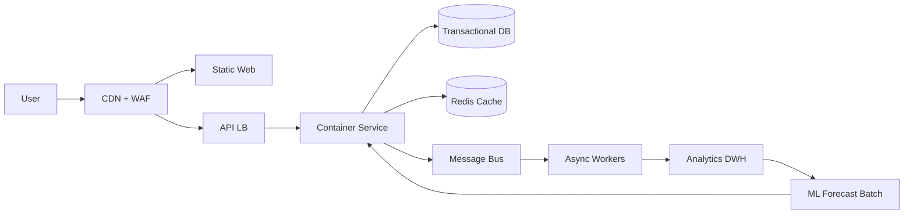

# Cloud Engineer Magazine (2026-05-16)
[[Home]]

## 1) 今日のアプリ
**リアルタイム在庫・需要予測付き D2C EC プラットフォーム**
- 注文、在庫更新、キャンペーン時の急増トラフィックに強い
- 「売り越し防止」と「在庫回転率最適化」が目的

## 2) 要件整理（機能要件/非機能要件）
### 機能要件
- 商品検索、カート、注文、決済連携
- 在庫の即時引当（同時購入競合対策）
- イベント配信（注文作成、出荷、返品）
- 需要予測バッチ（日次）

### 非機能要件
- **可用性**: 99.9%以上、AZ障害を吸収
- **性能**: 商品詳細 P95 < 300ms、注文API P95 < 500ms
- **セキュリティ**: 最小権限IAM、KMS暗号化、WAF、Secrets管理
- **コスト**: 平常時は小さく、セール時のみ水平スケール

## 3) 推奨アーキテクチャ（なぜその構成か）
**視点: マルチクラウド比較（実装は単一クラウドでも再現可能）**
- フロントはCDN+オブジェクト配信で低遅延
- APIはマネージドLB配下のコンテナでオートスケール
- 在庫整合性はトランザクション強いRDBを中心に、読み取りはキャッシュ分離
- 注文イベントはPub/Sub系で疎結合化し、分析基盤へ非同期連携
- 需要予測はマネージドML/分析サービスで日次バッチ

**理由**
- 注文系は整合性重視（RDB）
- 商品閲覧はスループット重視（CDN/キャッシュ）
- 非同期化でピーク吸収し、障害波及を抑える

## 4) クラウド別実装マップ
### AWS
- CDN: **CloudFront**
- 静的配信: **S3**
- API/コンテナ: **ALB + ECS(Fargate)**
- RDB: **Aurora PostgreSQL**
- キャッシュ: **ElastiCache for Redis**
- 非同期: **SQS / SNS / EventBridge**
- 需要予測分析: **Glue + Athena + SageMaker**
- 監視: **CloudWatch + X-Ray + CloudTrail**
- 認証: **Cognito**（顧客） + **IAM**（サービス間）

### OCI
- CDN/Edge: **OCI WAF + CDN**
- 静的配信: **Object Storage**
- API/コンテナ: **Load Balancer + OKE**
- RDB: **Autonomous Transaction Processing** または **MySQL HeatWave**
- キャッシュ: **OCI Cache (Redis)**
- 非同期: **OCI Queue / Streaming / Events**
- 分析/ML: **Data Flow (Spark) + OCI Data Science**
- 監視: **OCI Monitoring + Logging + Events**
- 認証: **OCI IAM**

### GCP
- CDN: **Cloud CDN**
- 静的配信: **Cloud Storage**
- API/コンテナ: **Cloud Load Balancing + GKE Autopilot**
- RDB: **Cloud SQL for PostgreSQL**（高可用構成）
- キャッシュ: **Memorystore for Redis**
- 非同期: **Pub/Sub + Eventarc + Cloud Tasks**
- 分析/ML: **BigQuery + Vertex AI**
- 監視: **Cloud Monitoring + Cloud Logging + Cloud Trace + Audit Logs**
- 認証: **Identity Platform / IAM**

## 5) システム構成図（Mermaid）

## 6) データフロー/認証・認可/監視運用の要点
- **データフロー**: 注文確定時にRDBコミット → イベント発行 → 在庫更新/通知/分析を非同期実行
- **認証・認可**:
  - 顧客認証はOIDCベース（Cognito / Identity Platform 相当）
  - サービス間はIAMロール + 短期クレデンシャル
  - DB/キュー権限をマイクロサービス単位で分離（最小権限）
- **監視運用**:
  - SLI: APIレイテンシ、注文成功率、在庫不整合件数
  - アラート: しきい値 + 異常検知（急増/急減）
  - 監査ログを集中保管し、改ざん耐性ある保存先へ

## 7) コスト最適化ポイント（初期・成長期）
### 初期
- 小さめインスタンス/最小ノード、オートスケール有効化
- 低頻度バッチはサーバレス実行優先
- ストレージはライフサイクルで低頻度層へ移行

### 成長期
- 予約/コミット割引（AWS Savings Plans, GCP CUD, OCI割引プラン）
- キャッシュヒット率改善でDB負荷削減
- 分析基盤はパーティション/クラスタリング最適化

## 8) 障害時の設計（DR/バックアップ/フェイルオーバー）
- マルチAZ構成を標準化（DB/コンテナ/LB）
- DB自動バックアップ + PITR（Point-in-Time Recovery）
- 非同期キューに再試行・DLQを設定
- リージョン障害に備え、
  - RPO/RTOを定義（例: RPO 15分, RTO 1時間）
  - 重要データをクロスリージョン複製

## 9) 学習ポイント（今日覚えるクラウド機能）
- **イベント駆動**で注文ピーク時の耐障害性を高める
- **WAF + IAM最小権限 + Secrets管理**を初期から組み込む
- **RDB(整合性) + Cache(速度) + Bus(疎結合)** の役割分担

## 10) 30〜60分ミニ演習
1. 任意クラウドで「商品API + Redisキャッシュ」の最小構成を作る
2. `/products/{id}` でキャッシュヒット/ミスのメトリクスを可視化
3. 注文イベントを1つ発行し、ワーカーで在庫更新の疑似処理を実装
4. IAMを見直し、APIサービスに不要権限がないか確認

## 11) 公式ドキュメント参照リンク（AWS/OCI/GCP）
### AWS
- Well-Architected: https://docs.aws.amazon.com/wellarchitected/latest/framework/welcome.html
- Amazon ECS: https://docs.aws.amazon.com/ecs/
- Amazon Aurora: https://docs.aws.amazon.com/aurora/
- Amazon ElastiCache: https://docs.aws.amazon.com/elasticache/
- EventBridge: https://docs.aws.amazon.com/eventbridge/
- CloudWatch: https://docs.aws.amazon.com/cloudwatch/

### OCI
- OCI Architecture Center: https://docs.oracle.com/en-us/iaas/Content/Architecture/Concepts/architecturecenter.htm
- OKE: https://docs.oracle.com/en-us/iaas/Content/ContEng/home.htm
- Load Balancer: https://docs.oracle.com/en-us/iaas/Content/Balance/home.htm
- Autonomous Database: https://docs.oracle.com/en-us/iaas/autonomous-database/
- OCI Streaming: https://docs.oracle.com/en-us/iaas/Content/Streaming/home.htm
- OCI Monitoring: https://docs.oracle.com/en-us/iaas/Content/Monitoring/home.htm

### GCP
- Architecture Framework: https://docs.cloud.google.com/architecture/framework
- GKE: https://docs.cloud.google.com/kubernetes-engine/docs
- Cloud SQL: https://docs.cloud.google.com/sql/docs
- Pub/Sub: https://docs.cloud.google.com/pubsub/docs
- Cloud Monitoring: https://docs.cloud.google.com/monitoring/docs
- BigQuery: https://docs.cloud.google.com/bigquery/docs
